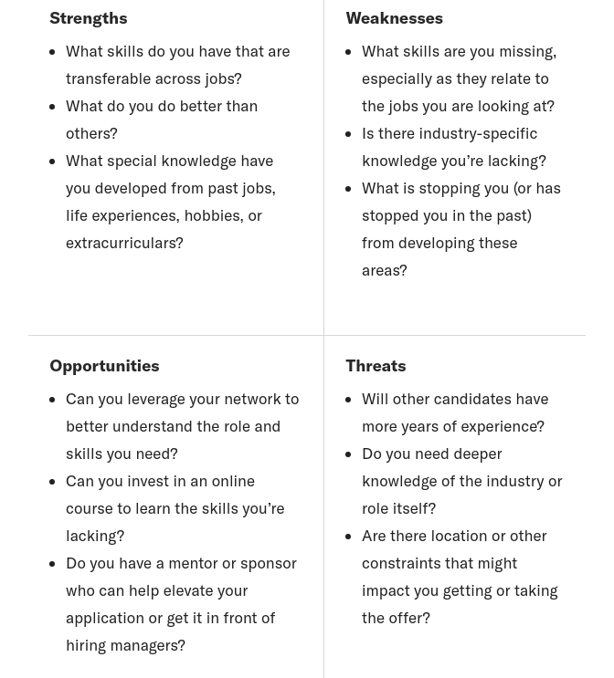

# Entrevista do Google

Verificar se está tudo em ordem: câmera, microfone, mesa, papel e caneta

- Estudar algoritmo e estrutura de dados: 
  - algoritmos de ordenação e a diferença entre eles
  - algoritmos de busca, como busca binária
  - dividir para conquistar
  - programação dinâmica
  - algoritmos gulosos
  - algoritmos recursivos
  - algoritmos combinatórios
- Avaliar complexidade do algoritmo de tempo e espaço
- Estrutura de dados
  - Listas ligadas
  - Pilhas
  - Filas
  - Conjuntos
  - Hashmaps
  - Árvores Binárias
  - Heaps
  - Grafos

A entrevista é feita no editor sem compilador.

**Perguntas**

Falar sobre si mesmo

Porque se candidatou ao estágio

O que pretende aprender no estágio

Detalhar mais sobre os projetos e o que aprendi com eles

Detalhar o que pretende na carreira

Perguntar sobre a vaga e a empresa 

- qual o horário de trabalho, flexível ou não
- modelo de negócios
- trabalho remoto ou presencial
- metolodologia ágil utilizada

**SWOT** 

strengths, weaknesses, opportunities, and threats.

“Quando comparada com minha função ideal, quais lacunas ou fraquezas de conhecimento eu vejo?” Por exemplo, talvez os números não sejam sua praia, mas você precisa entender os dados para fazer um bom trabalho. Ou talvez você não seja o melhor orador público, mas precisa de ótimas habilidades de apresentação para conseguir o emprego dos seus sonhos.

Sabendo disso, existem oportunidades para você encontrar uma função em uma empresa diferente com as habilidades que você possui (seus pontos fortes) ou para desenvolver novas competências para conseguir o emprego que deseja?

Uma ameaça pode ser um campo hipercompetitivo ou uma falta de habilidades avançadas ou experiência que outros candidatos têm. Você precisa saber o que são quando se candidata a funções, para que possa se preparar para explicar e falar diretamente com eles, caso seja chamado para uma entrevista.

Escreva um pequeno parágrafo que descreva o que você tem paixão (seus valores e propósito), o que você conquistou até agora (sua história) e o que você traz para a mesa (sua visão). Conforme você escreve, dê uma olhada em sua análise SWOT e considere como você pode ampliar seus pontos fortes, abordar seus pontos fracos e se diferenciar de qualquer pessoa considerada uma ameaça

[Pramp](https://www.pramp.com/#/)