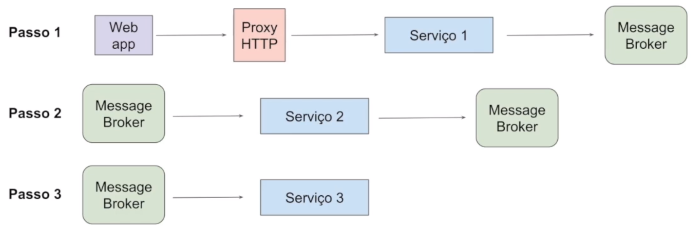
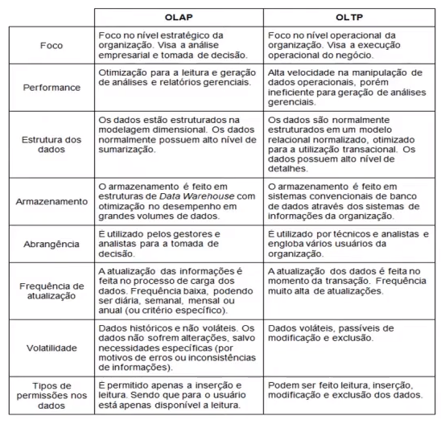
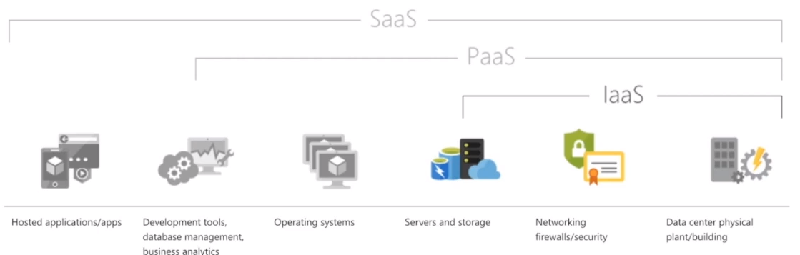

# Arquitetura de Sistemas Avançado

*Anderson de Alencar Barros, 6 de abril de 2021*

#### Sumário

- **[Conceitos de integração de sistemas e mensageria](#1)**
- **[Arquitetura de dados não estruturados e business intelligence](#2)**
  - [Business Intelligence em Modelos de Dados](#2.1)
  - [Data Warehouse](#2.2)
  - [Big Data e dados não estruturados](#2.3)
  - [Data Lake](#2.4)
- **[Fundamentos de arquitetura de aplicações em nuvem](#3)**
- **[Desenvolvimento e operação de software integrado](#4)**

## Conceitos de integração de sistemas e mensageria 

**Arquitetura de Mensageria** serviços se comunicam por meio de criando e lendo mensagens.

| Vantagens              | Desvantagens            |
| ---------------------- | ----------------------- |
| Desacoplamento         | Single Point of Failure |
| Fácil Plug & Play      | Difícil Monitoramento   |
| Comunicação assíncrona |                         |
| Simples Escalabilidade |                         |
| Broadcasting           |                         |
| Permite Event Source   |                         |

O **Gerenciamento de erros** pode ser feito por

- **Dead Letter Queue (Fila de Re-Tentativas)** ver quem produziu uma mensagem de erro e tentar executa-la novamente
- **Monitoramento entre Serviços** 
- **Rastreamento de Fluxo** ver o ponto inicial do problema por meio de logs

## Arquitetura de dados não estruturados e business intelligence 

### Business Intelligence em Modelos de Dados 

**Business Intelligence (BI)** é um ecossistema formado de ferramentas, infraestrutura, profissionais e dados para que eles sejam interpretados e decisões melhores sejam tomadas.

Esses dados podem ser dados operacionais, dados gerenciais, pesquisas de campo ou indicadores de mercado e entre outros.

### Data Warehouse 

Modo de modelar os dados para o BI. 

**OLTP (Online Transaction Processing):** transações do usuário, geralmente de grandes quantidades de usuários.

**OLAP (Online Analytical Processing):** análise dos dados, focado para poucos usuários, como diretores, gerentes e etc.

### Big Data e dados não estruturados 

**Big Data** é um termo que descreve um grande volume de dados, seja estruturados ou não e de ferramentas usada para extrair informações.

O modelo relacional fornece um sistemas de regras muito rígidas para bancos de dados, porém pensando em mais flexibilidade surgiu os **dados semi estruturados**, como o JSON, XML e os **bancos de** **dados não relacionais** ou **NoSQL**. 

### Data Lake 

**Data Lake** é similar ao Big Data, porém combina dados estruturados e não estruturados, gerando transformações para catalogar e extrair informações.

## Fundamentos de arquitetura de aplicações em nuvem 

### Cloud Computing 

**Cloud Computing** provedor que faz o gerenciamento de hardware e software. Paga apenas o que consome.

**IAAS (Infrastructure as a Service)** funciona como uma máquina alugada.

**PAAS (Platform as a Service)** fornece o hardware e software e um meio de automatizar o processo.

**BAAS (Backend as a Service)** toda a complexidade do banco de dados é automatizada, por exemplo o Firebase.

### Serverless 

Não precisar dar conta do servidor. Tem-se um serviço que gerencia automaticamente do servidor e os aplicativos ganham escalabilidade automaticamente, porém custa mais caro e aumenta a complexidade.

## Desenvolvimento e operação de software integrado 

**DevOps** é um conjunto de práticas que integram e automatizam os processos entre equipes de desenvolvimento, operações e apoio para produção rápida e confiável de software.

**DevOps** baseia-se na cultura de colaboração entre equipes.

**Framework CALMS**

- **Culture** disposição, DevOps veio para resolver problemas humanos

- **Automation** eliminar trabalho manual repetitivo

- **Lean** entregar valor ao cliente, ser objetivo e enxuto.

- **Measurement** mensurar e obter métricas é essencial para novas melhorias, dar previsibilidade, analisar falhas e etc.

- **Sharing** gerar conhecimento, descentralizar o conhecimento

**3 caminhos**

- **Flow** otimização do fluxo, eliminar desperdícios com metodologias ágeis
- **Feedback** visam resolver problemas o quanto antes, alertar sobre qualquer falha. Monitoramento ajuda a gerar feedback
- **Learning** aprendizado contínuo, discussões técnicas. A equipe realizando experimentos para gerar melhorias. Elimina a cultura da culpa.

**Continuous Integration** é uma série de etapas de testes.

**Continuous Inspection** inspeção da qualidade do código, identificar a complexidade ciclomática do software, identificar código duplicado, vulnerabilidades, padronização, quantidade de linhas e etc.

