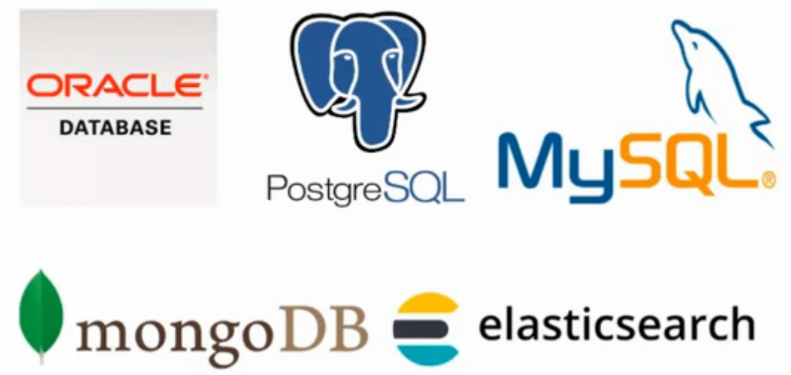
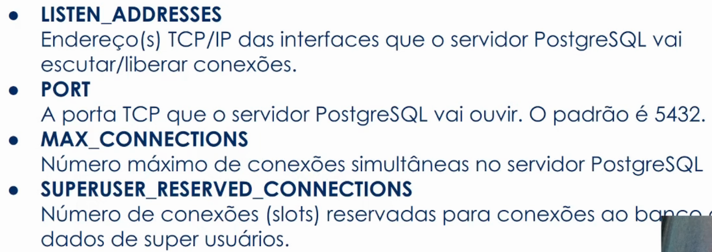
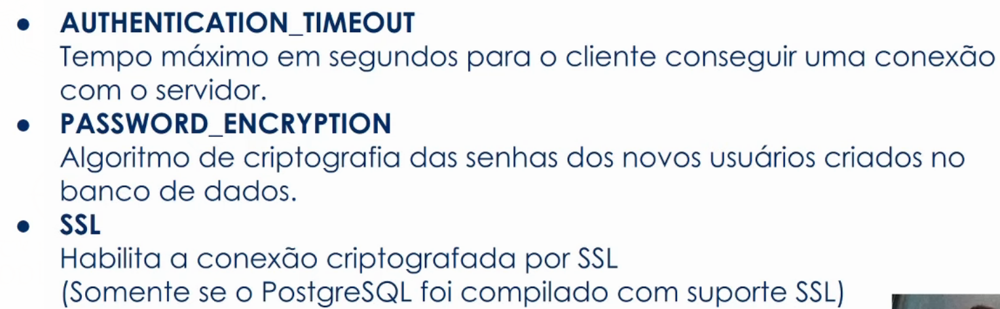
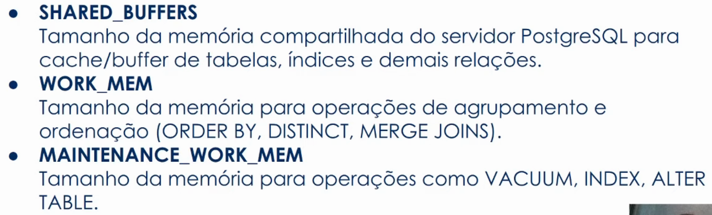
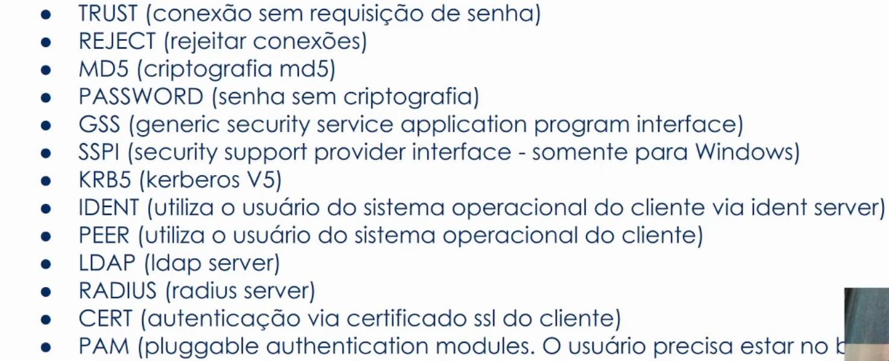
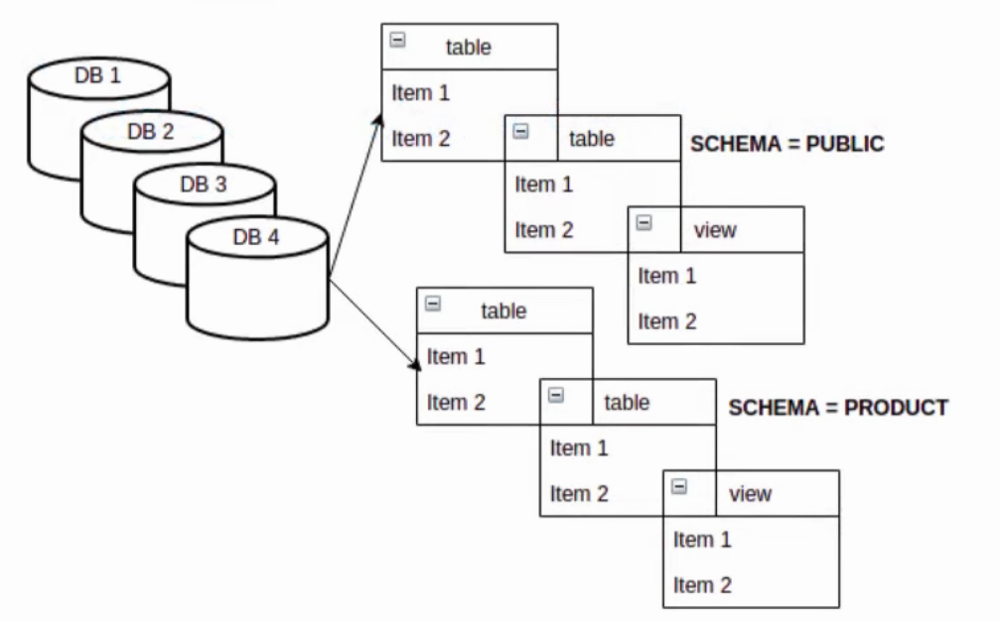
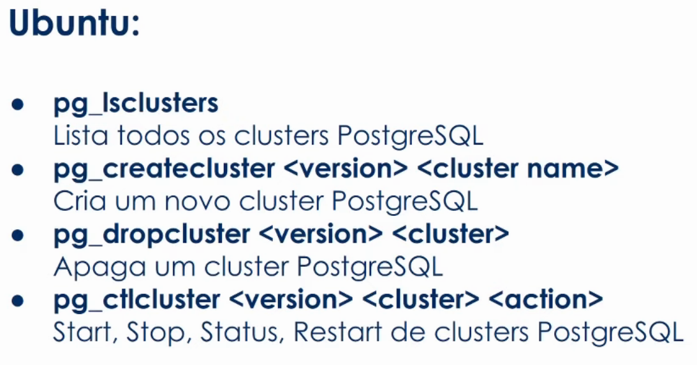
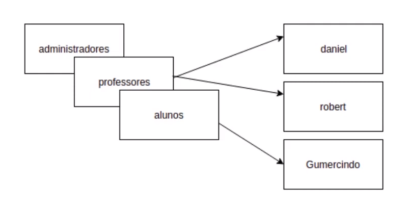
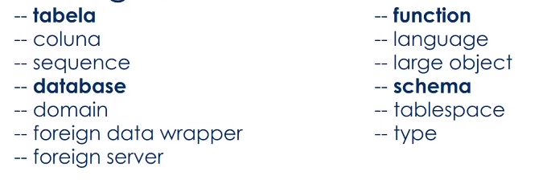

# Conceitos e melhores práticas com bancos de dados PostgreSQL

*Anderson de Alencar Barros*

#### Sumário

- **[Introdução](#1)**
- **[Objetos e tipos de dados do PostgreSQL](#2)**
  - [Arquivos de Configurações](#2.1)
    - [O arquivo `postgresql.conf`](#2.1.1)
    - [O arquivo `pg_hba.conf`](#2.1.2)
    - [O arquivo `pg_ident.conf`](#2.1.3)
  - [Comandos Administrativos](#2.2)
  - [Administrando usuários](#2.3)
    - [Administrando users/roles/groups](#2.3.1)
    - [Administrando acessos](#2.3.2)
  - [Objetos e comandos do banco de dados](#2.4)
    - [Database, Schemas e Objetos](#2.4.1)
    - [Tabelas, Colunas e Tipos de Dados](#2.4.2)
    - [DML e DDL](#2.4.3)
- **[Fundamentos da Structured Query Language (SQL)](#3)**
- **[Comandos avançados da Structured Query Language (SQL)](#4)**

## Introdução <a name="1"></a>

**Dados** são valores brutos, fatos, observações documentadas. registros soltos que são armazenados sem qualquer tratamento.

**Informações** são dados estruturados, organizados. Conjunto de dados, relacionados entre si e que dá sentido aos dados.

**Modelo Relacional** classifica e organiza as informações em tabelas. As linhas, também chamadas de tuplas, são onde os dados são organizados e as colunas são os campos da tabela, os atributos.

**Chave Primária (PK)** campos que nunca se repetem, sendo assim, úteis para criação de relacionamentos entre tabelas.

**Chave Estrangeira (FK)** é a referência de uma PK de outra tabela ou até da mesma para criar um relacionamento.

**Sistema de Gerenciamento de Banco de Dados (SGBD)** são software responsável pela gestão de um banco de dados, facilitando a administração.



**PostgreSQL** é um SGBD open source de gestão de um banco de dados relacional.

## Objetos e tipos de dados do PostgreSQL <a name="2"></a>

### Arquivos de Configurações <a name="2.1"></a>

O PostgreSQL é formado por alguns arquivos de configurações: `postgresql.conf`, `pg_hba.conf` e o `pg_ident.conf`.

#### O arquivo `postgresql.conf` <a name="2.1.1"></a>

O arquivo`postgresql.conf` define e armazena configurações do servidor PostgreSQL, de como o servidor vai se comportar no sistema operacional. Geralmente, localizado dentro da pasta `PGDATA`.

A view `pg_settings` mostra todas as configurações atuais em execução.

```sql
SELECT name, setting
FROM pg_settings;
```

**Configurações de Conexão**





**Configurações de Memória**



#### O arquivo `pg_hba.conf` <a name="2.1.2"></a>

O arquivo `pg_hba.conf` é responsável pelo controle de autenticação dos usuários no servidor PostgreSQL. O arquivo pode ter vários formatos diferentes:

```
local         database  user  auth-method [auth-options]
host          database  user  address     auth-method  [auth-options]
hostssl       database  user  address     auth-method  [auth-options]
hostnossl     database  user  address     auth-method  [auth-options]
hostgssenc    database  user  address     auth-method  [auth-options]
hostnogssenc  database  user  address     auth-method  [auth-options]
host          database  user  IP-address  IP-mask      auth-method  [auth-options]
hostssl       database  user  IP-address  IP-mask      auth-method  [auth-options]
hostnossl     database  user  IP-address  IP-mask      auth-method  [auth-options]
hostgssenc    database  user  IP-address  IP-mask      auth-method  [auth-options]
hostnogssenc  database  user  IP-address  IP-mask      auth-method  [auth-options]
```

É possível configurar de qual o local está vindo o acesso, qual o banco de dados, o usuário, a forma de autenticação e algumas opções de autenticação.

Métodos de Autenticação



Mais detalhes em [The pg_hba.conf File](https://www.postgresql.org/docs/current/auth-pg-hba-conf.html).

#### O arquivo `pg_ident.conf` <a name="2.1.3"></a>

O arquivo `pg_ident.conf` é responsável por mapear os usuários do sistema operacional com os usuários do banco de dados. Está localizado dentro do `PGDATA`. O arquivo tem o seguinte formato:

```
# MAPNAME       SYSTEM-USERNAME         PG-USERNAME

omicron         bryanh                  bryanh
omicron         ann                     ann
# bob has user name robert on these machines
omicron         robert                  bob
# bryanh can also connect as guest1
omicron         bryanh                  guest1
```

`MAPNAME` é apenas um nome genérico para referenciar a relação. `SYSTEM-USERNAME` é o nome do usuário no sistema operacional e `PG-USERNAME` é o nome do usuário quando entra no banco de dados.

No exemplo acima, ninguém alem de  `bryanh`, `ann` ou `robert`  têm acesso ao banco de dados. O usuário `robert` só pode acessar o banco quando se conecta com `bob`, `ann` só pode acessar como `ann` e `bryanh` tem permissão de acessar como `bryanh` e `guest1`.

Mais detalhes em [User Name Maps](https://www.postgresql.org/docs/current/auth-username-maps.html).

### Comandos Administrativos <a name="2.2"></a>

**Clusters** são uma coleção de banco de dados que compartilham as mesmas configurações do PostgreSQL e do sistema operacional.

**Banco de dados** são um conjunto de schemas com seus objetos e relações.

**Schemas** são um conjunto de objetos/relações, como tabelas, funções, views e etc.





### Administrando usuários <a name="2.3"></a>

**Roles** (papéis ou funções), users e grupo de usuários são perfis de atuação em um banco de dados e possuem permissões em comum ou específicas.

Roles podem pertencer a outras roles.



Podemos criar roles com o comando

```sql
CREATE ROLE name [ [ WITH ] option [ ... ] ]

where option can be:

      SUPERUSER | NOSUPERUSER
    | CREATEDB | NOCREATEDB
    | CREATEROLE | NOCREATEROLE
    | INHERIT | NOINHERIT
    | LOGIN | NOLOGIN
    | REPLICATION | NOREPLICATION
    | BYPASSRLS | NOBYPASSRLS
    | CONNECTION LIMIT connlimit
    | [ ENCRYPTED ] PASSWORD 'password' | PASSWORD NULL
    | VALID UNTIL 'timestamp'
    | IN ROLE role_name [, ...]
    | IN GROUP role_name [, ...]
    | ROLE role_name [, ...]
    | ADMIN role_name [, ...]
    | USER role_name [, ...]
    | SYSID uid
```

Mais detalhes em [CREATE ROLE](https://www.postgresql.org/docs/current/sql-createrole.html).

Deve-se tomar extremo cuidado com a role `SUPERUSER` por ter permissões quase ilimitadas no banco de dados.

`CREATEDB` e `NOCREATEDB` tem permissões ou não de criar banco de dados.

`CREATEROLE` e `NOCREATEROLE` permissão ou não de criar novas roles.

`INHERIT` e `NOINHERIT` diz que se uma role pertencer a outra, ela vai herdar todos os privilégios daquela role, porém não herda as permissões de administradores.

`LOGIN` e `NOLOGIN` pode ou não logar no banco de dados.

`REPLICATION` e `NOREPLICATION` serve para fazer um backup, uma replicação. Apenas administradores podem criar essa role

`BYPASSRLS` e `NOBYPASSRLS` refere-se se a role pode desviar o row-level security (RLS).

`CONNECTION LIMIT <connlimit>` definir quantidade de conexões simultâneas uma role pode ser.

`[ ENCRYPTED ] PASSWORD 'password'`e `PASSWORD NULL` define uma senha para aquela role, por padrão a senha já é encriptada.

`VALID UNTIL <timestamp>` define uma data e tempo que a role pode acessar o banco de dados.

`IN GROUP <role_name>` é obsoleto, não é mais usado e substituído por `IN ROLE`.

`IN ROLE <role_name>` a nova role criada passa a pertencer a role citada em `role_name`.

`ROLE <role_name>` a role passada em `role_name` passa a pertencer a role criada.

`ADMIN <role_name>` garante acesso administrativo e pode, por exemplo, criar e excluir roles desse grupo de roles.

`USER <role_name>` obsoleto, mantido por questões de compatibilidade.

`SYSID <uid>` obsoleto, mantido por questões de compatibilidade.

**Exemplos**

```sql
CREATE ROLE administradores
    CREATEDB
    CREATEROLE
    INHERIT
    NOLOGIN
    REPLICATION
    BYPASSRLS
    CONNECTION LIMIT -1;
```

```sql
CREATE ROLE professores
    NOCREATEDB
    NOCREATEROLE
    INHERIT
    NOLOGIN
    NOBYPASSRLS
    CONNECTION LIMIT 10;
```

```sql
CREATE ROLE alunos
    NOCREATEDB
    NOCREATEROLE
    INHERIT
    NOLOGIN
    NOBYPASSRLS
    CONNECTION LIMIT 90;
```

#### Administrando users/roles/groups <a name="2.3.1"></a>

Para a role assumir as permissões de outra role é necessário a opção `INHERIT`.

No momento da criação da role

​    `IN ROLE` a role passa a pertencer a role informada

​    `ROLE` a role informada passa a pertencera nova role

Após a criação, existe o comando que define acesso a privilégios

`GRANT [ role a ser condedida ] TO [ role que assumirá permissões ]`

Por exemplo,

```sql
GRANT professores TO anderson;
```

cede as permissões dos `professores` para `anderson`.

Para dessaciar roles, pode se usar o comando

`REVOKE [role que será revogada] FROM [ role que perderá permissões ]`

Por exemplo,

```sql
REVOKE professores FROM anderson;
```

neste caso, `anderson` perde as permissões de `professores`.

Para alterar uma role, pode-se usar

```sql
ALTER ROLE role_specification [ WITH ] option [ ... ]

where option can be:

      SUPERUSER | NOSUPERUSER
    | CREATEDB | NOCREATEDB
    | CREATEROLE | NOCREATEROLE
    | INHERIT | NOINHERIT
    | LOGIN | NOLOGIN
    | REPLICATION | NOREPLICATION
    | BYPASSRLS | NOBYPASSRLS
    | CONNECTION LIMIT connlimit
    | [ ENCRYPTED ] PASSWORD 'password' | PASSWORD NULL
    | VALID UNTIL 'timestamp'
```

Mais detalhes em [ALTER ROLE](https://www.postgresql.org/docs/current/sql-alterrole.html).

Para deletar uma role

```sql
DROP ROLE <role_name>
```

#### Administrando acessos <a name="2.3.2"></a>

`GRANT` são privilégios de acesso aos objetos do banco de dados. São eles:



Para definir permissões em banco de dados,

```sql
GRANT { { CREATE | CONNECT | TEMPORARY | TEMP } [, ...] | ALL [ PRIVILEGES ] }
    ON DATABASE database_name [, ...]
    TO role_specification [, ...] [ WITH GRANT OPTION ]
```

Ou em tabelas,

```sql
GRANT { { SELECT | INSERT | UPDATE | DELETE | TRUNCATE | REFERENCES | TRIGGER }
    [, ...] | ALL [ PRIVILEGES ] }
    ON { [ TABLE ] table_name [, ...]
         | ALL TABLES IN SCHEMA schema_name [, ...] }
    TO role_specification [, ...] [ WITH GRANT OPTION ]
```

E em schemas

```sql
GRANT { { CREATE | USAGE } [, ...] | ALL [ PRIVILEGES ] }
    ON SCHEMA schema_name [, ...]
    TO role_specification [, ...] [ WITH GRANT OPTION ]
```

Além de vários outros em [GRANT](https://www.postgresql.org/docs/current/sql-grant.html).

`REVOKE` remove permissões da role.

Por exemplo, nos bancos de dados

```sql
REVOKE [ GRANT OPTION FOR ]
    { { CREATE | CONNECT | TEMPORARY | TEMP } [, ...] | ALL [ PRIVILEGES ] }
    ON DATABASE database_name [, ...]
    FROM role_specification [, ...]
    [ CASCADE | RESTRICT ]
```

E em schemas

```sql
REVOKE [ GRANT OPTION FOR ]
    { { CREATE | USAGE } [, ...] | ALL [ PRIVILEGES ] }
    ON SCHEMA schema_name [, ...]
    FROM role_specification [, ...]
    [ CASCADE | RESTRICT ]
```

Mais detalhes em [REVOKE](https://www.postgresql.org/docs/current/sql-revoke.html).

### Objetos e comandos do banco de dados <a name="2.4"></a>

#### Database, Schemas e Objetos <a name="2.4.1"></a>

#### Tabelas, Colunas e Tipos de Dados <a name="2.4.2"></a>

#### DML e DDL <a name="2.4.3"></a>