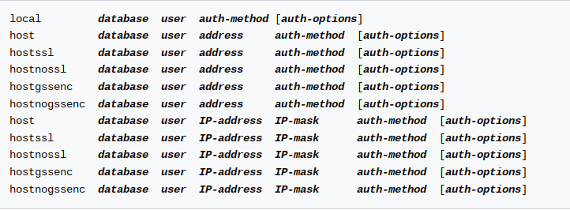
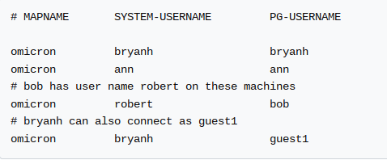

# Conceitos e melhores práticas com bancos de dados PostgreSQL

#### Sumário

- **[Introdução](#1)**
- **[Objetos e tipos de dados do PostgreSQL](#2)**
  - [Arquivos de Configurações](#2.1)
  - [Comandos Administrativos](#2.2)
- 

## Introdução <a name="1"></a>

**Dados** são valores brutos, fatos, observações documentadas. registros soltos que são armazenados sem qualquer tratamento.

**Informações** são dados estruturados, organizados. Conjunto de dados, relacionados entre si e que dá sentido aos dados.

**Modelo Relacional** classifica e organiza as informações em tabelas. As linhas, também chamadas de tuplas, são onde os dados são organizados e as colunas são os campos da tabela, os atributos.

**Chave Primária (PK)** campos que nunca se repetem, sendo assim, úteis para criação de relacionamentos entre tabelas.

**Chave Estrangeira (FK)** é a referência de uma PK de outra tabela ou até da mesma para criar um relacionamento.

**Sistema de Gerenciamento de Banco de Dados (SGBD)** são software responsável pela gestão de um banco de dados, facilitando a administração.


**PostgreSQL** é um SGBD open source de gestão de um banco de dados relacional.

## Objetos e tipos de dados do PostgreSQL <a name="2"></a>

### Arquivos de Configurações <a name="2.1"></a>

O PostgreSQL é formado por alguns arquivos de configurações: `postgresql.conf`, `pg_hba.conf` e o `pg_ident.conf`.

O arquivo`postgresql.conf` define e armazena configurações do servidor PostgreSQL, de como o servidor vai se comportar no sistema operacional. Geralmente, localizado dentro da pasta `PGDATA`.

A view `pg_settings` mostra todas as configurações atuais em execução.

```sql
SELECT name, setting
FROM pg_settings;
```

**Configurações de Conexão**


**Configurações de Memória**


O arquivo `pg_hba.conf` é responsável pelo controle de autenticação dos usuários no servidor PostgreSQL. O arquivo pode ter vários formatos diferentes:



É possível configurar de qual o local está vindo o acesso, qual o banco de dados, o usuário, a forma de autenticação e algumas opções de autenticação.

**Métodos de Autenticação**


[The pg_hba.conf File](https://www.postgresql.org/docs/current/auth-pg-hba-conf.html)

O arquivo `pg_ident.conf` é responsável por mapear os usuários do sistema operacional com os usuários do banco de dados. Está localizado dentro do `PGDATA`. O arquivo tem o seguinte formato:



`MAPNAME` é apenas um nome genérico para referenciar a relação. `SYSTEM-USERNAME` é o nome do usuário no sistema operacional e `PG-USERNAME` é o nome do usuário quando entra no banco de dados.

No exemplo acima, ninguém alem de  `bryanh`, `ann` ou `robert`  têm acesso ao banco de dados. O usuário `robert` só pode acessar o banco quando se conecta com `bob`, `ann` só pode acessar como `ann` e `bryanh` tem permissão de acessar como `bryanh` e `guest1`.

[User Name Maps](https://www.postgresql.org/docs/current/auth-username-maps.html)

### Comandos Administrativos <a name="2.2"></a>

**Clusters** são uma coleção de banco de dados que compartilham as mesmas configurações do PostgreSQL e do sistema operacional.

**Banco de dados** são um conjunto de schemas com seus objetos e relações.

**Schemas** são um conjunto de objetos/relações, como tabelas, funções, views e etc.


