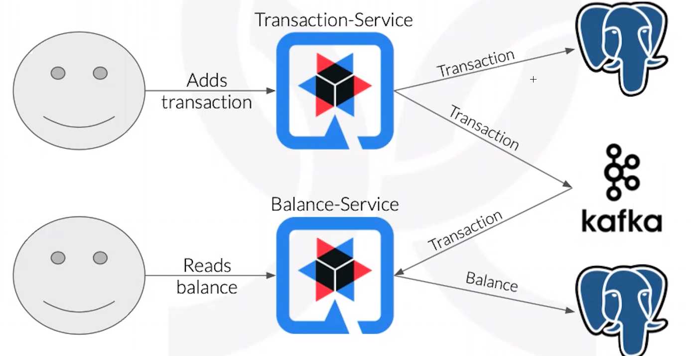

# Criando um sistema de orçamento, utilizando CQRS, Quarkus, Kafka e deploy no EKS

Fazer uma aplicação Quarkus rodar no Kubernetes do AWS.

A ideia é separar o serviço de escrita do serviço de leitura do banco de dados. No caso de um banco, ler o saldo requer ler os gastos, isso consistiria de ler uma tabela toda vez que o usuário pede, logo geraria um problema de desempenho. 

Porém, caso o cliente peça o saldo e ainda existir alguma mensagem não processada, pode existir um saldo que não é real, ou seja, é impossível ter uma aplicação de alta performance e uma consistência nos dados, é preciso balancear.

Teorema **CAP** - Consistência, Disponibilidade (Availability) e Performance. Dá pra ter dois a custas de um. 

**Kubernetes** ajuda automatizar algumas taferas, como gerar instâncias, deploy de uma nova versão e a escalar a aplicação.

Aplicação

`transaction-service` é um projeto Quarkus, 

Quarkus é uma tecnologia em Java que usa pouca memória e inicia rápido. Para esse desempenho, é preciso construir o artefato de forma nativa que roda somente no docker Linux.

A inicialização rápida é útil em momentos que a aplicação "dorme" e não está recebendo requisições. Se fosse Spring Boot e o app estivesse dormindo, quando recebesse uma requisição haveria um delay para iniciar.

**Proxy reverso** fica na ponta da arquitetura para fazer a conexão com o mundo exterior, é o único que se comunica internamente da aplicação.

**Ingress** permite o ingresso da conectividade (internet) para dentro do cluster. 

