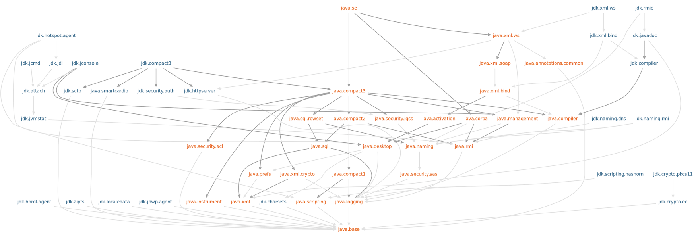

# Desenvolvimento avançado em Java :coffee:

#### Sumário

- **[Paradigma Funcional no Java](#paradigma-funcional-no-java)**
  - [Conceitos fundamentais da Programação Funcional](#conceitos-fundamentais-da-programacao-funcional)
  - [Expressões Lambda no Java](#expressoes-lambda)
  - [Recursividade em Java](#recursividade-em-java)
- **[Interfaces funcionais](#interfaces-funcionais)**
- **[Processamento Assíncrono e Paralelo](#processamento-assincrono-e-paralelo)**
- **[Modularização do Java](#modularizacao-no-java)**
- **[Java 10](#java-10)**
- **[Java 11](#java-11)**

## Paradigma Funcional no Java <a name="paradigma-funcional-no-java"></a>

> Programação funcional é o processo de construir software através de composição de funções puras, evitando compartilhamento de estados, dados mutáveis e efeitos colaterais. É declarativa ao invés de imperativa.
>
> Eric Elliott

**Paradigma Imperativo** é aquele que expressa o código através de comandos ao computador, nele é possível ter controle do estados dos objetos.

**Paradigma Funcional** damos uma regra, uma declaração de como queremos que o programa se comporte. 

### Conceitos fundamentais da Programação Funcional <a name="conceitos-fundamentais-da-programacao-funcional"></a>

- **Composição de funções** é criar uma nova função através da composição de outras. Seria como receber uma função como parâmetro ou o uso da `Streams`. Além de melhorar a legibilidade do código.

Por exemplo, dado um ArrayList

```java
import java.util.ArrayList;
import java.util.List;

public class Example {
    public static void main(String[] args) {
        List<Integer> valores = new ArrayList<>();
        valores.add(1);
        valores.add(2);
        valores.add(3);
        valores.add(4);
    }
}
```

No Paradigma Funcional, temos

```java
valores.stream()
        .filter(num -> num % 2 == 0)
        .map(num -> num * 2)
        .forEach(System.out::println);
```

Enquanto que no Paradigma Imperativo teríamos

```java
for (int i = 0; i < valores.size(); i++) {
    int v = 0;
    if (valores.get(i) % 2 == 0) {
        v = valores.get(i) * 2;

        if (v != 0)
            System.out.println(v);
    }
}
```

Logo, no Paradigma Funcional temos um código mais limpo, organizado e fácil de depurar.

- **Funções Puras** são chamadas assim pois quando invocadas mais de uma vez produzem exatamente o mesmo resultado.

- **Imutabilidade** uma vez que uma variável que recebeu um valor ou um objeto é criado não é permitido que seja modificado.

### Expressões Lambda no Java <a name="expressoes-lambda"></a>

Os lambdas obedecem o conceito de paradigma funcional e com eles é possível facilitar a legibilidade do código, além de uma alta produtividade para lidar com objetos.

**Interface Funcional** são interfaces que possuem apenas um método abstrato a nível de classe. Com apenas um método, o compilador já consegue interpretar do que se trata.

```java
public class LambdaExample {
    public static void main(String[] args) {
        // Declaração de uma função lambda
        // com uma Interface Funcional
        Funcao funcao = valor -> "Sr. " + valor;
        // Chamada da função lambda
        System.out.println(funcao.gerar("Anderson"));
		
        // Quando a lambda tem mais de uma instrução, é necessário uso de chaves {}.
        // Se o return for diferente de void, é preciso especificar
        Funcao funcao1 = valor -> {
            String prefixo = "Sr. ";
            String nome = prefixo + valor;
            return nome;
        };
		
        System.out.println(funcao1.gerar("Ana"));
    }
}

@FunctionalInterface
interface Funcao {
    String gerar(String s);
}
```

### Recursividade em Java <a name="recursividade-em-java"></a>

Uma função chama a si mesma repetidamente até atingir uma condição de parada. Cada chamada gera uma nova alocação na pilha de execução e alguns dados podem estar em um escopo global ou local. 

Toda recursividade tem dois casos: o **caso base**, que significa o critério de parada e o **caso recursivo**, que chama de novo a função e continua a recursão.

Recursão tem a desvantagem de consumir muita memória e com várias chamadas de recursão, existe uma redução de desempenho.

```java
public static int fat(int v) {
 	// caso base
    if(v == 1) {
        return v;
    } else {
        return v * fat(v - 1); // caso recursivo
    }
}
```

**Tail Recursion ou Tail Call** é uma recursão onde não há nenhuma linha de código após a chamada do próprio método, não há nenhum processamento a ser feito após a chamada recursiva. É lançado um estouro de pilha (StackOverflow) caso a recursão fique muito grande, sendo mais comum em linguagens que tem um paradigma funcional.

```java
// Exemplo de fatorial com Tail Recursion
// O parâmetro result armazena o valor em cada chamada
public static int fatTailCall(int v, int result) {
    if (v == 0)
        return result;

    return fatTailCall(v - 1, result * v);
}
```

**Memoization** é uma técnica de otimização que consiste no cache do resultado de uma função, baseado nos parâmetros de entrada, com isso é possível uma execução mais rápida. Técnica muito usada em Programação Dinâmica.

```java
static Map<Integer, Integer> mapFatorial = new HashMap<>();
public static int fatMemoization(Integer v) {
    if (v == 1)
        return v;
    else {
        if (mapFatorial.containsKey(v))
            return mapFatorial.get(v);
        else {
            Integer resultado = v * fatMemoization(v - 1);
            mapFatorial.put(v, resultado);
            return resultado;
        }
    }
}
```

## Interfaces funcionais <a name="interfaces-funcionais"></a>

**Funções de alta ordem** são funções que recebem uma função por parâmetro ou retornam uma função.

```java
import java.util.function.Consumer;

public class FuncaoAltaOrdem {
    public static void main(String[] args) {
        Calculo calculo = (a,b) -> a + b;
        Calculo subtrair = (a,b) -> a - b;
        Calculo dividir = (a,b) -> a / b;
        Calculo multiplicar = (a,b) -> a * b;

        System.out.println(executarOperacao(calculo, 1, 3));
        System.out.println(executarOperacao(subtrair, 1, 3));
        System.out.println(executarOperacao(dividir, 1, 3));
        System.out.println(executarOperacao(multiplicar, 1, 3));
    }

    public static int executarOperacao(Calculo c, int a, int b) {
        return c.calcular(a, b);
    }
}

interface Calculo {
    public int calcular(int a, int b);
}
```

O pacote `java.util.function` é focado em Interfaces Funcionais. São elas: Consumer, Supplier, Predicate e Function.

- **Consumer** tem o método `accept()` que aceita uma única entrada e não tem saída, apenas recebe um parâmetro e consome este parâmetro.

```java
// import java.util.function.Consumer;
Consumer<String> print = frase -> System.out.println(frase);
print.accept("Oi, eaw");

// Method Reference
Consumer<String> printString = System.out::println;
printString.accept("Oi, tudo ok");
```

Consumer tem implementações específicas para tipos integer, double e long com o IntConsumer, DoubleConsumer, and LongConsumer.

- **Function** tem o método `apply()` recebem um parâmetro e deve ter um retorno.

```java
// import java.util.function.Function;
Function<String, String> nameReversed = name -> new StringBuilder(name).reverse().toString();
Function<String, Integer> StringToIntTimesTwo = string -> Integer.valueOf(string) * 2;

var i = StringToIntTimesTwo.apply("3");
// 6

var s = nameReversed.apply("Anderson");
// nosrednA
```

- **Predicate** tem o método `test()` recebe um parâmetro e retorna um boolean.

```java
// import java.util.function.Predicate;

Predicate<String> isEmpty = String::isEmpty;

var b = isEmpty.test("");
// true

List<String> names = Arrays.asList("John", "Smith", "Samueal", "Catley", "Sie");
Predicate<String> nameStartsWithS = str -> str.startsWith("S");
names.stream().filter(nameStartsWithS).forEach(System.out::println);
// Smith
// Samueal
// Sie
```

- **Supplier** tem o método `get()` que não recebem parâmetros e apenas retorna valores.

```java
Supplier<Double> doubleSupplier1 = () -> Math.random();
DoubleSupplier doubleSupplier2 = Math::random;

System.out.println(doubleSupplier1.get());
System.out.println(doubleSupplier2.getAsDouble());
```

Veja as variantes com tipo primitivos,

```java
IntSupplier int getAsInt();
DoubleSupplier double getAsDouble();
LongSupplier long getAsLong();
BooleanSupplier boolean getAsBoolean();
```

Todas essas interfaces funcionais são muito úteis, por exemplo, no uso da `Streams`, onde cada função recebe um tipo de interface funcional, sendo possível facilitar ainda mais a produção do código.

## Processamento Assíncrono e Paralelo <a name="processamento-assincrono-e-paralelo"></a>

- **Thread** é um pequeno programa que trabalha como um subsistema, sendo uma forma de um processo de autodividir em duas ou mais tarefas. Essas tarefas múltiplas podem ser executadas simultaneamente para rodar mais rápido do que um programa em um único bloco.
- **Processamento síncrono** são todos os processamentos que ocorrem em sequência, em fila. É preciso que um processo termine para que outro seja executado, ou seja, são dependentes.
- **Processamento assíncrono** é quando dois ou mais processos são realizados ao mesmo tempo, sem que um processo necessite que o outro termine para ser executado.

Considere, por exemplo, gerar um relatório em PDF ao mesmo tempo que fazemos uma barra de carregamento. 

```java
// Uma forma de fazer uma thread, herdando a classe Thread
class GeradorPDF extends Thread {

    @Override
    public void run() {
        try {
            System.out.println("Iniciado!");
            Thread.sleep(5000);
        } catch (InterruptedException e) {
            e.printStackTrace();
        }
        System.out.println("Gerado o PDF");
    }
}
```

Ao declarar um thread precisamos implementar o método `run()`. Outra forma de declarar um Thread é da seguinte forma

```java
 Thread thread = new Thread(new GeradorPDF());
```

Também precisamos da classe que gera a barra de carregamento. As threads do `GeradorPDF` e `BarradeCarregamento` precisam se comunicar de alguma forma, `BarradeCarregamento` precisa saber se a thread do `GeradorPDF` está ativa e executando, e o meio de fazer isso é passando pelo construtor

```java
class BarradeCarregamento extends Thread {
    private Thread geradorPDF;
	
    // Recebe a thread GeradorPDF
    public BarradeCarregamento(Thread geradorPDF) {
        this.geradorPDF = geradorPDF;
    }

    @Override
    public void run() {
        while (true) {
            try {
                Thread.sleep(500);
            } catch (InterruptedException e) {
                e.printStackTrace();
            }
			
            // verifica se a thread está ativa
            if (!geradorPDF.isAlive()) {
                break;
            }
            System.out.println("Loading...");
        }
    }
}
```

Na `main`,

```java
public static void main(String[] args) { 
    GeradorPDF geradorPDF = new GeradorPDF();
    BarradeCarregamento barradeCarregamento = new BarradeCarregamento(geradorPDF);
	
    // Chama a execução das threads
    geradorPDF.start();
    barradeCarregamento.start();

}
```


Vale lembrar que a `main` é executada em uma thread diferente, então deve-se prestar atenção ao fluxo do programa ao usar multithreading.

- **Execução da API do Java 8:** O problema da classe `Threads` é que não é possível retornar valores, assim, foram adicionadas as classes `Future`, `FutureTask` e `Callable`.

Também é possível paralelizar e execução da `Streams` com as funções `parallel()` e `parallelStream()`. É recomendado usar apenas quando os objetos não dependam um do outro e para uma grande quantidade de objetos.

O exemplo abaixo mostra a execução de um longo fatorial em paralelo e não paralelo,

```java
import java.util.stream.IntStream;

public class ParallelStreams {
    public static void main(String[] args) { 
        long inicio;
        long fim;

        // Não Paralelo
        inicio = System.currentTimeMillis();
        IntStream.range(1, 100000).forEach(num -> fatorial(num));
        fim = System.currentTimeMillis();
        
        System.out.println("Tempo de execução: " + (fim - inicio));

        // Paralelo
        inicio = System.currentTimeMillis();
        IntStream.range(1, 100000).parallel().forEach(num -> fatorial(num));
        fim = System.currentTimeMillis();
        
        System.out.println("Tempo de execução Paralelo: " + (fim - inicio));
    }

    public static long fatorial(long num) {
        long fat = 1;

        for (long i = 2; i <= num; i++) {
            fat *= i;
        }

        return fat;
    }
}
```

É possível ver a diferença no tempo de execução,

```
Tempo de execução: 4149
Tempo de execução Paralelo: 1409
```

Também é possível executar uma `Streams`  com o método `parallelStream()`,

```java
List<String> nomes = Arrays.asList("Anderson", "Ana", "Carlos");
nomes.parallelStream().forEach(System.out::println);
```

## Modularização no Java <a name="modularizacao-no-java"></a>

Também chamado de **Jigsaw**, a ideia por trás não é só criar um sistema de módulos, mas também aplica-lo em toda a plataforma JDK em busca de melhor organização e desempenho.

Dessa forma,

- diminui o acoplamento entre componentes
- deixa claro as dependências entre os componentes
- esconde a implementação por meio de um forte encapsulamento



## Java 10 <a name="java-10"></a>

A mudança mais vísivel no Java 10 foi a inclusão da declaração de variáveis com `var`, ou seja, onde o tipo das variáveis são inferidos.

Por exemplo, se antes tinhamos

```java
URL url = new URL("http://www.oracle.com/"); 
URLConnection conn = url.openConnection(); 
Reader reader = new BufferedReader(
    new InputStreamReader(conn.getInputStream()));
```

Com o `var` podemos deixar o código mais fácil de escrever, deixando o código menos verboso

```java
var url = new URL("http://www.oracle.com/"); 
var conn = url.openConnection(); 
var reader = new BufferedReader(
    new InputStreamReader(conn.getInputStream()));
```

O `var` é um nome de tipo reservado, não uma palavra chave, o que significa que o código existente que usa `var` como variável, método ou nome de pacote não é afetado. No entanto, o código que usa var como uma classe ou nome de interface é afetado e a classe ou interface precisa ser renomeada.

Apenas é possível usar `var` 

- a nível de escopo, nunca a nível de classe
- deve ser sempre inicializada, atribuído um valor
- não pode ser usado como parâmetro
- podemos usar em loops, indexadores e no try-catch-resources 

## Java 11 <a name="java-11"></a>

O Java 11 conta com duas novidades principais: inferência dentro das expressões lambdas e um novo cliente HTTP.

Agora é possível também inferir tipos dentro das lambdas

```java
Function<Integer, Double> divisaoPor2 = (var num) -> num / 2.0;
System.out.println(divisaoPor2.apply(10));
```

O cliente HTTP tornou-se mais moderno, suportando requisições em HTTP/2.0 que suporta requisições paralelas. 

```java
HttpRequest request = HttpRequest.newBuilder()
        .GET().uri(URI.create("https://andersonalencarbarros.github.io/alencarbarros.github.io/"))
        .build();

// httpClient é responsável pela execução, quem faz a chamada
HttpClient httpClient = HttpClient.newHttpClient();
// aqui é indicado como quer receber a resposta
HttpResponse<String> response = httpClient.send(request, HttpResponse.BodyHandlers.ofString());

System.out.println(response.statusCode());
System.out.println(response.headers());
System.out.println(response.body());
```

Também alguns novos métodos,

```java
// Para saber se a string é nula ou vazia
var ss = "";
var b = ss.isBlank();
```

```java
String html = "<html>\n<head>\n</head> \n <body>\n </body>\n</html>";
// lines() já retorna a string separada linha por linha em uma string multilinhas
var str = html.lines()
        .filter(s -> s.contains("head"))
        .collect(Collectors.joining());
System.out.println(str);
```

```java
// Na Collections, o método of() foi criado para declarar collections
// e assim pode ser usado para todas as collections
Collection<String> alfabeto = List.of("A", "B", "C", "D");
System.out.println(alfabeto);
```

```java
// repeat() repete uma certa quantidade de vezes
String letra = "A";
System.out.println(letra.repeat(10));
```

