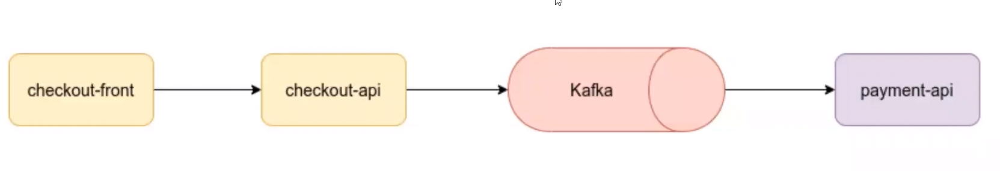
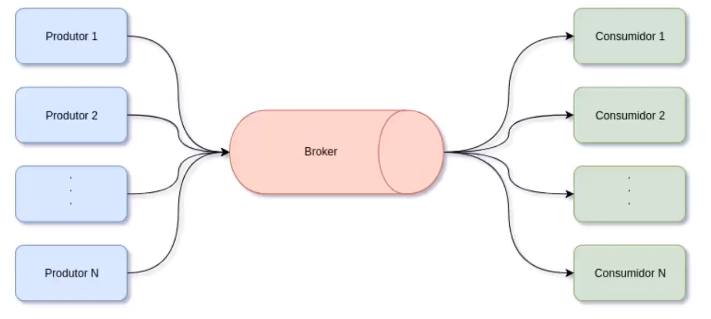
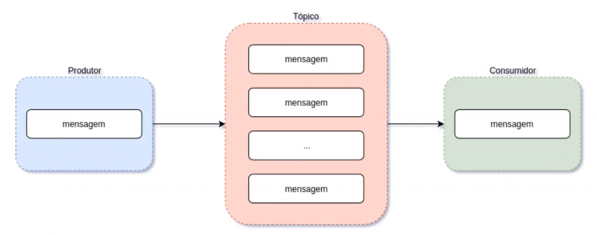
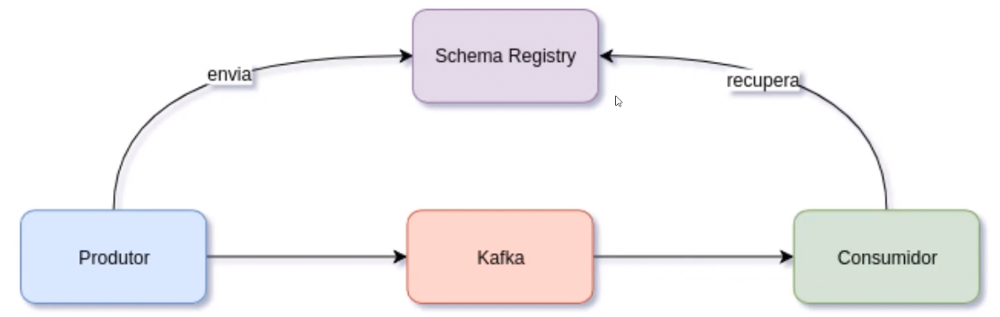

# Criando uma solução de e-commerce com microserviços em Java

**Domínio**

**Arquitetura**

Comunicação entre as partes

**Streaming Data** lidar com grande quantidades de dados em tempo real de várias fontes.

**Apache Kafka** é uma plataforma de mensagens e streaming.

- **Mensagens** é informação produzida por um produtor

- **Tópicos** é o meio onde as mensagens são encaminhadas, onde existem partições e uma ordem de mensagens

- **Produtores** criam mensagens

- **Consumidores** consomem as mensagens

- **Brokers** instâncias do Kafka

- **Cluster** são várias instâncias de brokers

- **Apache Zookeeper** gerencia os clusters

**Apache Avro** sistema de serialização de dados. Fornece uma rica estrutura de dados, formato de dado binário, compacto e rápido e um container para gravar dados persistentes. Similar ao JSON.

**Schema Registry** mecanismo de armazenamento para o Apache Avro.

### Passos

1. Spring Initializer para criar o projeto e adicionar dependências
2. Definir os contratos da API, para que o frontend trabalhe em paralelo com o backend. Definir os dados que serão enviados e recebidos e as funções HTTP.   
3. Definir a estrutura dos pacotes e arquivos: config (config do spring), resource (similar ao controller) e streaming (para o Kafka)
4. Criar a classe entity, repository, service, 