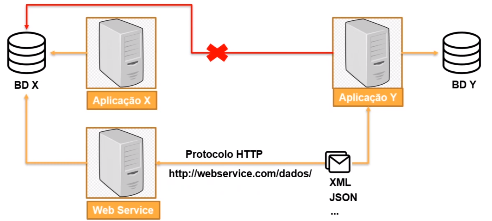
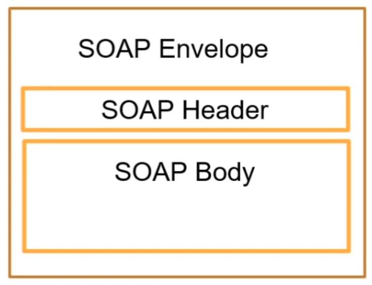
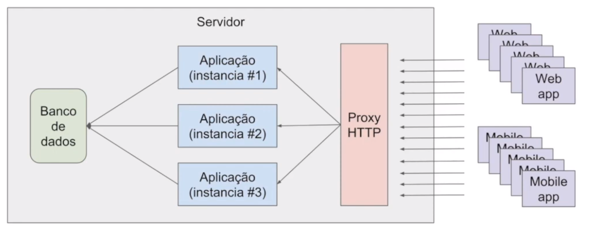
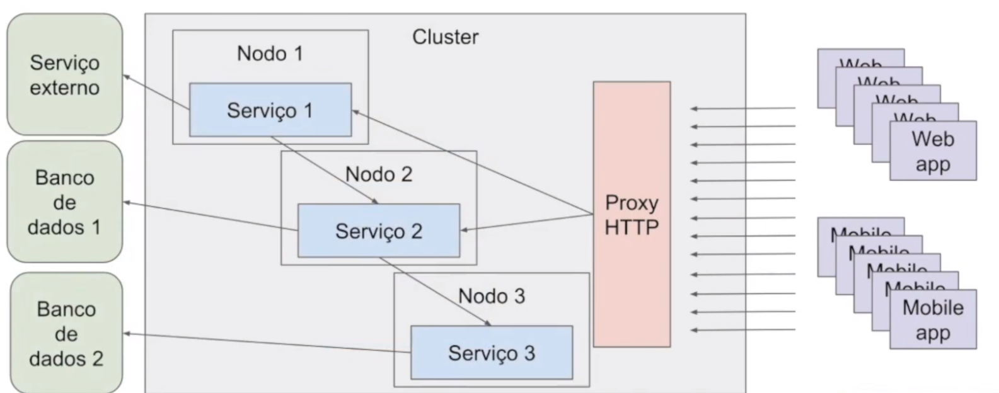
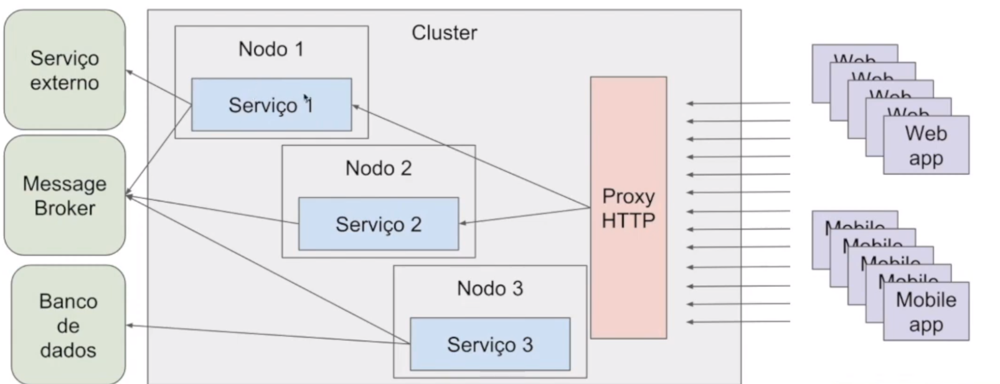
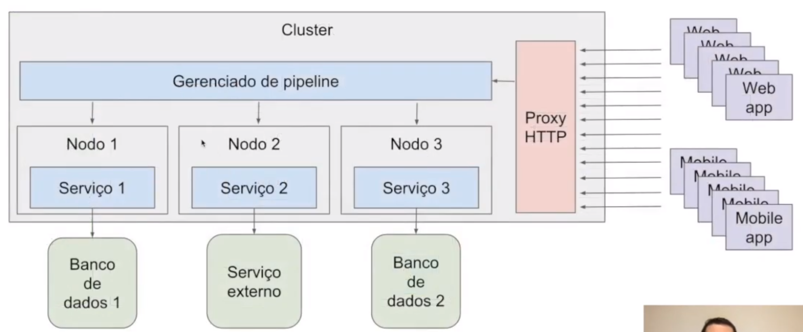

# Fundamentos de Arquitetura de Sistemas

*Anderson de Alencar Barros, 4 de março de 2021*

#### Sumário

- **[Vantagens e desenvolvimento de Web Services](#1)**
  - [Web Services](#1.1)
  - [Estrutura SOAP](#1.2)
  - [WSDL e XSD](#1.3)
  - [REST, API e JSON](#1.4)
  - [Principais Métodos HTTP](#1.5)
- **[Conceitos de arquitetura em aplicações para Internet](#2)**
- **[A arquitetura de aplicações móveis e Internet das Coisas](#3)**
- **[Conceitos de responsividade e experiência do usuário](#4)**
  - [Cores da Interface](#4.1)
  - [Tipografia](#4.2)
  - [Componentes da Interface do Usuário](#4.3)

## Vantagens e desenvolvimento de Web Services 

### Web Services 

Web Services são soluções para aplicações se comunicarem independente de linguagem, software ou hardware usados. Podemos dizer que são APIs que se comunicam por meio de redes sobre o protocolo HTTP.

Tem a vantagem de criar uma linguagem comum de comunicação, facilita a integração, reutilização de implementação, mais segurança e reduz custos.

### Estrutura SOAP 

SOAP (Simple Object Access Protocol) é um protocolo baseado em XML para serviços web por HTTP. Desenvolvido para facilitar a integração entre aplicações. Pode ser usado por outros protocolos além do HTTP.

XML (Extensible Markup Language) é uma linguagem de marcação que facilita a separação de conteúdo. Comum para integração de aplicações.

O SOAP Message possui a seguinte estrutura

- **SOAP Envelope** encapsula toda a mensagem SOAP
- **SOAP Header** possui os metadados da requisição e informações dos atributos
- **SOAP Body** onde fica o conteúdo da mensagem.

### WSDL e XSD 

WSDL (Web Services Description Language) funciona como um contrato, descreve um Web Service funciona. Um exemplo pode ser visto no [link](http://www.soapclient.com/xml/soapresponder.wsdl).

XSD (XML Schema Definition) define a estrutura de dados que será validada no XML. Funciona como a documentação de como deve ser montado o XML enviado.

### REST, API e JSON 

REST (Representational State Transfer) trabalha com a transferência de objeto em determinado estado. Ao contrário do SOAP, não é um protocolo, é um estilo de arquitetura de software que define uma web service. Possível trabalhar com vários formatos e utiliza métodos HTTP para operações. Fácil compreensão.    

API (Application Programming Interface) é uma aplicação web que disponibiliza rotinas e padrões por meio de serviços web para que outras aplicações consumam essas funcionalidades.

JSON (Javascript Object Notation) formatação leve usada para troca de mensagens.

### Principais Métodos HTTP 

- **GET** solicita a representação de um recurso
- **POST** solicita a criação de um recurso
- **DELETE** remove um recurso
- **PUT** atualiza um recurso

**Códigos de Estado HTTP**

- **1XX** - Informativo
- **2XX** - Sucesso
- **3XX** - Redirecionamento
- **4XX** - Erro do Cliente
- **5XX** - Erro do Servidor

## Conceitos de arquitetura em aplicações para Internet 

**Monolito** a aplicação é única e mais simples.

| Vantagens                  | **Desvantagens**             |
| -------------------------- | ---------------------------- |
| Baixa Complexidade         | Stack única                  |
| Monitoramento simplificado | Compartilhamento de recursos |
|                            | Acoplamento                  |
|                            | Difícil escalabilidade       |

**Microserviços** a aplicação é distribuída, cada serviço pode ser independente ou não e podem ser de linguagem diferentes. Mais complexo de gerenciar, principalmente quando o sistema vai crescendo. 

A arquitetura de Microserviços podem variar de acordo com a necessidade.

| **Vantagens**          | **Desvantagens**         |
| ---------------------- | ------------------------ |
| Stack dinâmica         | Acoplamento              |
| Simples escalabilidade | Monitoramento complexo   |
|                        | Provisionamento complexo |

Abaixo, uma arquitetura de microserviços com cada serviço independente. Isso torna a estrutura mais resiliente a erros, pois um serviço não afeta o outro, porém torna dependente do Message Broker, este permite identificar o motivo de um determinado serviço ter sido incapaz de responder no momento de uma requisição..

| Vantagens              | Desvantagens                  |
| ---------------------- | ----------------------------- |
| Stack dinâmica         | Monitoramento complexo        |
| Simples escalabilidade | Provisionamento complexo      |
| Baixo Acoplamento      | Dependência do Message Broker |

A arquitetura abaixo é gerenciada pelo pipeline que dependendo da requisição do cliente, envia para o serviço correspondente. O sistema é dependente do pipeline. É preciso saber lidar com erros para que seja possível reverter o que foi feito pelos serviços anteriores.

| Vantagens            | Desvantagens             |
| -------------------- | ------------------------ |
| Stack dinâmica       | Provisionamento complexo |
| Fácil escalabilidade | Dependência do pipeline  |
| Baixo acoplamento    |                          |
| Menor complexidade   |                          |

**Dead Letter Queue** ou **Filas de Re-tentativas** são formas de gerenciar erros. Uma fila de mensagens de erros e que são tentadas ser processadas novamente ou usadas para *rollback*.

## A arquitetura de aplicações móveis e Internet das Coisas 

Importante considerar na escolha de uma rede IoT

- Baixo consumo de energia
- Rede de dados limitada
- Resiliência
- Segurança
- Customização
- Baixo custo

**Protocolo MQTT** criado para conectar sensores de pipelines de petróleo a satélites, eficiente para IoT.

## Conceitos de responsividade e experiência do usuário 

**Briefind** entender o que é o projeto, o objetivo e o porquê daquele trabalho.

**Imersão**  conhecer o problema, contexto, público, regras do negócio, demandas e etc. Base de conhecimento necessário para propor uma solução.

**Unpack** é o primeiro dia do projeto, onde se ouve várias informações do projeto do cliente, dos stakeholders e etc.

**Estrutura** como os objetos devem ser posicionados

**Conteúdo** como os conteúdos serão colocados para ajudar na usabilidade e interatividade do usuário

**Hierarquia informativa** como será organizado e apresentado

**Funcionalidade** como será a usabilidade na interface e como interagir com o usuário

**Grid** determinar o fluxo de leitura mais fácil para o usuário

**Luzes e sombras** garantem movimento, profundidade, sobreposição e contraste

**Consistência e padrão** manter o mesmo tom da redação (UX Writer), mesmo padrão visual (Design System) e entre vários dispositivos (UX Design)

### Cores da Interface 

Conhecer a psicologia das cores para entregar algo factível ao cliente

**Cores Primárias** mais importantes de todo o sistema. São elas azul, laranja e cinza. Uma cor fria, uma quente e uma neutra

**Cores Secundárias** verde, amarelo, vermelho e etc. São cores já conhecidas do usuário por indicar um significado, como vermelho que indica erro, verde é sucesso, amarelo indica atenção.

**Gradiente** dá mais profundidade, impacto, dinamismo e movimento. São comumente indicadas como Cores Flat.

### Tipografia 

A tipografia indica muito sobre a personalidade do site.

**4 categorias básicas**

- **Serifadas** apresenta traços no final das letras. Representam seriedade e tradicionalidade.

- **Sem Serifa (sans-serif)** Não tem as linhas extras no final. Mais modernas e dinâmicas.

- **Cursivas (script)** fontes manuscritas, podendo ser elegantes, divertidas, descontraídas. 

- **Decorativas** objetivam chamar atenção. São mais inusitadas e devem ser usadas em pequenos textos.

O **tamanho da fonte** **padrão** é 16px .

**Peso** é a grossura dos caracteres. O peso normal é 400, podendo variar de 100 a 900.

### Componentes da Interface do Usuário 

**Ícones** devem ser simples e traduzir de formas simples a informação desejada.

Pode-se incluir texto junto aos ícones para esclarecer a mensagem desses símbolos, dando aos usuários mais confiança.

**Deve-se escolher ícones familiares** pode-se pesquisar primeiro o que está sendo usado em plataformas similares

**Utilizar espaçamento** de pelo menos 1cm x 1cm para melhor uso mobile e legibilidade.

**Consistência** manter a paleta de cores, no máximo 3 cores, manter o mesmo ícone para a mesmo ação, pois a repetição ajuda o usuário a associá-lo a uma ação.

**Imagens** não devem ser tratadas como decoração, devem ter contexto e relevância ao serem usadas.

**Responsividade** é trabalhar com tamanhos diferentes de telas. Oferecer um site adaptado para um celular ou qualquer outra tela.

Através da Responsividade é possível oferecer

- Facilidade e conforto de acesso
- Boa experiência de uso
- Satisfação do usuário
- Fidelização do usuário

*Google Resize (site)* e *Window Resize (extensão)*

**Acessibilidade** importante ter empatia para se colocar no lugar do usuário para saber as dificuldades de executar uma tarefa no site. Dessa forma, é possível construir um serviço que funciona para todos.

**Prototipagem** pode ser usado para melhorar experiência do usuário, atualizar modelos de negócios e criar produtos e serviços.

Protótipos podem ser de baixa, média ou alta fidelidade.

Protótipos de alta fidelidades podem criar expectativas no cliente.

A **Contextualidade** define onde o protótipo será testado:

- **Restrita** ambiente controlado

- **Geral** qualquer usuário e ambiente

- **Parcial** usuário final ou ambiente final

- **Total** usuário final e ambiente final