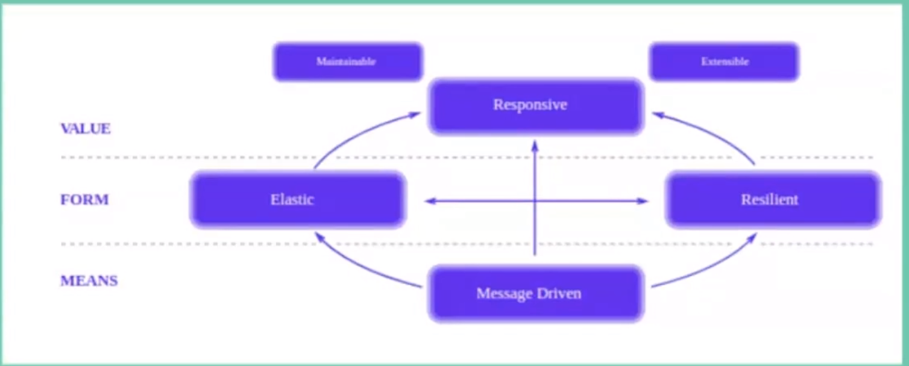
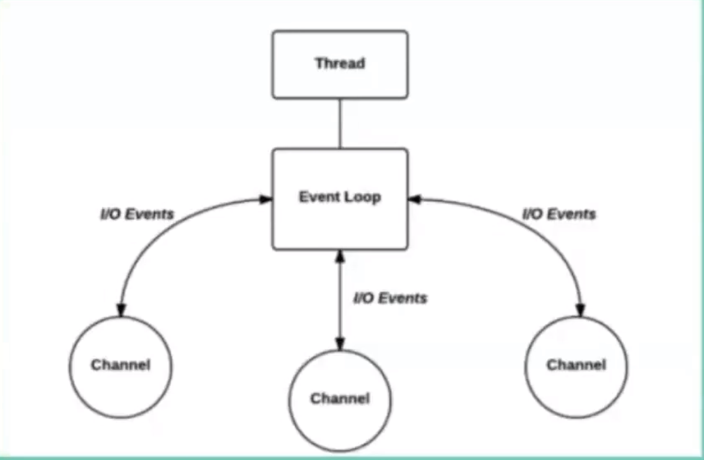
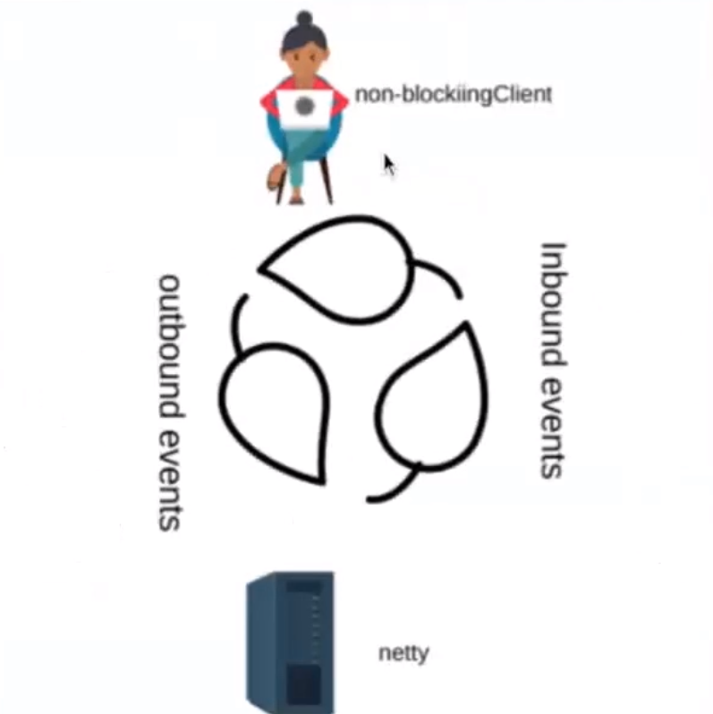

# Gerenciador de super heróis da Marvel e da DC em uma API reativa com Spring Boot

**Manifesto Reativo**

**Responsivo** responde em tempo hábil, o mais rápido 

**Resiliente** permanecer mesmo com falhas

**Elástico** ser escalável, suportar carga variável

**Message Driven** mensagens assíncronas entre os componentes, garantindo acomplamento fléxivel, isolamento e transparẽncia

*Project Reactor* é um exemplo - reactor-core, reactor-test e reactor-netty

Dois componentes principais do **Reactor**:

**Flux** um conjunto de informações

**Mono** um único dado ou evento

**Netty** servidor assíncrono, não bloqueante e facilita na escalabilidade do sistema

Usado as tecnologias,

- Java 8
- Maven
- IntellJ
- Spring WebFlux
- Spring Data
- Reactor
- AWS CLI
- Amazon DynamoDB
- JUnit
- Swagger UI
- Postman
- SL4G

**Passos**

1. Cria projeto no spring initializr - Maven, Java. Dependências Lombok, Spring Reactive Web.
2. Incluir dependências no pom: springdoc, awssdk (dynamodb), spring-data-dynamo-db, junit
3. Instalar e configurar AWS CLI (aula 2).
4. Instalar Amazon DynamoDb localmente.
5. Criar arquivo de configuração DynamoConfig
6. Criar na sequência arquivos de 
   - HeroesData
   - HeroesConstant
   - Heroes
   - HeroesRepository
   - HeroesService
   - HeroesController
7. Publicar a API no Postman
8. API no Swagger