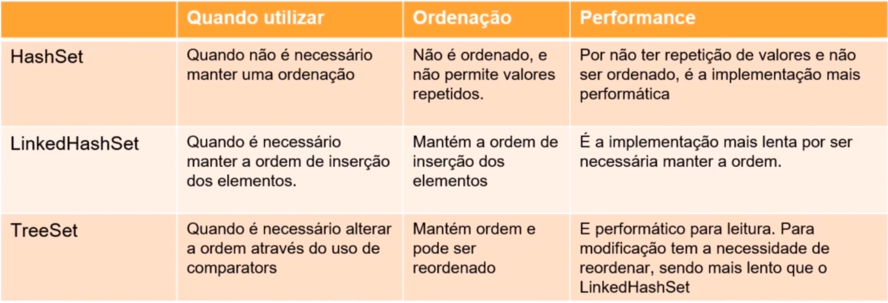

# Implementando Collections e Streams com Java

*Anderson de Alencar Barros*


#### Sumário

- **[List](#list)**
  - [ArrayList](#arraylist)
  - [Vector](#vector)
- **[Queue](#queue)**
- **[Set](#set)**
  - [HashSet](#hashset)
  - [LinkedHashSet](#linkedhashset)
  - [TreeSet](#treeset)
- **[Map](#map)**
  - [HashMap](#hashmap)
  - [TreeMap](#treemap)
  - [HashTable](#hashtable)
- **[Comparators](#comparators)**
- **[Utilizando o Optional](#utilizando-o-optional)**
- **[Streams - Dominando fluxo de dados](#streams)**

## List <a name="list"></a>

Na `java.util.List` existe as implementações *ArrayList* e *Vector*  

- Ambos são implementados encima do array 
- Garante uma ordem de inserção
- Permite adição, atualização, leitura e remoção
- Permite ordenação por meio de *comparators*

### ArrayList <a name="arraylist"></a>

```java
import java.util.ArrayList;
import java.util.Collections;
import java.util.Iterator;
import java.util.List;

public class ArrayListExample {
    public static void main(String[] args) {
        // Declaração de um ArrayList
        List<String> nomes = new ArrayList<>();
    }
}
```

- `nomes.add("Anderson")` adiciona elementos
- `Collections.sort(nomes)` ordena a lista, requer `import java.util.Collections;`
- `nomes.set(0, "Maria")` altera o elemento de uma posição 
- `nomes.remove(2)` remove um elemento de uma dada posição
- `nomes.remove("Anderson")` também é possível remover passando o elemento como parâmetro 
- `nomes.get(2)` retorna o elemento da posição indexada, pode ocorrer de acessar uma posição inválida da memória
- `nomes.size()` retorna o tamanho
- `nomes.contains("Anderson")` verifica se está na lista
- `nomes.indexOf("Joana")` retorna a posição de um elemento, retorna -1 se não estiver na lista
- `nomes.isEmpty()` verifica se está vazia
- `nomes.clear()` limpa a lista

**Vale deixar claro que uma séria de métodos estão implementados na interface `Collections` por isso são comuns a todas as estruturas, como `size()`,`isEmpty()`, `clear()` e etc.**

Para iterar sobre a lista pode-se fazer

```java
for(String nome : nomes)
    System.out.printf(" %s :", nome);

// import java.util.Iterator; 
Iterator<String> it = nomes.iterator();
while (it.hasNext())
    System.out.println("-> " + it.next());
```

### Vector <a name="vector"></a>

Tanto ArrayList quando Vector tem os mesmo métodos

```java
import java.util.Vector;
import java.util.Collections;
import java.util.Iterator;
import java.util.List;

public class VectorExample {
    public static void main(String[] args) {
        List<String> nomes = new Vector<>();        
    }
}
```

Desse modo, a diferença entre ArrayList e Vector são que

- Vector são sincronizados por padrão, e ArrayList não.

Pode-se tornar ArrayList também sincronizado passando o objeto ArrayList para o método `Collections.synchronizedList()`  
**Sincronizado** significa que pode ser usado com vários threads sem qualquer efeito colateral. 

- As ArrayLists aumentam em 50% do tamanho quando o espaço não é suficiente para o novo elemento, enquanto o Vector aumentará 100% do tamanho quando não houver espaço para o novo elemento de entrada.

Por ArrayList não ser sincronizado significa mais velocidade, por isso é sempre recomendado usar ArrayLists se não houver um requisito específico para usar Vector

## Queue <a name="queue"></a>

Na `java.util.LinkedList`  é onde está implementada a queue (fila)

- Garante uma ordem de inserção
- Segue a regra **FIFO**, o primeiro que entra é o primeiro que sai

```java
import java.util.LinkedList;
import java.util.Queue;

public class QueueExample {
    public static void main(String[] args) {
        Queue<String> fila = new LinkedList<>();
    }
}
```

- `fila.add("João")` adiciona elementos na fila
- `fila.poll()` retorna e remove primeiro elemento
- `fila.peek()` lê o primeiro da fila, caso a fila esteja vazia, ele retorna `null`
- `fila.element()` retorna o primeiro elemento, porém se a fila estiver vazia, ocorre um erro de execução  `NoSuchElementException`
- `fila.isEmpty()` verifica se está vazia
- `fila.clear()`  limpa a fila

Para iterar sobre a fila pode-se fazer como na lista

```java
for (var s : fila)
    System.out.println(s);

var it = fila.iterator();
while (it.hasNext())
    System.out.println("-> " + it.next());
```

## Set <a name="set"></a>

Implementações do `java.util.Set` são `java.util.HashSet`, `java.util.TreeSet` e `java.util.LinkedHashSet`

- Não garantem ordem de inserção
- Não permite itens repeditos
- Permite adição e remoção normalmente 
- Não possuem busca por item e atualização 
- Não é indexada, mas é possível iteração 
- Não permite mudança de ordenação, permitido apensar por o `java.util.TreeSet` e `java.util.LinkedHashSet`

A `java.util.Set` foi criada para ser performática, para ser trabalhada com grandes conjuntos de dados, por isso não mantém a ordem, para conseguir um ganho de desempenho. A `java.util.LinkedHashSet` permite ordenação, porém se perde o desempenho



### HashSet <a name="hashset"></a>

O Set e o HashSet não garantem a ordem de inserção justamente para obter maior performance na adição, remoção e leitura de dados, por exemplo, quando se trabalha com grandes quantidades de dados vindo de um banco de dados

```java
import java.util.HashSet;
import java.util.Set;

public class SetExample {
    public static void main(String[] args) {
        // Declaração
        Set<Double> notasAlunos = new HashSet<>();

        // adiciona elementos
        notasAlunos.add(3.4);
        notasAlunos.add(10.0);
        notasAlunos.add(5.2);
        notasAlunos.add(1.1);
        notasAlunos.add(7.4);

        // remove passando um objeto como parâmetro
        notasAlunos.remove(1.1);

        // iterar sobre o Set
        var it = notasAlunos.iterator();
        while (it.hasNext())
            System.out.println(it.next());

        for (var d : notasAlunos)
            System.out.println("-> " + d);

        // limpa o Set
        notasAlunos.clear();

        // verifica se está vazio
        notasAlunos.isEmpty();
    }
}
```

### LinkedHashSet <a name="linkedhashset"></a>

- Permanece a ordem natural de inserção, o que faz ser um pouco mais lenta que o HashSet 
- De resto, mantém os mesmos métodos

```java
import java.util.LinkedHashSet;

public class LinkedHashSetExample {
    public static void main(String[] args) {
        // Declaração
        LinkedHashSet<Integer> seq = new LinkedHashSet();
    }
}
```

### TreeSet <a name="treeset"></a>

É baseado em árvores binárias, desse modo, os métodos são equivalentes ao de manipulação de árvores. Toda vez que é modificado a estrutura do TreeSet o algoritmo de ordenação é executado novamente

```java
import java.util.TreeSet;

public class TreeSetExample {
    public static void main(String[] args) {
        // Declaração
        TreeSet<String> treeSet = new TreeSet<>();
    }
}
```

- `treeSet.add("Anderson")` adiciona elementos
- `treeSet.first()` retorna o primeiro elemento da árvore
- `treeSet.last()` retorna o último elemento da árvore
- `treeSet.lower("Anderson")`  retorna o maior elemento neste conjunto que é estritamente menor do que o elemento fornecido.
- `treeSet.higher("Anderson")` retorna o menor elemento neste conjunto que é estritamente maior do que o elemento fornecido.
- `treeSet.pollFirst()` retorna e remove o primeiro da árvore
- `treeSet.pollLast()` retorna e remove o último da árvore

## Map <a name="map"></a>

Implementações do `java.util.Map` são `java.util.HashMap`, `java.util.TreeMap` e `java.util.HashTable`

- Entrada de chave e valor 
- Permite valores repetidos, porém com chaves diferentes 
- Permite adição, busca por chave ou valor, atualização, remoção e navegação 
- Pode ser ordenado


### HashMap <a name="hashmap"></a>

Não é sincronizado, é o mais rápido entre todos e mais recomendado na maioria das situações e permite adicionar valores `null`

```java
import java.util.HashMap;
import java.util.Map;

public class MapExample {
    public static void main(String[] args) {
        // Declaração
        Map<String, Integer> campeoes = new HashMap<>();

        campeoes.put("Brasil", 5);
        campeoes.put("Alemanha", 4);
        campeoes.put("Itália", 4);
        campeoes.put("Argentina", 2);
    }
}
```

- `campeoes.put("Brasil", 5)`  adiciona ou atualiza valores
- `campeoes.get("Alemanha")` 
- `campeoes.containsKey("Canadá")`
- `campeoes.remove("Itália")`
- `campeoes.containsValue("2")`
- `campeoes.size()`

Para iterar sobre o `HashMap` pode-se fazer

```java
for (String s : campeoes.keySet())
    System.out.println(s + " - " + campeoes.get(s));
```

### TreeMap <a name="treemap"></a>

Também não sincronizado, porém a cada modificação o algoritmo da árvore é executado novamente.

```java
import java.util.Map;
import java.util.TreeMap;

public class TreeMapExample {
    public static void main(String[] args) {
        // Declaração
        TreeMap<String, String> capitais = new TreeMap<>();

        capitais.put("RS", "Porto Alegre");
        capitais.put("PE", "Recife");
        capitais.put("CE", "Fortaleza");
        capitais.put("MG", "Belo Horizonte");
        capitais.put("SC", "Floripa");
        capitais.put("AC", "Rio Branco");

    }
}
```

- `capitais.put("RS", "Porto Alegre")` adiciona ou atualiza elementos
- `capitais.firstKey()` retorna o primeiro par da árvore
- `capitais.lastKey()` retorna o último par da árvore
- `capitais.lowerKey("AC")` mostra quem está abaixo de um elemento
- `capitais.higherKey("PE")` mostra quem está acima de um elemento
- `capitais.firstEntry()` retorna o par com o valor da chave mais baixo entre todos
- `capitais.lastEntry()` retorna o par com o valor da chave mais alta
- `capitais.pollFirstEntry()` retorna e remove o primeiro da árvore
- `capitais.pollLastEntry()` retorna e remove o último da árvore
- `capitais.higherEntry("PE")` retorna o menor elemento neste conjunto que a chave é maior que a chave do que o elemento fornecido
- `capitais.lowerEntry("CE")` retorna o maior elemento neste conjunto que a chave é menor que a chave do que o elemento fornecido

Para iterar no `TreeMap` pode-se fazer

```java
var it = capitais.keySet().iterator();
while (it.hasNext())
    System.out.println(it.next() + " - " + capitais.get(it.next()));
```

### HashTable <a name="hashtable"></a>

É sincronizado, por isso, é mais lento que o `HashMap` e mais antigo. Não é recomendado usar há não ser em situações específicas.  
Possui os mesmo métodos que `HashMap`

```java
import java.util.HashMap;
import java.util.Hashtable;
import java.util.Map;

public class MapExample {
    public static void main(String[] args) {
        // Declaração
        Map<String, Integer> hashtable = new Hashtable<>();
    }
}
```

## Comparators <a name="comparators"></a>

As interfaces `java.util.Comparator` e `java.util.Comparable` são interfaces que permitem a padronização de objetos que podem ser ordenados

A interface `java.util.Comparator` é usada para definir uma classe com a regra de negócio que vai ser utilizada para ordenar uma coleção

A interface `java.util.Comparable` é usada para implementar a regra dentro da classe de domínio

Considere a classe `Estudante` que implementa um `Comparable` e assim obtém o método `compareTo(Object o)`

```java
public class Estudante implements Comparable<Estudante>{
    private String nome;
    private int idade;

    public Estudante(String nome, int idade) {
        this.nome = nome;
        this.idade = idade;
    }

    public String getNome() {
        return nome;
    }

    public int getIdade() {
        return idade;
    }

    @Override
    public int compareTo(Estudante estudante) {
        int i = this.getIdade() - estudante.getIdade();
        return i;
    }
}
```

`compareTo(Object o)` retorna 3 tipos de valores:

- positivo, se o objeto atual será antes que o objeto de comparação.
- negativo, se o objeto atual (this) será depois do objeto de comparação.
- 0 se ambos são iguais

`Comparable` é usada apenas dentro da classe de domínio, comparando o próprio objeto com outro

Vejamos um  `Comparator`, onde se pode criar uma classe com uma regra de ordenação. Desse modo, é possível ter várias regras de ordenação para uma classe apenas passando como parâmetro para `Collections.sort()`.

```java
import java.util.Comparator;

public class EstudanteOrdemInversa implements Comparator<Estudante> {
    // Comparator serve para criar regras específicas,
    // externa a classe de domínio.
    // Pode ser criada várias regras diferentes

    @Override
    public int compare(Estudante t1, Estudante t2) {
        return t2.getIdade() - t1.getIdade();
    }
}
```

Supondo que tenhamos uma lista de `Estudante` e desejássemos ordená-la, podemos fazer de várias maneiras

```java
import java.util.ArrayList;
import java.util.Collections;
import java.util.Comparator;
import java.util.List;

public class Main {
    public static void main(String[] args) {
        // Lista de Estudantes
        List<Estudante> estudanteList = new ArrayList<>();

        estudanteList.add(new Estudante("Pedro", 19));
        estudanteList.add(new Estudante("Ana", 20));
        estudanteList.add(new Estudante("Anderson", 21));
        estudanteList.add(new Estudante("Larissa", 18));
        estudanteList.add(new Estudante("Zé", 33));

        // Ordem de inserção
        System.out.println(estudanteList);

        // Usando expressões Lambdas 
        // não necessitamos de Comparable ou Comparator
        // Ordem crescente de idade
        estudanteList.sort((first, second) ->
            first.getIdade() - second.getIdade()
        );

        // Ordem decrescente
        estudanteList.sort((first, second) ->
                second.getIdade() - first.getIdade()
        );

        // Ordem crescente de idade
        estudanteList.sort(Comparator.comparingInt(Estudante::getIdade));
        // Ordem decrescente de idade
        estudanteList.sort(Comparator.comparingInt(Estudante::getIdade).reversed());

        // Só pode ser passado como parâmetro uma lista 
        // que implemente um objeto que estenda `Comparable`
        Collections.sort(estudanteList);

        // Passando um `Comparator` como parâmetro
        // Desse modo, pode-se criar quantas regras preferir
        Collections.sort(estudanteList, new EstudanteOrdemInversa());
    }
}
```

## Utilizando o Optional <a name="utilizando-o-optional"></a>

O objetivo do `Optionals` é trabalhar com dados que sejam opcionais, ou seja, que podem ser nulos. Assim, permite que execute operações em valores que podem ser nulos sem preocupações com `NullPointerException`.

- Possui 2 estados: 
  - **presente** quando o objeto está sendo usado
  - **vazio** quando o objeto é nulo

Existe várias formas de declaração

```java
import java.util.Optional;
import java.util.OptionalDouble;
import java.util.OptionalInt;
import java.util.OptionalLong;

public class OptionalExample {
    public static void main(String[] args) {
        // cria um Optional, porém este não permite `null`
        // caso seja `null`, um `NullPointerException` é lançado
        Optional<String> opt = Optional.of("Valor Presente");

        // cria um Optional, este método permite o valor `null`
        // caso seja `null`, cria-se um optional vazio
        Optional<String> optNull = Optional.ofNullable(null);

        // cria um Optional vazio
        Optional<String> optEmpty = Optional.empty();

        // Existem extensões do Optional para alguns tipos primitivos
        OptionalInt.of(10).ifPresent(System.out::println);
        OptionalDouble.of(10.0).ifPresent(System.out::println);
        OptionalLong.of(23L).ifPresent(System.out::println);
    }
}
```

Alguns métodos dos `Optionals` são

- `opt.ifPresentOrElse(System.out::println, () -> System.out.println("Valor nulo"))` executa o primeiro parâmetro se o objeto não for nulo ou executa o segundo caso seja nulo ou vazio
- `opt.isPresent()` verifica se está presente
- `optNull.isEmpty()` verifica se está vazio
- `opt.ifPresent(System.out::println)` executa uma função se presente
- `opt.get()` retorna o conteúdo de um `Optional`. É preferível usar junto com o método `isPresent()`, pois usá-la em um `Optional` resulta em erro
- `opt.map((v) -> v.concat("***")).ifPresent(System.out::println)` se o valor estiver presente retorna um Optional com o resultado da função de mapeamento de valor, caso contrário retorna vazio
- `opt.orElseThrow(IllegalAccessError::new)` se não estiver presente lança uma exceção

## Streams - Dominando fluxo de dados <a name="streams"></a>

`Streams` faz a manipulação de collections com paradigma funcional, de forma paralela e imutável, não altera a coleção de origem, sempre criando uma nova coleção. 

Traduzindo do [Javadoc](https://docs.oracle.com/javase/8/docs/api/java/util/stream/Stream.html), para realizar um cálculo, as streams são compostas de um *stream pipeline*. Um  *stream pipeline* consiste em: 

- uma fonte (que pode ser uma matriz, uma coleção, uma função geradora, um canal de E/S, etc)
- zero ou mais operações intermediárias (que transformam um fluxo em outro fluxo, como `filter()` ) 
- e uma operação de terminal (que produz um resultado ou efeito colateral, como `count()` ou `forEach (Consumer)`)

Na `Streams` a computação nos dados de origem só é realizada quando uma operação `terminal` é iniciada e os elementos de origem são consumidos apenas conforme necessário. 

Por isso, algumas funções podem não produzir uma saída, por exemplo, `nameStream.peek(System.out::println)` pois não há uma operação `terminal`.

Para fazer uso da paralelização, basta trocar o método `stream()` por `parallelStream()`.

**Principais Funcionalidades**

| Função    | Definição                                                                             |
| --------- | ------------------------------------------------------------------------------------- |
| Mapping   | retorna uma coleção com mesmo tamanho da origem com os elementos alterados            |
| Filtering | retorna uma coleção igual ou menor que a coleção de origem, com os elementos intactos |
| ForEach   | executa uma determinada lógica para cada elemento, retornando nada                    |
| Peek      | executa uma determinada lógica para cada elemento, retornando a própria coleção       |
| Counting  | retorna um inteiro que representa o total de elementos                                |
| Grouping  | retorna uma coleção agrupara de acordo com a regra definida                           |

Considere uma lista de estudantes,

```java
import java.util.ArrayList;
import java.util.Comparator;
import java.util.List;
import java.util.Locale;
import java.util.stream.Collectors;

public class StreamsExample {
    public static void main(String[] args) {
        List<String> estudantes = new ArrayList<>();

        estudantes.add("Pedro");
        estudantes.add("Ana");
        estudantes.add("Carlos");
        estudantes.add("Beto");
        estudantes.add("Joana");
        estudantes.add("Fernando");
    }
}
```

Podemos fazer com a `Streams` 

```java
// retorna a quantidade de elementos
var i = estudantes.stream().count();
```

```java
// retorna a string com mais caracteres
var j = estudantes.stream().max(Comparator.comparingInt(String::length));

// retorna a string com menos caracteres
var a = estudantes.stream().min(Comparator.comparingInt(String::length));
```

```java
// filter() aplica uma função a todas os elementos da collection
// que pode ser armazenada em outra estrutura e retorna uma nova stream
var list = estudantes.stream().filter(
    (estudante) -> estudante.toLowerCase(Locale.ROOT)
                    .contains("r")
).collect(Collectors.toList()); // .collect() permite coletar o conteúdo da stream
```

```java
// map() aplica uma função aos elementos e deve retornar
// uma estrutura com o mesmo tamanho da collection original
var list1 = estudantes.stream().map(
        (estudante) -> estudante.concat(" - ")
                        .concat((String.valueOf(estudante.length())))
).collect(Collectors.toList());
```

```java
// peek() aplica a todos os elementos 
// uma função void e retorna a própria coleção.
// Este método existe principalmente para dar suporte à depuração 
final var estudanteStream = estudantes.stream();
estudanteStream.peek(System.out::println).collect(Collectors.toList());
```

```java
// retorna os 3 primeiros elementos
var list2 = estudantes.stream().limit(3).collect(Collectors.toList());
```

```java
// similar ao peek(), mas não retorna nada, apenas executa
estudantes.stream().forEach(System.out::println);
```

```java
// verifica se todos os elementos satisfazem certa condição
estudantes.stream().allMatch((str) -> str.contains("W"));
// verifica se nenhum os elementos satisfazem certa condição
estudantes.stream().noneMatch((str) -> str.contains("W"));
// verifica se algum os elementos satisfazem certa condição
estudantes.stream().anyMatch((str) -> str.contains("W"));
```

```java
// retorna o primeiro elemento
estudantes.stream().findFirst().ifPresent(System.out::println);
```
