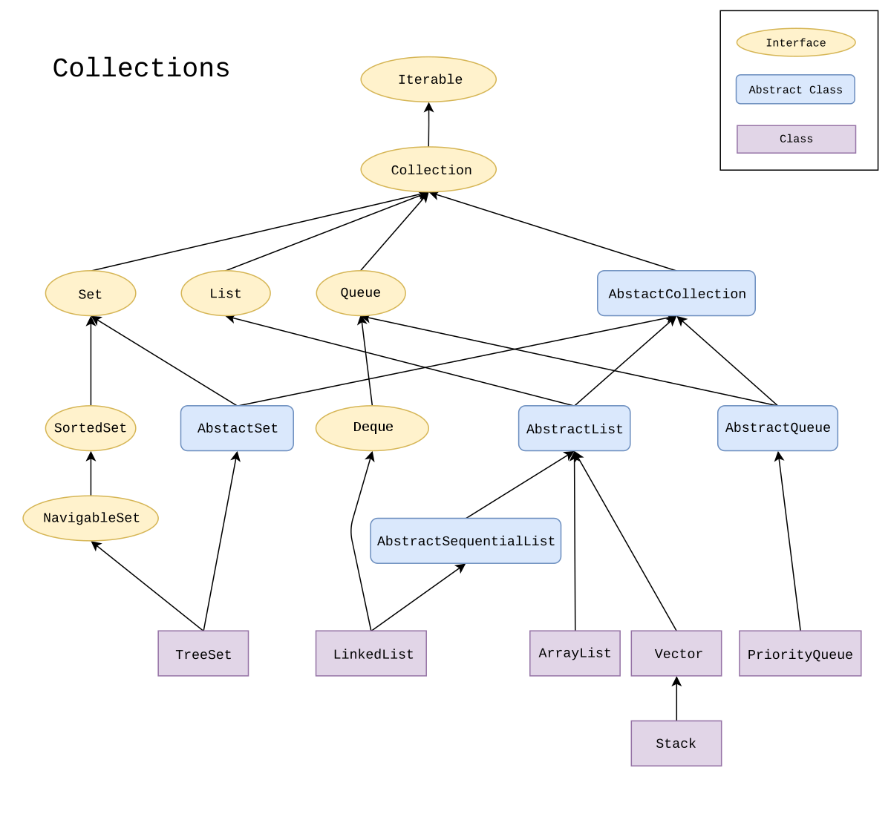

# Implementando Collections e Streams com Java



## List

Na `java.util.List` existe as implementações *ArrayList* e *Vector*  

Garante uma ordem de inserção  
Permite adição, atualização, leitura e remoção  
Permite ordenação por meio de *comparators*  

```java
import java.util.ArrayList;
import java.util.Collections;
import java.util.Iterator;
import java.util.List;

public class ArrayListExample {
    public static void main(String[] args) {
        // Declaração de um ArrayList
    	List<String> nomes = new ArrayList<>();
    }
}
```

- `nomes.add("Anderson")` adiciona elementos
- `Collections.sort(nomes)` ordena a lista, requer `import java.util.Collections;`
- `nomes.set(0, "Maria")` altera o elemento de uma posição 
- `nomes.remove(2)` remove um elemento de uma dada posição
- `nomes.remove("Anderson")` também é possível remover passando o elemento como parâmetro 
- `nomes.get(2)` retorna o elemento da posição indexada, pode ocorrer de acessar uma posição inválida da memória
- `nomes.size()` retorna o tamanho
- `nomes.contains("Anderson")` verifica se está na lista
- `nomes.indexOf("Joana")` retorna a posição de um elemento, retorna -1 se não estiver na lista
- `nomes.isEmpty()` verifica se está vazia
- `nomes.clear()` limpa a lista

Vale deixar claro que uma séria de métodos estão implementados na interface `Collections` por isso são comuns a todas as estruturas, como `size()`,`isEmpty()`, `clear()` e etc.

Para iterar sobre a lista pode-se fazer

```java
for(String nome : nomes)
    System.out.printf(" %s :", nome);

// import java.util.Iterator; 
Iterator<String> it = nomes.iterator();
while (it.hasNext())
    System.out.println("-> " + it.next());
```

Tanto ArrayList quando Vector tem os mesmo métodos

```java
import java.util.Vector;
import java.util.Collections;
import java.util.Iterator;
import java.util.List;

public class VectorExample {
    public static void main(String[] args) {
        List<String> nomes = new Vector<>();		
    }
}
```

Desse modo, a diferença entre ArrayList e Vector são que

- Vector são sincronizados por padrão, e ArrayList não.

Pode-se tornar ArrayList também sincronizado passando o objeto ArrayList para o método `Collections.synchronizedList()`  
Sincronizado significa que pode ser usado com vários threads sem qualquer efeito colateral. 

- As ArrayLists aumentam em 50% do tamanho quando o espaço não é suficiente para o novo elemento, enquanto o Vector aumentará 100% do tamanho quando não houver espaço para o novo elemento de entrada.

Por ArrayList não ser sincronizado significa mais velocidade, por isso é sempre recomendado usar ArrayLists se não houver um requisito específico para usar Vector

## Queue

Na `java.util.LinkedList`  é onde está implementada a queue (fila)

Garante uma ordem de inserção  
Permite adição, atualização, leitura e remoção  seguindo a regra **FIFO**, o primeiro que entra é o primeiro que sai

```java
import java.util.LinkedList;
import java.util.Queue;

public class QueueExample {
    public static void main(String[] args) {
        Queue<String> fila = new LinkedList<>();
    }
}
```

- `fila.add("João")` adiciona elementos na fila
- `fila.poll()` retorna e remove primeiro elemento
- `fila.peek()` lê o primeiro da fila, caso a fila esteja vazia, ele retorna `null`
- `fila.element()` retorna o primeiro elemento, porém se a fila estiver vazia, ocorre um erro de execução  `NoSuchElementException`
- `fila.isEmpty()` verifica se está vazia
- `fila.clear()`  limpa a fila

Para iterar sobre a fila pode-se fazer como na lista

```java
for (var s : fila)
    System.out.println(s);

var it = fila.iterator();
while (it.hasNext())
    System.out.println("-> " + it.next());
```

