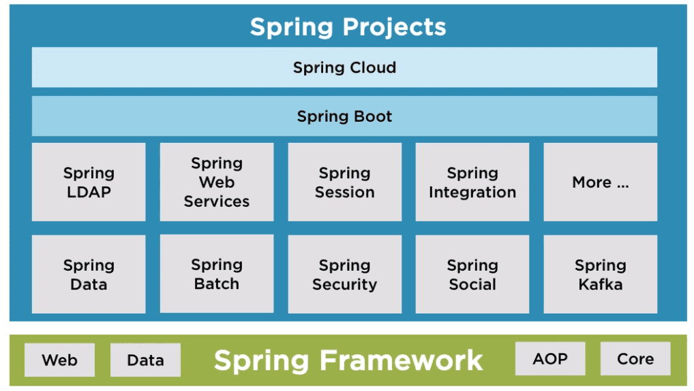
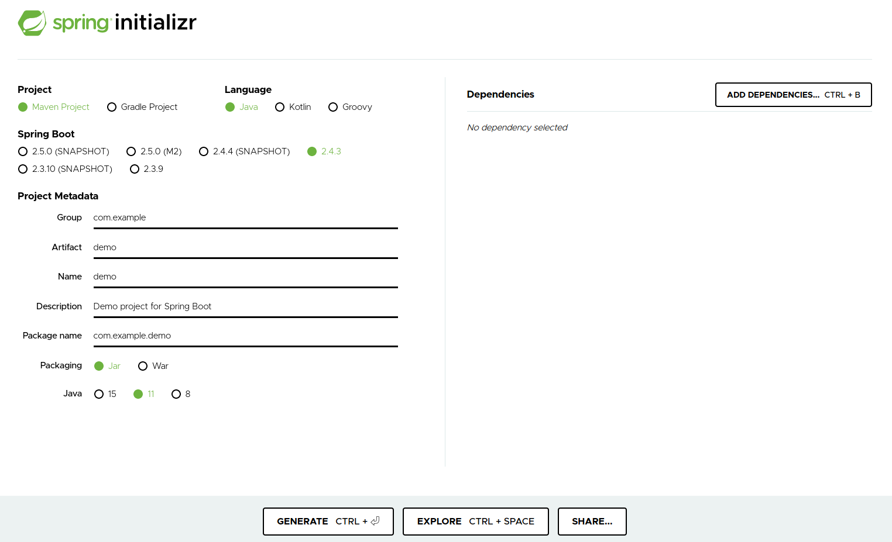
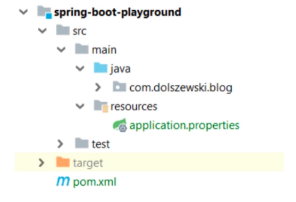
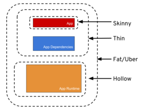
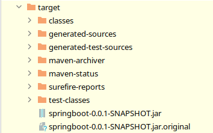
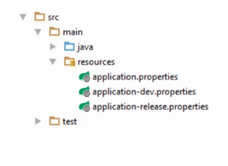

# Introdução ao framework Spring Boot

*Anderson de Alencar Barros*

#### Sumário

- **[O que é o Spring Boot?](#introducao)**
- **[Auto Configuration](#auto-configuration)**
- **[FatJar ou UberJar](#fatjar-uberjar)**
- **[Trabalhando com Profiles e Configurações ](#trabalhando-com-profiles-e-configurações)**
  - [Profiles](#profiles)
  - [Configurações com Properties](#properties)
  - [Configurações com YAML](#yaml)
  - [Configurações pela linha de comando](#config-pela-linha-de-comando)
  - [Configurações com variáveis de ambiente](#config-com-var-de-ambiente)

## O que é o Spring Boot? <a name="introducao"></a>

Spring Boot foi criado pela Spring Source em 2012 com o objetivo de facilitar o setup de projetos Spring sem a necessidade de criar arquivos de configurações. Com isso, é possível ter maior produtividade e, consequentemente, maior tempo no desenvolvimento  do software.



Assim, o Spring Boot é responsável por gerenciar todas as dependências do Spring para o projeto.

Com o [Spring initializr](https://start.spring.io/) é possível criar um setup simplificado do projeto. Podemos fazer pelo site ou pela IDE. 



No Spring, existe arquivos de dependências chamadas de **Starters**, que são configuradas automaticamente pelo Spring Boot.

Por fim, tudo é centralizado em um arquivo chamado **application.properties**.



## Auto Configuration <a name="auto-configuration"></a>

Antes disso, tudo era necessário configurar manualmente múltiplos arquivos XML. O Auto Configuration deixou tudo mais simples, pois com os Starters as dependências são simplificadas e automáticas. Isso já é uma característica natural do String Boot quando o usuário adiciona uma dependência.

## FatJar ou UberJar <a name="fatjar-uberjar"></a>

É uma forma de empacotar o código junto com todas as dependências. Antes do Spring Boot, existia uma dependência de um container web ou servidor de aplicação e isso gerava uma complexidade de configurações e uma dificuldade para atualizações junto com a versão do projeto.

Assim, com o Fatjar/UberJar já temos um projeto pronto para execução, pois já temos todas as dependências principais do projeto embarcados.



Assim, temos as formas de empacotamento

- **Skinny** contém somente o código criado

- **Thin **contém tudo do anterior mais as dependências diretas da aplicação 

- **Hollow**  contém somente o código necessário para rodar a aplicação mas não contem a aplicação em si.

- **Fat/Uber** contém o código criado mais as dependências necessárias para rodar o programa por si só

Usando Maven podemos fazer a limpeza e empacotar usando o comando

```
mvn clean package
```

Todo o conteúdo é criado na pasta `target/` . 



Dentro desta pasta, usamos o comando `java -jar <arquivo>.jar` para executar a aplicação, já sabendo que ele contém todas as dependências.

Com o comando `jar tf <arquivo>.jar | more` podemos ver todas as dependências empacotadas dentro do `<arquivo>.jar`.

## Trabalhando com Profiles e Configurações <a name="trabalhando-com-profiles-e-configurações"></a>

### Profiles <a name="profiles"></a>

Com vários ambientes de desenvolvimento, o **Profile** tem o objetivo de definir configurações próprias para cada ambiente.



### Configurações com Properties <a name="properties"></a>

Cada classe é marcada com uma anotação `@Configuration` e `@ConfigurationProperties(<nome>)` e assim para cada ambiente. Também temos o `@Profile` para marcar métodos de diferentes ambientes.

Com o Properties,  temos

```
app.message=Dev Environment

spring.datasource.url=jdbc:postgresql://localhost:5432/banco
spring.datasource.username=postgres
spring.datasource.password=postgres
```

### Configurações com YAML <a name="yaml"></a>

O formato das configurações fica em um arquivo `.yml` e com um formato diferente, podendo ficar mais simples e limpo.

Com o YAML, temos

```
app:
  message: Dev Environment

spring:
  datasource:
    url: jdbc:postgresql://localhost:5432/banco
    username: postgres
    password: postgres
```

### Configurações pela linha de comando <a name="config-pela-linha-de-comando"></a>

As propriedades do arquivo de configuração são passados na linha de comando. Pela linha de comando , os valores passados tem maior prioridade do que os arquivos de configuração.

Por exemplo, o comando

```
mvn spring-boot:run -Dserver.port=8085
```

### Configurações com variáveis de ambiente <a name="config-com-var-de-ambiente"></a>

Variável de ambiente pode ser injetada através da anotação `@Value(<variável>)` no projeto. 

Por exemplo, 

```java
@Value("${HOME}")
private String envVariable;

@GetMapping("/envVariable")
public String getEnvVariable() {
    return "O path da pasta home é " + envVariable;
}
```

Também é possível por um valor *default*, caso nenhuma variável de ambiente seja encontrada. Neste caso, quando não encontrada, o valor após os dois pontos é atribuído.

```java
@Value("${ENV_DB_URL: Nenhuma}")
private String envVar;

@GetMapping("/envVar")
public String getEnvVar() {
    return "Environment Variable is " + envVar;
}
```