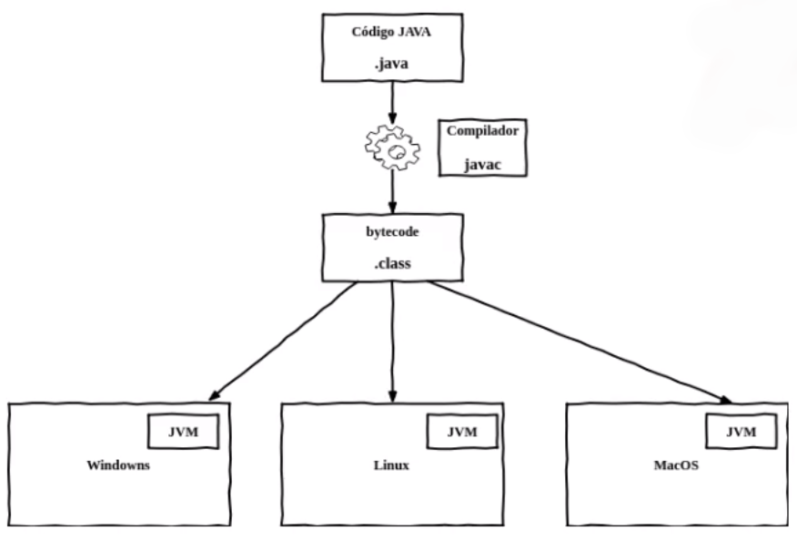

# Java Básico

#### Sumário

- **[Conceitos Iniciais](#conceitos-iniciais)**
- **[Instalação (Debian, Ubuntu)](#instalacao)**
- **[Características da linguagem](#caracteristicas-da-linguagem)**  
  - [Tipos Primitivos](#tipos-primitivos)
  - [Wrappers](#wrappers)
  - [Tipos Não Primitivos](#tipos-nao-primitivos)
  - [Tipagem forte e estática](#tipagem-forte-e-estatica)
  - [Modificadores de acesso](#modificadores-de-acesso)
  - [Interfaces](#interfaces)
  - [Enums](#enums)
  - [Strings](#strings)
  - [Laços, condicionais e operadores](#lacos-condicionais-e-operadores)
  - [Convenções de nomes](#convencoes-de-nomes)
- **[Debug de código](#debug-de-codigo)**
- **[Orientação a objetos com Java](#orientacao-a-objetos-com-java)**
  - [Encapsulamento, herança e polimorfismo](#encapsulamento-heranca-e-polimorfismo)
  - [Características específicas em orientação a objetos](#caracteristicas-especificas-em-orientação-a-objetos)
- **[S.O.L.I.D](#solid)**
- **[Trabalhando com Datas](#trabalhando-com-datas)**
  - [Date](#date)
  - [Calendar](#calendar)
  - [DateFormat](#dateformat)
  - [Datas no Java 8+](#datas-no-java8)
- **[Trabalhando com Arrays](#trabalhando-com-arrays)**
- **[Tratamento de Exceções](#tratamento-de-excecoes)**

## Conceitos Iniciais  

**Java** é uma linguagem de programação e plataforma computacional lançada em 1995 pela Sun Microsystems e anos depois adquirida pela Oracle. Java é compilado para um _bytecode_ que é interpretado por uma máquina virtual (JVM).

- **JVM (Java Virtual Machine)** é a máquina virtual que executa programas Java. A JVM remove a necessidade de compilar uma versão do software para cada SO
- **JRE (Java Runtime Environment)** é composto pela JVM, bibliotecas e APIs da linguagem Java e outros componentes para suporte da plataforma Java. É responsável pela execução do software Java
- **JDK (Java Development Kit)** é um conjunto de utilitários que permitem criar softwares para a plataforma Java e contém o compilador Java, bibliotecas da linguagem, ferramentas e a JRE
- **Java SE (Standard Edition)** é a distribuição mínima da plataforma de desenvolvimento de aplicações Java. OpenJDK é a implementação de referência open source da plataforma Java
- **Java EE (Enterprise Edition)** é uma extensão da Java SE que possui suporte a desenvolvimento de sistemas corporativos
- **Jakarta EE** com a falta de investimento da Oracle, ela cedeu o Java EE para a Eclipse Foundation, porém o nome Java EE é registrado

## Instalação (Debian, Ubuntu) 

- **Java 11:**  [Como instalar o Java com o Apt no Ubuntu 20.04
](https://www.digitalocean.com/community/tutorials/how-to-install-java-with-apt-on-ubuntu-20-04-pt)

        sudo apt install default-jre
        sudo apt install default-jdk

- **Gradle** 

        sudo snap install gradle --classic

- **Maven** 

        sudo apt install maven -y

Para evitar incompatibilidades entre os desenvolvedores `grable wrapper`, gera os arquivo de _wrapper_, permitindo que todos usem a mesma versão e mantendo a consistência dos projetos. Desse modo, o `gradlew` é uma versão local do Gradle, por exemplo, o comando `./gradlew -v`.

      gradle
      gradlew
      gradlew.bat

O mesmo para o Maven, `mvn -N io.takari:maven:wrapper`

**Criando Projetos**

- [Spring Initializr](https://start.spring.io/)

**Group ID** é o domínio do projeto  
**Artifact** nome do projeto

## Características da linguagem 

### Tipos Primitivos 

- Não podem ser `null`
- Possuem valores _default_ que são usados quando se inicializa uma classe

+ São tipos primitivos
  - `int` é um valor 32 bits, $-2^{31}$ até o $2^{31} – 1$
  - `byte` é um valor 8 bits, vai do -128 até o 127
  - `short` é um valor 16 bits, vai do -32768 até o 32767
  - `long` é um valor 64 bits, vai do $-2^{63}$ até o $2^{63} – 1$
  - `float` é um valor com single-precision de 32 bits
  - `double`  um valor com double-precision de 64 bits
  - `char` é um valor 16 bits Unicode simples, vai do ‘\u0000’ ou 0 até o valor máximo ‘\uffff’ ou 65535
  - `boolean` é um valor que permite apenas dois tipos de valores true e false

### Wrappers 

São objetos que representam um tipo primitivo no Java

| Tipo Primitivo | Wrapper |
| :--: | :--: |
| int |  Integer |
| byte | Byte |
| short | Short |
| long | Long |
| float | Float |
| double | Double |
| char | Character |
| boolean | Boolean |

- **Autoboxing** a conversão do tipo primitivo em Wrapper acontece automaticamente pelo Java quando achar necessário

  ~~~java
  Byte b = 127
  Character c = 'A'
  Float f = 65.0
  ~~~

- **Unboxing** a conversão de um objeto em um tipo primitivo

  ~~~Java
  int i = new Integer(3);
  boolean b1 = Boolean.TRUE;
  boolean b2 = Boolean.getBoolean("false");
  ~~~

### Tipos Não Primitivos 

- String
  ~~~java
  String text = "Hello World";
  ~~~

- Number
  ~~~java
  Number num = Integer.valueOf(100);
  num.toString();
  ~~~

- Object (como os Wrappers)
  ~~~java
  Object obj = new Object();
  ~~~

- Qualquer outro objeto, como a instanciação de uma classe

### Tipagem forte e estática 

- **Tipagem estática** significa que os tipos das variáveis são verificadas em tempo de compilação
- **Tipagem dinâmica** os tipos são verificados em tempo de execução
- **Tipagem forte** significa que após declarar o tipo de uma variável, o tipo não pode ser alterado
- **Tipo inferido** é possível declarar as variáveis sem declarar o tipo, exemplo, `var n = 100`, a partir do Java 10

### Modificadores de acesso 

São responsáveis por habilitar ou não a visualização de métodos ou atributos para outros membros ou programas.

- **public** pode ser acessada de qualquer lugar ou por qualquer entidade
- **private** não podem ser acessados ou usados por nenhuma outra classe, ou seja, só podem ser visto pela mesma classe
- **protected** visível para quem está no mesmo pacote ou através de herança, mas só se estiver no mesmo pacote
- **default (padrão)** visível  apenas para classes do mesmo pacote

- **abstract** não pode ser aplicado em variáveis. Classes abstratas não podem ser instanciadas. Se algum método for abstract, a classe deve ser também. Classe abstrata significa uma ideia de uma classe 
- **static** a variável ou método pode ser acessada no nível da classe, ou seja, sem precisar ser instanciada e presente em todas as instâncias desse objeto
- **final** quando aplicado na classe, não permite estender, nos métodos impede que seja sobrescrito (overriding) na subclasse e nas variáveis impede os valores de serem alterados depois que atribuídas

### Interfaces 

Uma interface em Java é um projeto de classe, um contrato. Possui constantes estáticas e métodos abstratos e, a partir do Java 8, métodos default. É usado para obter abstração total e herança múltipla em Java. Métodos default não quebram a implementação de uma interface, apenas métodos abstratos.

- Interface `Carro`
  ~~~java
  public interface Carro {
    String marca();

    default void ligar() {
      System.out.println("Ligando o Carro");
    }
  }
  ~~~

- `Gol` implementa a interface `Carro`
  ~~~java
  public class Gol implements Carro{

    @Override
    public String marca() {
        return "Volkswagen";
    }
  }
  ~~~

- Classe `main`
  ~~~java
  public static void main(String[] args) {
    Gol gol = new Gol();
    Carro golCar = new Gol(); // perceba como pode-se instanciar uma classe com a interface

    System.out.println(gol.marca());
    gol.ligar();
  }
  ~~~

- Continuando com a interface `Veiculo`
  ~~~java
  public interface Veiculo {
    String registro();

    default void ligar() {
        System.out.println("Ligando o veiculo");
    }
  }
  ~~~

- `Trator` implementa a interface `Veiculo`
  ~~~java
  public class Trator implements Veiculo{

    @Override
    public String registro() {
        return "BAR6E15";
    } 
  }
  ~~~

- Classe `main`
  ~~~java
  public static void main(String[] args) {
    Trator t = new Trator();
    Veiculo t1 = new Trator();

    System.out.println(t.registro());
    t.ligar();
  }
  ~~~

- Herança múltipla
  ~~~java
  public class Fiesta implements  Carro, Veiculo {
    @Override
    public String marca() {
        return "Ford";
    }

    @Override
    public String registro() {
        return "FDFAD659669";
    }

    // Neste caso, o Java não sabe qual método usar, desso modo...
    public void ligar() {
        Carro.super.ligar();    // pode-se escolher de qual interface irá usar
        Veiculo.super.ligar();  // ou implementar outro diferente
                                // neste caso, ele tem ambos os comportamentos
    }
  }
  ~~~

- Classe `main`
  ~~~java
  public static void main(String[] args) {
      Fiesta f = new Fiesta(); // neste caso, deve-se usar o próprio tipo Fiesta
      f.ligar();
  }
  ~~~

[Diferença entre classe Abstrata e Interface](https://pt.stackoverflow.com/questions/3603/classe-abstrata-x-interface)

### Enums 

 - É um "dicionário" de dados imutável

- Enum `TipoVeiculo`
  ~~~java
  public enum TipoVeiculo {
      TERRESTE,
      AQUATICO,
      AEREO
  }
  ~~~

- Enum `Status`
  ~~~java
  public enum Status {
      OPEN(13, "Aberto"),
      CLOSE(02, "Fechado");

      private int cod;
      private String text;

      Status(int cod, String text) {
          this.cod = cod;
          this.text = text;
      }

      public int getCod() {
          return cod;
      }

      public String getText() {
          return text;
      }
  }
  ~~~

- Classe `main`
  ~~~java
  public static void main(String[] args) { 
      System.out.println(TipoVeiculo.TERRESTE);
      System.out.println(TipoVeiculo.AQUATICO);

      for(TipoVeiculo t : TipoVeiculo.values())
        System.out.println(t); 

      System.out.println(Status.OPEN.getCod());
      System.out.println(Status.OPEN.getText());
  }
  ~~~

### Strings 

É uma sequência de caracteres e são imutáveis. Quando são alteradas de alguma forma elas criam uma novo objeto na memória e as "antigas" pedem a referência, mas continuam lá. Nestes casos, é recomendado usar `StringBuilder` que são mutáveis.

~~~java
var nome = "Anderson";
var sobreNome = "Alencar";
var nomeCompleto = nome + sobreNome; // concatenação

var s = "Minha String";
var sb = new StringBuilder(nome);
~~~

- Alguns métodos da classe `String`
  - `s.charAt(5)` retorna o caractere na posição
  - `s.length()` tamanho da string
  - `s.trim()` remove caracteres em branco
  - `s.toLowerCase()` torna tudo minúsculo
  - `s.toUpperCase()` torna tudo maiúsculo
  - `s.contains("M")` verifica se contém
  - `s.replace("n", "$")` substitui todos os caractere encontrados
  - `s.equals("MinhaString")` verifica se é igual
  - `s.equalsIgnoreCase("minhastring")`  verifica se é igual, sem case sensitive
  - `s.substring(1,6)`  obtém uma substring neste intervalo
  - `String.format("O cliente %s pediu...", nomeCompleto)` retorna uma string formatada
  - `s.toCharArray()` converte a string em um vetor de caracteres `char []`
  - `s.split(" ")` separa a string em um vetor de strings onde indica o regex
  - `s.replaceAll("\\s", "@")` substitui todas as ocorrências do regex

- Alguns métodos da classe `StringBuilder`
  - `sb.append("Barros")` concatena uma string
  - `sb.reverse()`  // reverte uma string
  - `sb.insert(builder.length(), "#")` insere uma string em uma dada posição 

### Laços, condicionais e operadores 

- [Operadores matemáticos, lógicos e operacionais](https://docs.oracle.com/javase/tutorial/java/nutsandbolts/opsummary.html)

Vale lembrar que em Java os operadores `&&` e `||` são _short circuiting_

Já `&` e `|` quando aplicados como operadores lógicos **não** são _short circuiting_, ou seja, sempre verificam ambos os lados da operação.

- Estrutura condicional

~~~java
if(true)
    System.out.println("true");
else {
    System.out.println("falso");
}
else if {
  ...
}

var result = condicao ? "true":"false" // operador condicional ternário
~~~

- Laços de repetição

~~~java
// For
for (/*inicio*/; /*fim*/; /*passo*/) {
  ...
}

for (int i = 0; i < 10; i++) {
    System.out.printf("%d ", i);
}
~~~

~~~java
// While e Do/While
while (condição) {
    ...
}

do {
    ...
}while (condição)
~~~

~~~java
// Laços com forEach e função lambda
IntStream.of(1,2,3,4,5).forEach(n -> {
    System.out.println(n);
});

IntStream.range(0, 5).forEach(n -> {
    System.out.println("Número: " + n);
});
~~~

### Convenções de nomes 

- Classe: 
  - primeira letra maiúscula
  - para nomes compostos usa-se _camelCase_, primeira letra de cada palavra maiúscula, começando com maiúscula

- Métodos
  - sempre minúsculos
  - para nomes compostos usa-se _camelCase_, começando com minúsculo

- Atributos e variáveis
  - nomes explicativos e minúsculos, sem números ou símbolos 

**Plugins**
  - Checkstyle Gradle Plugin
  - PMD Gradle Plugin  

## Debug de código 

Debug é testar o código, identificar e reduzir defeitos no software

No IntellIj, 

- **Breakpoints** são pontos onde a execução vai parar para testar, são os círculos vermelhos ao clicar no lado de uma linha de código

  

  É só clicar em _Debug_ para começar.

- O **Resume Program** segue o programa até o próximo breakpoint

  

- **Step Over** executa linha a linha

  

- **Step Into** leva até a linha do método que está sendo executado

  

- **Evaluate Expression** pode calcular o valor de uma variável ou expressão

## Orientação a objetos com Java 

A diferença entre um **código procedural** e um **orientado a objeto** é que nos códigos procedurais escolher o melhor algoritmo é o mais importante. Já na orientação a objeto pensar no projeto de classes, como se relacionam e como serão estendidas é o que mais importa.

**Classe** vai funcionar como um modelo que serve como base para construir algo
**Atributos** são as características de uma classe
**Métodos** são os comportamentos de uma classe

~~~java
public class Pessoa {
    private String nome;
    private Double altura;
    private Double peso;
}
~~~

**Objeto** é a aplicação das classes, a instanciação de um objeto da classe

~~~java
Pessoa pessoa = new Pessoa("Anderson", 1.77, 70.0);
~~~

**Construtores** usados para construir um objeto baseado em uma classe e assim o alocamos na memória, diz que está instanciando um objeto. Quando nenhum construtor é explícito, é criado um construtor padrão automaticamente. Quem é responsável por destruir os objetos (destrutor) é o **garbage collector**

~~~java
public Pessoa(String nome, Double altura, Double peso) {
    this.nome = nome;
    this.altura = altura;
    this.peso = peso;
}
~~~

### Encapsulamento, herança e polimorfismo 

- **Encapsulamento** é proteger isolando as informações de uma classe. É feito mantendo os atributos `private` e acessando-os apenas por métodos definidos pela regra de negócio do projeto

- **Herança** capacidade de uma classe de herdar o comportamento de outra. Métodos e atributos da classe pai são passadas para as classes filhos. **Composição** não deve ser usada no lugar de Herança por causa de problemas de encapsulamento: a subclasse necessita conhecer, em muitos casos, a implementação da superclasse, o que cria um acoplamento e quebra a nossa premissa básica do isolamento que vimos no encapsulamento

- **Polimorfismo** garante a capacidade de um objeto ser referenciado de múltiplas formas, como um método que é diferente em cada classe 

- Classe pai `Veiculo`
  ~~~java
  public class Veiculo {
    private double valorVenal;
    ...

    public double calculaImposto() {
      return this.valorVenal * 0.01;
    }
  }
  ~~~

- Classe filha `Motocicleta`
  ~~~java
  public class Motocicleta extends Veiculo { 
    ...
    
    public double calculaImposto() {
      return this.valorVenal * 0.03;
    }
  }
  ~~~

- Classe filha `Carro`
  ~~~java
  public class Carro extends Veiculo { 
    ...
    
    public double calculaImposto() {
      return this.valorVenal * 0.07;
    }
  }
  ~~~

### Características específicas em orientação a objetos 

- `this` autorreferência
- `super` referência a superclasse. Em Java, todas as classes herdam de `Object`, se usar `super` onde não tem herança, faz-se uma referência a `Object` 
- `equals` comparações entre objetos, porém compara as referência dos objetos, então mesmo com as mesmas informações, o Java não é capaz de identificar. Dessa forma, é recomendado sobrescrever esse método
- `hashCode` código que garante um caráter único a um objeto, este pode ser usado para comparar se objetos são iguais

~~~java
public int hashCode() {
  return Objects.hash(this.nome, this.altura, this.peso);
}
~~~

## S.O.L.I.D 

S.O.L.I.D é um acrônimo dos princípios de programação orientado a objeto descritas por Robert C. Martin, Uncle Bob, que auxiliam a escrever códigos mais limpos, facilitando a refatoração e estimulando o reaproveitamento do código, mantendo a coesão e baixo acoplamento.

- **Single Responsibility Principle** uma classe deve ter um, e somente um, motivo para mudar. 
A classe deve possuir apenas uma única responsabilidade dentro do software.
Preste atenção na conjunção de adição, se a classe faz isso **e** aquilo **e** mais outra coisa, ela possivelmente está quebrando este princípio

- **Open Closed Principle** você deve estender um comportamento de um classe, sem modificá-lo. 
Objetos devem estar abertos para extensão, mas fechado para modificação. 
Quando novos comportamentos precisam ser adicionados no software, devemos estender e não alterar o código fonte original.

    A solução pode ser feita usando Interfaces e a usando como parâmetro para não ter q alterar o software, apenas criar uma classe a mais

    Por exemplo, uma livraria que deseja implementar descontos para livros. Pode-se criar uma Interface

    ~~~java
    public interface DescontoLivro {
        double valorDesconto();
    }
    ~~~

    Daí, cada desconto específico implementa a mesma, como para livros de ação,

    ~~~java
    public class DescontoLivroAcao implements DescontoLivro{
      @Override
      public double valorDesconto() {
          return 0.5;
      }
    }
    ~~~

    E autoajuda,

    ~~~java
    public class DescontoLivroAutoAjuda implements DescontoLivro{
      @Override
      public double valorDesconto() {
          return 0.3;
      }
    }
    ~~~

    Desse modo, poderia ser adicionados mais tipos de descontos sem precisar alterar o código, apenas criando uma nova classe, e passando como parâmetro para um controlador de desconto. Perceba que o tipo da Interface permite tal proeza,

    ~~~java
    public class ControladorDeDesconto {
        public double adicionarDescontoLivro(DescontoLivro desconto) {
            return desconto.valorDesconto();
        }
    }
    ~~~

    Na main,

    ~~~java
    public static void main(String[] args) {
      DescontoLivroAcao descontoLivroAcao = new DescontoLivroAcao();
      DescontoLivroInfantil descontoLivroInfantil = new DescontoLivroInfantil();

      ControladorDeDesconto c = new ControladorDeDesconto();

      System.out.println(c.adicionarDescontoLivro(descontoLivroAcao));
      System.out.println(c.adicionarDescontoLivro(descontoLivroInfantil));
    }
    ~~~

- **Liskov Substitution Principle** classes derivadas devem substituíveis por suas classes base.

- **Interface Segregation Principle** faça interfaces refinadas que são específicas do cliente.
Uma classe não deve ser forçada a implementar interfaces e métodos que não serão utilizados.
É melhor criar interfaces mais específicas ao invés de termos uma única interface genérica

-  **Dependency Inversion Principle** dependa de abstrações e não de implementações.
Um módulo de alto nível não deve depender de módulos de baixo nível, ambos devem depender da abstração, ou seja, Interfaces
Por exemplo, no caso de banco de dados, isolar em uma classe e abstrair para poder usar qualquer banco de dados

    Suponha que existe um banco de dados de produtos e a classe `ProdutoRepository` é quem gerencia. Quando fazemos como abaixo, que implementamos o banco de dados com a variável `mySqlConnection` direto na classe, ficamos dependente da implementação, um desrespeito a este princípio

    ~~~java
    public class ProdutoRepository {
      // conexão com o banco de dados
      private MySqlConnection mySqlConnection;

      ...
      public ProdutoRepository(MySqlConnection mySqlConnection) {
          this.mySqlConnection = mySqlConnection;
      }

      ...
      public List<Produto> buscarProdutos() {
          // retorna lista de produtos da base de dados
          return new ArrayList<>();
      }
    }
    ~~~

    Assim, precisamos que abstrair o banco de dados, pois caso seja necessário alterar o banco de dados, não alterar toda a classe, sendo assim criamos uma Interface que será a abstração do banco de dados

    ~~~java
    public interface DbConnection {
        // métodos de conexão
    }
    ~~~

    E a classe `ProdutoRepository` torna-se

    ~~~java
    public class ProdutoRepository {
        // dbConnection é a abstração do banco de dados
        // pode-se alterar o banco de dados sem alterar o código
        // o código depende da abstração e não da implementação
        private DbConnection dbConnection;

        ...
        public ProdutoRepository(DbConnection dbConnection) {
            this.dbConnection = dbConnection;
        }

        ...
        public List<Produto> buscarProdutos() {
            // retorna lista de produtos da base de dados
            return new ArrayList<>();
        }
    }
    ~~~

## Trabalhando com Datas 

### Date 

- **Construtores**

~~~java
Date()
Date(long date)

@Deprecated
Date(int year, int month, int date)
Date(int year, int month, int date, int hrs, int min)
Date(int year, int month, int date, int hrs, int min, int sec)
Date(String s)
~~~

- `Date()` aloca um objeto da classe Date e inicializará com o milissegundo mais próximo do período de execução

~~~java
import java.util.Date;

public class Data {
  public static void main(String[] args) {
      Date d = new Date();
      System.out.println(d);
      // Sat Feb 13 08:54:52 BRT 2021
  }
}
~~~

- `Date(long date)` espera passar os milissegundos com base padrão de tempo (epoch) que usa-se como referência.

**Epoch timestamp** é padrão largamente aceito para representar uma data como um inteiro de 32 bits a partir do início do Unix Epoch

~~~java
import java.util.Date;

public class Data {
  public static void main(String[] args) {  
    Long currentTimeMillis = System.currentTimeMillis();
    System.out.println(currentTimeMillis);

    Date data = new Date(currentTimeMillis);
    // 1613217834717
    System.out.println(data);
    // Sat Feb 13 09:03:54 BRT 2021
  }
~~~

- **Métodos**

`compareTo()` retorna -1 caso a data que está dentro do parâmetro esteja no futuro, 1 caso esteja no passado e 0 se forem equivalentes

~~~java
int compareCase1 = dataNoPassado.compareTo(dataNoFuturo) // passado -> futuro
int compareCase2 = dataNoFuturo.compareTo(dataNoPassado) // futuro -> passado
int compareCase3 = dataNoFuturo.compareTo(mesmadataNoFuturo) // datas iguais

System.out.println(compareCase1);   // -1
System.out.println(compareCase2);   // 1
System.out.println(compareCase3);   // 0
~~~

`Instant()` é indicado para gravar marcações temporais de eventos da aplicação

~~~java 
import java.time.Instant;

public class Data {
  public static void main(String[] args) {
      Date d = new Date(); 

      Instant instant = d.toInstant();
      System.out.println(instant);
      // 2021-02-13T12:22:59.421Z
  }
}

~~~

### Calendar 

Foi necessário facilitar alguns recursos que a classe Date oferecia, por isso uma sério de métodos e construtores tornaram-se depreciados e a classe Calendar foi criada

Calendar tem métodos para converter data em um instante específico e alguns campos específicos para manipulação como MONTH, YEAR, HOUR e etc

~~~java  
public class Calendario {
  public static void main(String[] args) {
      Calendar now = Calendar.getInstance();
      System.out.println(now);
      // System.out.println(now.toString().replaceAll(",", ",\n"));
  }
}
~~~

_Saída_

    java.util.GregorianCalendar[
      time=1613220000997, 
      areFieldsSet=true,
      areAllFieldsSet=true,
      lenient=true,
      zone=sun.util.calendar.ZoneInfo [
        id="America/Recife",
        offset=-10800000,
        dstSavings=0,
        useDaylight=false,
        transitions=41,
        lastRule=null
      ],
      firstDayOfWeek=1,
      minimalDaysInFirstWeek=1,
      ERA=1,YEAR=2021,MONTH=1,
      WEEK_OF_YEAR=7,
      WEEK_OF_MONTH=2,
      DAY_OF_MONTH=13,
      DAY_OF_YEAR=44,
      DAY_OF_WEEK=7,
      DAY_OF_WEEK_IN_MONTH=2,
      AM_PM=0,HOUR=9,
      HOUR_OF_DAY=9,
      MINUTE=40,SECOND=0,
      MILLISECOND=997,
      ZONE_OFFSET=-10800000,
      DST_OFFSET=0
    ]

- Manipulando Datas

~~~java 
import java.util.Calendar;

public class Calendario {
  public static void main(String[] args) {
    Calendar now = Calendar.getInstance(); 

    System.out.println("Data Atual");
    System.out.println(now.getTime());

    System.out.println("Ontem");
    now.add(Calendar.DATE, -1);
    System.out.println(now.getTime());

    System.out.println("Mês que vem");
    now.add(Calendar.MONTH, 1);
    System.out.println(now.getTime());

    System.out.println("Ano passado");
    now.add(Calendar.YEAR, -1);
    System.out.println(now.getTime());
  }
}

~~~

- Imprimindo datas e horas

~~~java 
import java.util.Calendar;

public class Calendario {
  public static void main(String[] args) {
    Calendar now = Calendar.getInstance();  

    System.out.printf("%tc\n", now);
    // Sat Feb 13 10:14:21 BRT 2021
    System.out.printf("%tF\n", now);
    // 2021-02-13
    System.out.printf("%tD\n", now);
    // 02/13/21
    System.out.printf("%tr\n", now);
    // 10:14:21 AM
    System.out.printf("%tT\n", now);
    // 10:14:21

    // Também é possível
    // System.out.println(String.format("%tT", now));
  }
}

~~~

### DateFormat 

Existem duas classes para formatação de datas: **DateFormat** e **SimpleDateFormat**.

~~~java  
import java.util.Date;
import java.text.DateFormat;

public class Date_Format {
  public static void main(String[] args) {
    Date now = new Date();

    String dateStr = DateFormat.getInstance().format(now);
    System.out.println(dateStr);
    // 2/13/21, 10:27 AM

    dateStr = DateFormat.getDateTimeInstance(DateFormat.LONG, DateFormat.SHORT).format(now);
    System.out.println(dateStr);
    // February 13, 2021, 10:27 AM
  }
}
~~~

**SimpleDateFormat** traz a facilidade de definir um padrão de formatação para a saída de data que desejamos

~~~java 

import java.text.SimpleDateFormat;
import java.util.Date; 

public class Date_Format {
  public static void main(String[] args) {
    Date now = new Date(); 

    SimpleDateFormat formatter = new SimpleDateFormat("dd/MM/yyyy");
    String dateFormatted = formatter.format(now);

    System.out.println(dateFormatted);
    // 13/02/2021

    SimpleDateFormat hourFormatter = new SimpleDateFormat("hh:mm:ss:mmm");
    String hrs = hourFormatter.format(now);

    System.out.println(hrs);
    // 10:37:02:037
  }
}
~~~

### Datas no Java 8+ 

O Java 8 veio com um série de melhorias com o `java.time`. Date e Calendar são mutáveis, o `java.time` é imutável

- **LocalDate** representa uma data, o formatado padrão é **yyyy-MM-dd**

~~~java  
import java.time.LocalDate;

public class Time {
  public static void main(String[] args) {
    LocalDate hoje = LocalDate.now();
    System.out.println(hoje);
    // 2021-02-13

    LocalDate ontem = hoje.minusDays(1);
    System.out.println(ontem);
    // 2021-02-12
  }
}
~~~

- **LocalTime** representa um padrão de horas, minutos e segundos, até nanosegundos é possível

~~~java 
import java.time.LocalTime;

public class Time {
  public static void main(String[] args) {  
    LocalTime now = LocalTime.now();
    System.out.println(now);
    // 10:53:40.177684
    
    LocalTime maisUmaHora = now.plusHours(1);
    System.out.println(maisUmaHora);
    // 11:53:40.177684
  }
}
~~~

- **LocalDateTime** combinação de LocalTime com LocalDate, onde é possível trabalhar com datas e horas simultaneamente

~~~java 
import java.time.LocalDateTime;

public class Time {
  public static void main(String[] args) {  
    LocalDateTime now = LocalDateTime.now();
    System.out.println(now);
    // 2021-02-13T10:59:21.549811

    LocalDateTime futuro = now.plusHours(1).plusDays(1).plusSeconds(10);
    System.out.println(futuro);
    // 2021-02-14T11:59:31.549811
  }
}

~~~

## Trabalhando com Arrays 

**Array** é uma estrutura de dados que nos permite organizar valores na memória. Apenas armazenam elementos do mesmo tipo e podem ser unidimensionais ou multidimensionais.

+ Características
  * Todo Array inicia em 0
  * Cada elemento pode ser acessado por um índice
  * Não podem alterar seu tamanho após criadas

- Declarações
~~~java
int arr = new int[N];
int[] arr = {1,2,3,4,5};

arr[0] = 7;
~~~

- Tamanho
~~~java
System.out.println(arr.length)
~~~

- Percorrendo Arrays

~~~java
for (int i = 0; i < arr.length; i++) {
  System.out.println(arr[i]);
}
~~~

- Arrays Multidimensionais

~~~java
int[][] mtx = {{1,2,3,4}, {5,6,7}};
for (int i = 0; i < mtx.length; i++) {
  for (int j = 0; j < mtx[i].length; j++) {
      System.out.printf("%d ", mtx[i][j]);
  }
  System.out.println();
}
~~~

## Tratamento de Exceções 

Exceções são todos os erros que ocorrem durante o processamento de um método que podem ser esperados ou inesperados

- `try` é onde o código deve ser executado

- `catch` é o bloco do tratamento das exceções

- O bloco `finally` é opcional, porém se usado é sempre executado independente se ocorrer erros ou não. Normalmente usado para liberar recursos (como fechar a conexão com o banco de dados) ou dar continuidade em um fluxo que deve acontecer independente de erros

~~~java
try { 
  ...
} catch (Exception e) { 
  ...
} finally {
  ...            
}
~~~

- `throw` usado para lançar uma exceção desejada junto com a mensagem de erro
- `throws` é a assinatura do método que será retornado caso ocorra um erro para o método que fez a chamada

~~~java
public void abrirArquivo() {
  try {
      new java.io.FileInputStream("arquivo.txt");
  } catch (java.io.FileNotFoundException e) {
      System.out.println("Não foi possível abrir o arquivo");
  }
}
~~~

Toda vez que ocorre uma exceção dentro de um fluxo de processamento, sempre herdam da classe `Exception`, está classe existe justamente para capturar todo tipo de exceção que ocorre. Toda classe abaixo da `Exception` são mais específicas, podendo ser usadas para capturar erros mais esperados.

- **Checked Exceptions** são exceções esperadas, cujo fluxo ou método foi preparado para receber

Por exemplo, conexão com banco de dados

~~~java 
try {
  PreparedStatement stmt = con.prepareStatement(query);
  ...
} catch (SQLException e) {
  throw new AcessoADadosException("Problema na criação do Statement", e);
}
~~~

- **Unchecked Exceptions** são exceções que não são esperadas, como a `NullPointException` quando se tenta acessar uma posição da memória inválida

~~~java
try {
  Carro carro = new Carro();
  carro.getPlaca();
} catch (IntegrationException e) {
  throw new BusinessException("Erro na criação do objeto", e);
}
~~~
