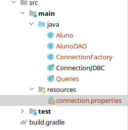
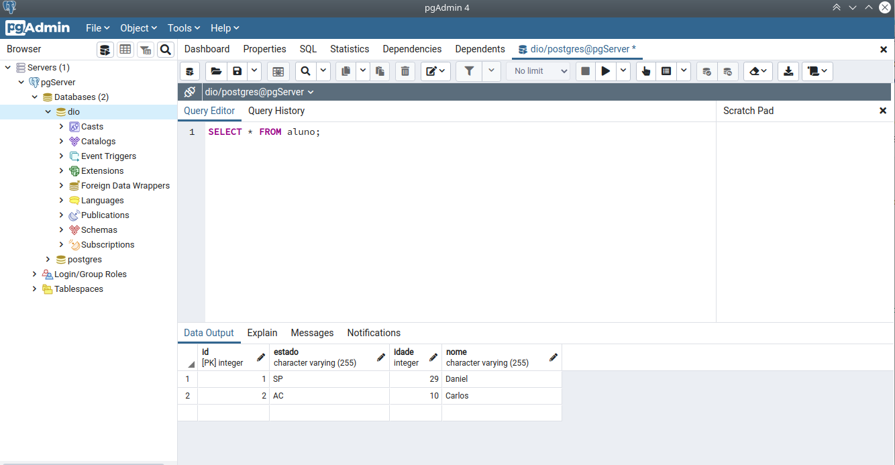
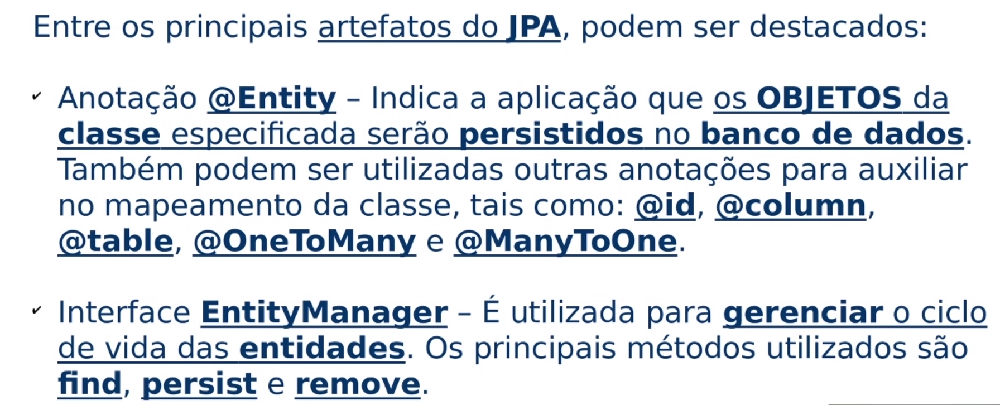
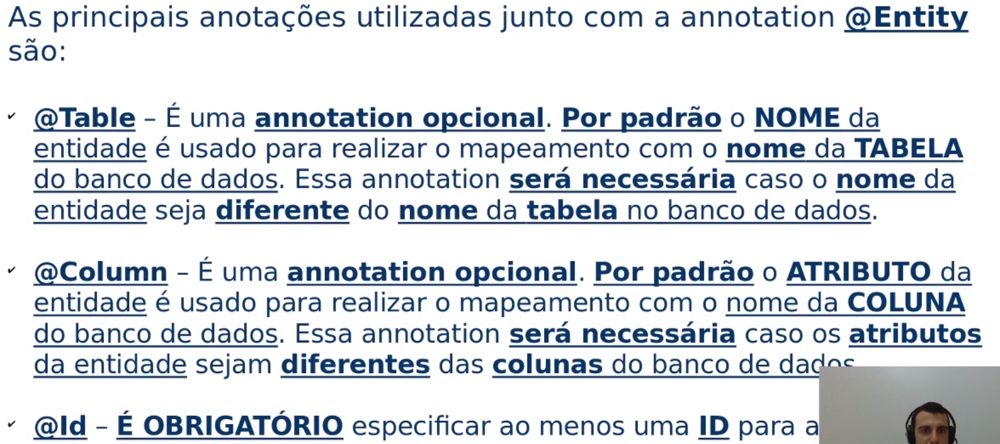
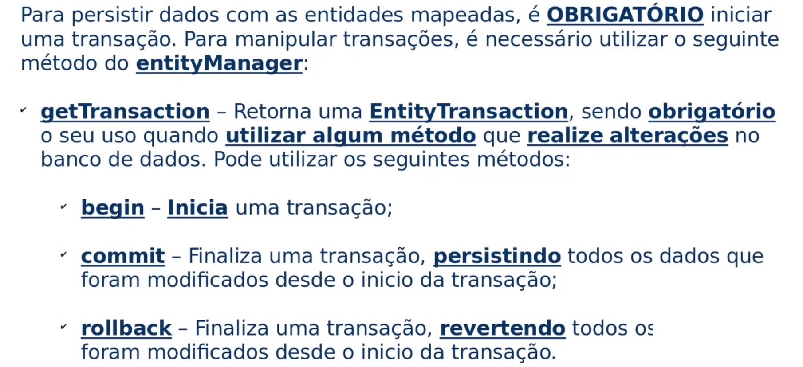
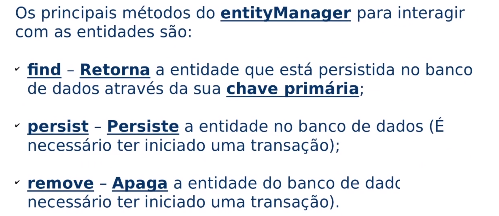
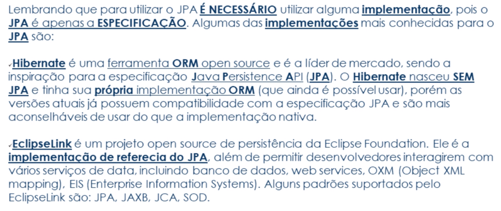
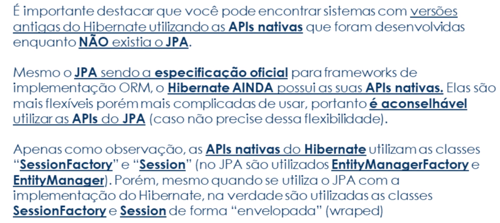
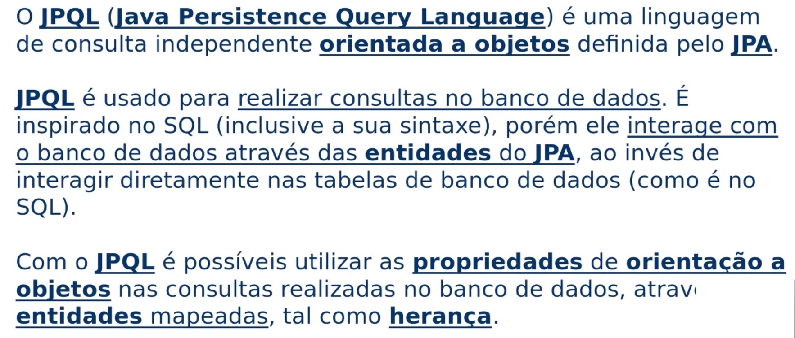
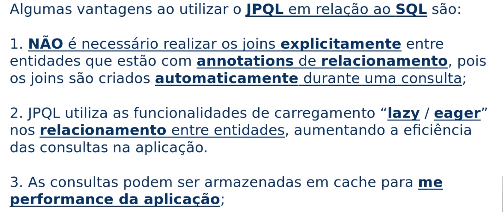

# Java JDBC Básico

*Anderson de Alencar Barros, 19 de março de 2021*

#### Sumário

- **[Introdução ao JDBC](#1)**
  - [JDBC e os drivers de conexão](#1.1)
  - [Consultas com JDBC](#1.2)
- **[Trabalhando com JPA](#2)**
  - [Linguagens de consulta orientada a objetos](#2.1)

## Introdução ao JDBC <a name="1"></a>

**Banco de dados** armazena dados de forma estruturada, tornando o acesso e atualização dos dados mais rápida, pois aumenta a eficiência computacional.

O **JDBC (Java Database Connectivity)** é uma API com classes e interfaces em Java presente nos pacotes `java.sql` e `javax.sql` para realizar conexões em banco de dados para consultas. O driver JDBC é o intermediário nessa interação.

A API JDBC ajuda a abstrair o banco de dados, não sendo necessário conhece o protocolo proprietário de diversos bancos de dados, sendo o driver o responsável por implementar as especificações de cada banco. 

A classe `DriverManager` é responsável pela comunicação com os drivers disponíveis.

A interface `Connection` representa a conexão com o banco de dados e permite criar **statements** que constroem consultas em SQL.

### JDBC e os drivers de conexão <a name="1.1"></a>

Para criar uma conexão com o banco de dados, primeiramente, deve-se baixar o driver relativo ao banco, que neste caso foi o PostgreSQL, que foi fácil graças ao Gradle, apenas inserindo a linha 

```java
implementation group: 'org.postgresql', name: 'postgresql', version: '42.2.19'
```

na seção de `dependencies` do Gradle.

Para se conectar com um banco precisamos de um link com o formato

```java
jdbc:<driver>://<endereço do banco>/<nome do banco de dados>
```

Para facilitar a leitura e manutenção podemos fazer

```java
// import java.sql.Connection;
// import java.sql.DriverManager;
// import java.sql.SQLException;

String driver = "postgresql";
String dataBaseAddress = "localhost";
String dataBaseName = "dio";
String user = "postgres";
String password = "12345";

String urlConnection = "jdbc:"  + driver
    + "://" + dataBaseAddress
    + "/"   + dataBaseName;
```

Por fim, para iniciar a conexão

```java
// try-catch-resource a partir do Java 7
try (Connection conn = DriverManager.getConnection(urlConnection, user, password)) {
    System.out.println("Banco Conectado com Sucesso");
} catch (Exception e) {
    System.out.println("Banco Não Conectado");
}
```

Também é possível usar um arquivo `connection.properties` dentro da pasta `resources` para facilitar a configuração.



```java
# connections.properties
jdbc.driver=postgresql
db.address=localhost
db.name=dio
db.user.login=postgres
db.user.password=12345
```

O código abaixo mostra a classe `ConnectionFactory` e como ler o arquivo de  propriedades. Esta classe também será usada posteriormente abaixo.

```java
import java.io.IOException;
import java.io.InputStream;
import java.sql.Connection;
import java.sql.DriverManager;
import java.sql.SQLException;
import java.util.Properties;

public class ConnectionFactory {

    public static Connection getConnection() {
        Connection connection = null;
        // Carregando o arquivo connection.properties
        try(InputStream input = ConnectionFactory.class.getClassLoader()
                                .getResourceAsStream("connection.properties")){

            // Definir parâmetros para se conectar ao banco de dados
            Properties prop = new Properties();
            prop.load(input);

            String driver = prop.getProperty("jdbc.driver");
            String dataBaseAddress = prop.getProperty("db.address");
            String dataBaseName = prop.getProperty("db.name");
            String user = prop.getProperty("db.user.login");
            String password = prop.getProperty("db.user.password");

            // Construção da string de conexão.
            String connectionUrl = "jdbc:"  + driver
                    + "://" + dataBaseAddress
                    + "/"   + dataBaseName;

            // Criar conexão usando o DriverManager,
            // passando como parâmetros a string de conexão, usuário e senha do usuário.
            try {
                connection = DriverManager.getConnection(connectionUrl, user, password);
            } catch (SQLException e) {
                System.out.println("FALHA ao tentar criar conexão");
                throw new RuntimeException(e);
            }

        } catch(IOException e) {
            System.out.println("FALHA ao tentar carregar aquivos de propriedades");
            e.printStackTrace();
        }

        return connection;
    }
}
```

### Consultas com JDBC <a name="1.2"></a>

São 3 interfaces para usar comandos SQL:

- `Statement` para SQL comuns, de forma estática;
- `PreparedStatement` para executar SQL parametrizáveis;
- `CallableStatement` para executar *store procedures*.

`PreparedStatement` é recomendado ao parametrizar as consultas por evita alguns problemas, como o ataque de SQL Injection, melhor legibilidade e desempenho.

Existem 3 métodos para executar os comandos em SQL:

- `execute` para qualquer tipo de SQL;
- `executeQuery` para o comando *SELECT*;
- `executeUpdate` para alteração no banco de dados, como *INSERT*, *UPDATE*, *DELETE*, *CREATE*, *ALTER*.

O objeto `ResultSet` contém os dados de uma dada consulta e com getters podemos ter acesso aos dados. `next()` é usado para iterar sobre o `ResultSet`.

É recomendado ter duas classes para fazer consultas no banco de dados: uma **classe espelho**, com os mesmo atributos da tabela do banco de dados e um **classe DAO,**  Data Access Object, para separar as regras de négocio das regras de acesso ao banco de dados.

Vamos supor uma tabela de alunos, teremos duas classes `Aluno` e `AlunoDAO` e que cada aluno tenha atributos *id*, *nome*, *idade* e *estado*. 

A tabela no PostgreSQL fica da forma



E a classe `Aluno` 

```java
public class Aluno {
    // Um espelho do banco de dados
    // Classe para criar objetos recebidos do banco

    private int id;
    private String nome;
    private int idade;
    private String estado;

    public Aluno(int id, String nome, int idade, String estado) {
        this.id = id;
        this.nome = nome;
        this.idade = idade;
        this.estado = estado;
    }

    public Aluno(String nome, int idade, String estado) {
        this.nome = nome;
        this.idade = idade;
        this.estado = estado;
    }
    
    public Aluno() {
    }
    
    // Além de métodos getters e setters...
```

Na classe `AlunoDAO` vamos usar a classe `ConnectionFactory` para criar conexões com o banco de dados e implementar por meio de método as regras que desejamos de acesso a ele. Vejamos exemplos

Para retornar uma lista de todos os alunos no banco,

```java
public List<Aluno> getAlunosList() {
    List<Aluno> alunos = new ArrayList<>();
	
    // Classe ConnectionFactory sendo usada 
    // para criar uma conexão do banco na variável 'conn'
    try(var conn = ConnectionFactory.getConnection()) {
        // Comando SQL em PreparedStatement
        PreparedStatement psrt = conn.prepareStatement("SELECT * FROM aluno");
        // Comando sendo executado pelo armazenado
        ResultSet rs = psrt.executeQuery();
	
        // Com o next() podemos iterar sobre todos os resultados 
        // e com getters recebemos cada dado na tabela 
        // que é usado para instânciar objetos
        while (rs.next()) {
            Aluno aluno = new Aluno(
                rs.getInt("id"),
                rs.getString("nome"),
                rs.getInt("idade"),
                rs.getString("estado")
            );

            alunos.add(aluno);
        }

    } catch (SQLException throwables) {
        throwables.printStackTrace();
    }

    return alunos;
}
```

Na `Main`, teríamos

```java
AlunoDAO alunoDAO = new AlunoDAO();
List<Aluno> alunos = alunoDAO.getAlunosList();
// imprime todos da lista
alunos.stream().forEach(System.out::println);
```

Retornar os dados de um aluno pelo `id`,

```java
public Aluno getAlunosByID(int id) {
    Aluno aluno = new Aluno();
    try(var conn = ConnectionFactory.getConnection()) {
        // Perceba como o ? é usado para passar um parâmetro
        PreparedStatement stmt = conn.prepareStatement("SELECT * FROM aluno WHERE id = ?");
        // usamos a posição de cada ? para indicar o local de cada parâmetro
        stmt.setInt(1, id);
        ResultSet rs = stmt.executeQuery();

        if (rs.next()) {
            aluno.setId(rs.getInt("id"));
            aluno.setNome(rs.getString("nome"));
            aluno.setIdade(rs.getInt("idade"));
            aluno.setEstado(rs.getString("estado"));
        }

    } catch (SQLException throwables) {
        throwables.printStackTrace();
    }

    return aluno;
}
```

Na `Main`

```java
Aluno aluno = alunoDAO.getAlunosByID(4);
System.out.println(aluno);
```

Inserir um aluno no banco,

```java
public void inserirAluno(Aluno aluno) {
	try(var conn = ConnectionFactory.getConnection()) {
        String sql = "INSERT INTO aluno(nome, idade, estado) VALUES (?, ?, ?)";
        PreparedStatement stmt = conn.prepareStatement(sql);
        stmt.setString(1, aluno.getNome());
        stmt.setInt(2, aluno.getIdade());
        stmt.setString(3, aluno.getEstado());

        int linhaAlterada = stmt.executeUpdate();
        System.out.println("A linha alterada foi " + linhaAlterada);

    } catch (SQLException throwables) {
    throwables.printStackTrace();
    }
}
```

Na `Main`. Podemos usar o método anterior `getAlunosList()` para visualizar.

```java
Aluno alunoTemp = new Aluno("Anderson", 23, "PE");
alunoDAO.inserirAluno(alunoTemp);
```

Remover um aluno pelo `id`,

```java
public void deletarAluno(int id) {
    try(var conn = ConnectionFactory.getConnection()) {
        String sql = "DELETE FROM aluno WHERE id = ?";
        PreparedStatement stmt = conn.prepareStatement(sql);

        stmt.setInt(1, id);

        int linhaAlterada = stmt.executeUpdate();
        System.out.println("A linha alterada foi " + linhaAlterada);

    } catch (SQLException throwables) {
        throwables.printStackTrace();
    }
}
```

Atualizar os dados de um aluno pelo `id`,

```java
public void atualizarAluno(int id) {
    try(var conn = ConnectionFactory.getConnection()) {
        String sql = "UPDATE aluno SET nome = 'Anderson Alencar' WHERE id = ?";
        PreparedStatement stmt = conn.prepareStatement(sql);

        stmt.setInt(1, id);

        int linhaAlterada = stmt.executeUpdate();
        System.out.println("A linha alterada foi " + linhaAlterada);

    } catch (SQLException throwables) {
        throwables.printStackTrace();
    }
}
```

## Trabalhando com JPA <a name="2"></a>

Existia um problema de produtividade com muito tempo gasto com JDBC, o desenvolvedor investia muito tempo em saber como buscar os dados ao invés de focar na regra de negócio, além da mudança de paradigma entre a orientação a objeto com o modelo relacional.

Pensando neste último problema, foi criado o **Mapeamento Objeto Relacional (ORM)** para representar tabelas através de classes. Assim, uma tabela era mapeada em uma classe, uma coluna em um atributo e um registro em um objeto. Portanto, foi criado uma padronização de implementações ORM conhecida como **JPA (Java Persistence API)**. 

Desse modo, o JPA fornece uma interface comum, porém cada implementação pode pode resolver um problema de forma diferente, mas seguindo certas restrições, sendo possível manter o código independente da implementação e ajudando a abstrair o código.














Para os exemplos abaixo foi usado o **Hibernate** como implemenação do JPA e para instalar foi usado os comandos nas dependências do Gradle para instalar o Hibernate e o JPA

```java
implementation group: 'org.springframework.boot', name: 'spring-boot-starter-data-jpa', version: '2.4.3'
implementation group: 'org.hibernate', name: 'hibernate-core', version: '5.4.29.Final'
```

Voltando ao código da classe `Aluno`, mapeamos os atributos para as colunas da tabela

```java
import javax.persistence.*;

@Entity     // mapeia uma tabela para uma classe
public class Aluno {

    @Id     // é obrigatório, todos os objetos devem ter uma id única, uma chave primária
    @GeneratedValue(strategy = GenerationType.SEQUENCE) // gera um id quando for persistir a classe Aluno
    private int id;

    @Column     // mapeamento das colunas
    private String nome;
    @Column
    private int idade;
    @Column
    private String estado;

    // construtores, getters e setters...
}
```

Precisamos configurar a persistência por meio de um arquivo `persistence.xml` na pasta `resources/META-INF`

```xaml
<?xml version="1.0" encoding="UTF-8"?>
<persistence xmlns="http://xmlns.jcp.org/xml/ns/persistence"
             xmlns:xsi="http://www.w3.org/2001/XMLSchema-instance"
             xsi:schemaLocation="http://xmlns.jcp.org/xml/ns/persistence http://xmlns.jcp.org/xml/ns/persistence/persistence_2_2.xsd"
             version="2.2">

    <!-- Unidade de persistência. Deve ser lembrado, pois será usado no código -->
    <persistence-unit name="part1-DIO">

        <description> Unidade de persistência do tutorial básico de JPA da Digital Innovation One sem implementacoes</description>

        <!-- Especifica quem implementa o JPA-->
        <provider>org.hibernate.jpa.HibernatePersistenceProvider</provider>

        <!-- Classes (entidades) que serao mapeadas -->
        <class>JPA.Aluno</class>

        <!-- Configuracoes de conexao ao banco de dados -->
        <properties>
            <!-- Configuracoes do banco de dados -->
            <property name="javax.persistence.jdbc.url" value="jdbc:postgresql://localhost/dio" />
            <property name="javax.persistence.jdbc.user" value="postgres" />
            <property name="javax.persistence.jdbc.password" value="12345" />
            <property name="javax.persistence.jdbc.driver" value="org.postgresql.Driver" />

            <!-- Configuracoes do Hibernate (os parametros so sao reconhecidos se estiver usando a implementacao do Hibernate)-->
            <property name="hibernate.dialect" value="org.hibernate.dialect.PostgreSQL82Dialect" />
            <property name="hibernate.show_sql" value="true" />
            <property name="hibernate.format_sql" value="true" />
            <!-- Deve-se tomar cuidado com essa configuração 'create', ela deleta a tabela a cada execução e deve ser usada somente para desenvolvimento. O ideal seria validate -->
            <property name="hibernate.hbm2ddl.auto" value="create" />  <!-- Possible values for hibernate.hbm2ddl.auto are: validate, update, create, create-drop -->
        </properties>

    </persistence-unit>
</persistence>
```

Para iniciar o `EntityManager` e carregar o arquivo `persistence.xml`, fazemos

```java
//import javax.persistence.EntityManager;
//import javax.persistence.EntityManagerFactory;
//import javax.persistence.Persistence;

EntityManagerFactory entityManagerFactory = Persistence.createEntityManagerFactory("part1-DIO");
EntityManager entityManager = entityManagerFactory.createEntityManager();
```

Com as configurações feitas, podemos agora persistir os dados no banco. Vale lembrar que para alterar os dados com essa interface precisamos sempre de uma transação. Suponha alguns objetos da classe `Aluno`,

```java
Aluno alunoParaAdicionar1 = new Aluno("Daniel", 29, "SP");
Aluno alunoParaAdicionar2 = new Aluno("Carlos", 10, "AC");
Aluno alunoParaAdicionar3 = new Aluno("Anderson", 23, "PE");
```

Para adicionar no banco,

```java
entityManager.getTransaction().begin();	// inicia a transação

entityManager.persist(alunoParaAdicionar1);
entityManager.persist(alunoParaAdicionar2);
entityManager.persist(alunoParaAdicionar3);

entityManager.getTransaction().commit(); // termina a transação
```

Para ler instâncias do banco,

```java
// perceba como não é preciso uma transação, pois nenhum dado é alterado
Aluno alunoEncontrado = entityManager.find(Aluno.class, 3);
System.out.println(alunoEncontrado);
```

Alterar uma entidade,

```java
entityManager.getTransaction().begin();

alunoEncontrado.setNome("Karam");
alunoEncontrado.setIdade(20);

entityManager.getTransaction().commit();
```

Remover uma entidade,

```java
entityManager.getTransaction().begin();

entityManager.remove(alunoEncontrado);

entityManager.getTransaction().commit();
```

E para fechar a conexão,

```java
entityManager.close();
entityManagerFactory.close();
```

### Linguagens de consulta orientada a objetos (JPQL) <a name="2.1"></a>






Vamo lembrar que existem também o **JPA Criteria API**, porém este é mais complexo e pouco usado.

Aqui, usarei JPQL e SQL Nativo para exemplificar.

Inicialmente, vamos instanciar alguns dados,

```java
EntityManagerFactory entityManagerFactory = Persistence.createEntityManagerFactory("part1-DIO");
EntityManager entityManager = entityManagerFactory.createEntityManager();

entityManager.getTransaction().begin();

entityManager.persist(new Aluno("Daniel", 29, "PE"));
entityManager.persist(new Aluno("Anderson", 23, "PE"));
entityManager.persist(new Aluno("Joao", 20, "GO"));
entityManager.persist(new Aluno("Pedro", 30, "AC"));

entityManager.getTransaction().commit();
```

Usando o método `find()` do `entityManager`, temos

```java
// traz somente um resultado, não é possível trazer uma lista de alunos
Aluno alunoEntityManager = entityManager.find(Aluno.class, 1);
```

Usando SQL Nativo é possível realizar consultas mais complexas

```java
// Trazendo somente 1 resultado
String sql = "SELECT * FROM Aluno WHERE nome = :nome ";
Aluno alunoSQL = (Aluno) entityManager
    .createNativeQuery(sql, Aluno.class)
    .setParameter("nome", nome)
    .getSingleResult();

// Trazendo uma lista como resultado
String sqlList = "SELECT * FROM Aluno";
List<Aluno> alunoSQLList = entityManager
    .createNativeQuery(sqlList, Aluno.class)
    .getResultList();
```

E o mesmo é possível com JPQL, que abstrai a linguagem SQL e mesmo trocando o banco, a linguagem JPQL se mantém

```java
// Trazendo somente 1 resultado
String jpql = "select a from Aluno a where a.nome = :nome";
Aluno alunoJPQL = entityManager
    .createQuery(jpql, Aluno.class)
    .setParameter("nome", nome)
    .getSingleResult();

// Trazendo uma lista como resultado
String jpqlList = "select a from Aluno a where a.estado = :estado";
List<Aluno> alunoJPQLList = entityManager
    .createQuery(jpqlList, Aluno.class)
    .setParameter("estado", "PE")
    .getResultList();
```

