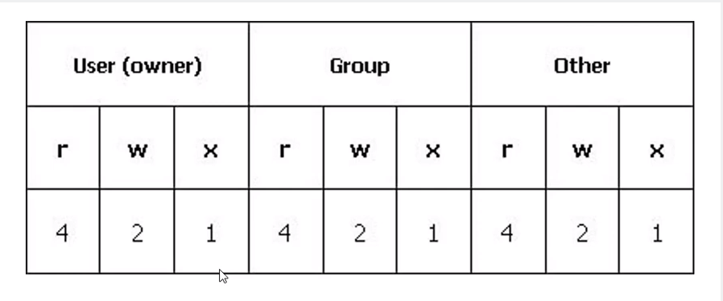

# Linux: Introdução ao sistema operacional

*Anderson de Alencar Barros*

## Comandos Iniciais

- `ls` lista diretórios e arquivos
- `ls -l` lista longa com detalhes
- `ls -s` lista com o tamanho alocado de cada arquivo  
- `ls -a` exibe arquivos e diretórios ocultos
- `ls <dir>` lista diretório dado
- `history` histórico de comandos
- `mkdir` cria diretório
- `rm` remover
- `rm -f` remove forçadamente, ignorando arquivos não existentes ou argumentos
- `rm -r` remove diretórios recursivamente
- `rm -rf` remover diretórios não vazios
- `rmdir` remover diretórios vazios
- `cd <dir>` muda diretório
- `~` pasta pessoal home
- `.` pasta atual
- `cd ..` retorna ao diretório anterior
- `--help` exibe arquivo de ajuda
- `man` manual do comando
- `mv` mover 
- `mv -i` confirmar antes de substituir
- `mv -n` sem substituição 
- `mv -b` substituição pelo backup 
- `mv -u` substitua se o arquivo de destino for antigo ou não existir
- `mv <nome_antigo> <nome_novo>` renomeia um arquivo
- `cp` copiar
- `cp -i` copia, porém verifica se o arquivo já existe
- `cp -v` exibe uma saída
- `cp -r` copia diretórios
- `cp -l` cria hard links 
- `cp -s` cria links simbólicos
- `cp -u` copia apenas quando o arquivo de destino for antigo ou não existir
- `clear` limpa terminal ou `CTRL + L`
- `exit` sai do terminal 

## Comandos para manipulação de arquivos e textos e redirecionamento

- `nano` é o editor do texto do terminal do Ubuntu
- `cat` imprime o arquivo .txt em ordem normal
- `tac` imprime o arquivo .txt em ordem inversa
- `head` imprime as primeiras 10 linhas de um ou mais arquivos
- `tail` imprime as últimas 10 linhas de um ou mais arquivos
- `cal` mostra o calendário
- `cal 2020` mostra o calendário do ano de 2020 
- `cal december 2020` mostra o calendário do ano de 2020 e o mês de dezembro 
- `date` mostra a data e horário
- `!!` repete o último comando
- `>>` adiciona uma informação a um arquivo de texto
- `grep` faz uma busca por um termo dentro do texto
- `|` serve para usar mais de um comando
- `| more` ou `| less` servem para o arquivo ficar paginado, sem exibir totalmente
- `&` executa dois ou mais comandos com saídas separadas
- `&&` executa dois ou mais comandos em sequência com as saídas unidas
- `file` mostra o tipo de arquivo ou pasta
- `whatis` mostra o que faz determinado comando
- `find` busca um arquivo em um diretório
- `find <dir> -type f -name <nome>` busca um arquivo (`-type f`) em um diretório, o nome pode ser um padrão em Regex
- `find <dir> -type d -name <nome>` busca por um diretório (`-type d`)

- `touch` cria arquivos vazios 
- `echo` imprime algo na saída

## Diretórios do Linux e Comandos de Sistema

### Diretórios

- `/` É o diretório raiz, todos os demais diretórios estão abaixo dele.
- `/bin` Contém arquivos programas do sistema que são usados com frequência pelos usuários.
- `/boot` Arquivos estáticos e gerenciador de inicialização.
- `/dev` Arquivos de dispositivos (periféricos).
- `/etc` Arquivos de configuração do sistema, específicos da máquina.
- `/home` Contém os diretórios dos usuários.
- `/lib` Bibliotecas essenciais compartilhadas e módulos do kernel.
- `/mnt` Ponto de montagem para montar um sistema de arquivos temporariamente.
- `/proc` Diretório virtual de informações do sistema.
- `/root` Diretório home do usuário root.
- `/sbin` Diretório de programas usados pelo super usuário root, para administração e controle do funcionamento do sistema.
- `/tmp` Arquivos temporários.
- `/usr` Contém a maior parte de seus programas. Normalmente acessível somente como leitura.
- `/var` Dados variáveis, como: arquivos e diretórios de spool, dados de administração e login, e arquivos transitórios.
- `/opt` Aplicativos adicionais e pacotes de softwares.

### Comandos e arquivos do sistema

- `/proc/cpuinfo` contém todas as informações da CPU
- `/proc/meminfo` contém todas as informações da memória
- `/etc/passwd` contém todos os usuários do sistema
- `lspci` mostra informações dos dispositivos PCI 
- `lsusb` mostra informações dos dispositivos USB
- `lscpu` mostra informações do CPU
- `lshw` mostra de todo hardware que encontrar
- `lshw -short` mostra de todo hardware que encontrar resumidamente
- `arch` mostra qual a arquitetura do computador
- `uname` mostra o nome do kernel
- `uname -r` mostra a versão do kernel
- `uname -m` mostra a arquitetura do kernel
- `free` mostra a memória física e a memória swap
- `du -h` estima o espaço ocupado por um diretório 

## Fundamentos de Rede e Comandos de Rede

> Rede de computadores é um conjunto de equipamentos interligados de maneira a trocarem informações e recursos.

### Tipos de Redes

- **Rede WAN**, Wide Area Network ou World Area Network é uma rede geograficamente distribuída.

- **Rede MAN**, Metropolitan Area Network, é uma rede metropolitana que interligam várias redes locais.

- **Rede LAN**, Local Area Network, é uma rede local de uma forma geral em um único prédio, uma casa ou campus.

### Protocolos

**Protocolo** é uma linguagem usada pelos dispositivos de uma rede de modo que eles consigam se entender.

- IP são números que identificam seu computador em uma rede.

- ICMP (Internet Control Message Protocol) tem o objetio prover mensagens de controle na comunicação entre nós.

- DNS (Domain Name Server) é um protocolo de aplicação que tem por função identificar endereços IP e manter uma tabela com endereços dos caminhos da rede.

### Interface de Rede

Interface de Rede são softwares ou hardware que faz comunicação em uma rede.

As interfaces de rede no Linux estão em `/dev` e a maioria é criada dinamicamente pelos softwares quando requisitadas.

Exemplo: `eth0` placa de rede ethernet, `loopback` permite fazer conexões com si mesmo, permitindo testar programas de rede sem precisar interferir na sua rede, por padrão, tem endereço IP `127.0.0.1`.

#### Comandos

- `ifconfig` mostra detalhes da redes ativas além de configurar as interfaces de rede
- `hostname` mostra informações do host, o nosso computador na rede
- `hostname -i` exibe IP do loopback
- `hostname -I` mostra o IP do computador
- `w` mostra informações do usuário na rede
- `who` mostra como estamos logados
- `whoami` mostra o nome do usuário logado na rede
- `whois` traz várias informações sobre dado host, como dono, DNS, contato, e-mail e etc
- `ping` mostra se o host está ativo. Envia um pacote de requisição para o host e recebe as respostas
- `dig` mostra informações sobre DNS
- `dig +short` mostra o IP do host dado
- `traceroute` traçar a rota até determinado host, mostrando informações dos nós até o host dado
- `finger` traz informações detalhadas do usuário logado

## Fuçando no Linux com comandos diversos

- `history -c` limpa o histórico de comandos
- `alias` cria atalhos para comandos
- `nl` exibe o arquivo com o número de linhas 
- `wc` exibe linhas, palavras, e letras de um arquivo
- `wc -l` mostra o número de linhas, conta as linhas em branco 
- `wc -w` conta o número de palavras de um arquivo
- `cmp` compara arquivos 
- `diff` compara arquivos e exibe o arquivo
- `sort -n` ordena as linhas de um arquivo, em ordem numérica
- `last reboot` exibe todas as informações de reinicialização do sistema
- `route -n` mostra todas as tabelas de roteamento IP
- `time` mostra o tempo de um processo
- `uptime` mostra por quanto tempo o sistema está rodando
- `cowsay` exibe uma vaquinha que fala
- `cmatrix` exibe as letrinhas de Matrix
- `init 0` desliga a máquina
- `telinit 0` desliga a máquina
- `halt` desliga a máquina, todavia com autenticação
- `seq inicio fim` exibe uma sequência de números 
- `whereis` exibe o caminho do programa e seu manual
- `which` exibe o local de um comando a ser executado no ambiente atual

## Controle de usuários, grupos e permissões

#### Usuários

- `adduser <nome_usuario>` adiciona novo usuário, só o root pode adicionar usuários
- `su <nome_usuario>` muda de usuário
- `passwd <nome_usuario>` muda a senha de um usuário
- `lastlog` exibe informações de login de todos os usuários
- `last` listagem de entrada e saída de usuários no sistema
- `logname` exibe nome do usuário atual logado no sistema

#### Grupos

- `id` exibe os identificadores do usuário e a que grupo pertence
- `/etc/passwd` já dito anteriormente, contém todos os usuários do sistema
- `/etc/group` contém todos os grupos do sistema
- `userdel -r <nome_usuario>` remove um usuário e sua pasta pessoal
- `groups` exibe todos os grupos que o usuário pertence
- `addgroup` cria um grupo
- `adduser <nome_usuario> <grupo>` adiciona um usuário a um grupo
- `gpasswd -a <nome_usuario> <grupo>` também adiciona um usuário a um grupo
- `gpasswd -d <nome_usuario> <grupo>` remove o usuário de um grupo
- `groupdel <grupo>` remove um grupo

#### Permissões

As permissões são divididas em 3 partes: o dono, grupo e outros cada um com 3 caracteres. Por exemplo, `drwxr-xr-x` mostra que nesse diretório o dono tem permissão `rwx`,  o grupo `r-x` e os outros `r-x`. As letras indicam as permissões e o traço uma restrição, sendo `r` para ler, `w` para escrever e `x` para executar.

- `ls -lh` exibe as permissões em um diretório

##### Comando `chmod <modo> <arquivo>` e o Modo Octal

O comando `chmod` altera as permissões de um arquivo ou diretório, sendo possível definir permissões para cada uma das partes, o dono, grupo e outros.

- Um número é definido para cada grupo
- 0 representa uma restrição
- Para mais de uma permissão soma-se ambos. Por exemplo, para execução e escrita em um arquivo qualquer para apenas o dono faz da seguinte maneira, `chmod 300 <arquivo>`, como também 777 daria todas as permissões possíveis

## Compactação, descompactação e arquivamento

- `gzip <arquivo>` compactador com taxa excelente de compactação, o arquivo original deixa de existir
- `gzip -9 <arquivo>` compactação com grau máximo
- `gunzip <arquivo>` para descompactar um arquivo *.gz*
- `zip <arquivo.zip> <arquivo>+` compactador, porém mantém o arquivo original e pode ser colocado vários arquivos
- `unzip <arquivo.zip>` para descompactar um arquivo *.zip*
- `bzip2 <arquivo>` compactador mais atual que o `gzip` e `zip`, o arquivo original deixa de existir
- `bzip2 -d <arquivo.bz2>` para descompactar um arquivo *.bz2*
- `rar a <arquivo.rar> <arquivo>+` gera um arquivo *.rar* e pode ser usado com vários arquivos
- `rar x <arquivo.rar>` para descompactar um arquivo *.rar*

#### Arquivadores

Junta vários arquivos em um só. Pode ser usado em conjunto com um compactador para armazenar arquivos compactados. Um dos mais conhecidos é o *.tar*.

- `tar -cf <arquivo.tar> <arquivo>+` cria um arquivo *.tar* com um ou mais arquivos. 
- `tar -xvf <arquivo.tar.gz>` descompacta um arquivo *.tar.gz*, ou seja, um arquivo que foi empacotado com `tar` e em seguida, compactado com `gzip`
- `tar -xvf <arquivo.tar.gz> -C <dir>` extrai para outro diretório

## Gerenciamento de pacotes

**Pacotes** são programas colocados dentro de um arquivo identificados por sua extensão e incluem arquivos necessários para sua instalação, como *.deb*, *.rpm* e outros.

**Gerenciadores de Pacotes** são sistemas que possuem resolução automática de dependências entre pacotes, método fácil de instalação de pacotes, como dpkg, apt, yum.

- `sudo apt install <pacote>` instala e atualiza um pacote
- `sudo apt upgrade <pacote>` atualiza um pacote 
- `sudo apt remove <pacote>` remove um pacote 
- `sudo apt update && sudo apt upgrade` atualiza todos os pacotes 

#### Sites de Pacotes

Locais onde se pode baixar pacotes

- [pkgs.org](https://pkgs.org/)
- [rpm.pbone.net](http://rpm.pbone.net/)

- `sudo dpkg -i <pacote.deb>` instala um pacote *.deb* 
- `sudo dpkg -I <pacote.deb>` obtém informações de um pacote
- `sudo dpkg -r <pacote>` remove um pacote *.deb*, usa-se o nome do pacote dado nas informações dele

No Fedora,

- `sudo rpm -ivh --nodeps <pacote.rpm>` instala um pacote e resolve as dependências
- `sudo rpm -U <pacote.rpm>` atualiza um pacote 
- `sudo rpm -e <pacote.rpm>` remove um pacote 

## Shell script

É uma interface de usuário para acessar os serviços de um sistema operacional. Script é uma linguagem de programação que executa no sistema em tempo de execução, muito usada em automação.

#### Variáveis de Ambiente

- `env` mostra as variáveis de ambiente
- `portfolio=~/Documents/alencarbarros.github.io/` criando uma variável de ambiente `portfolio` com um caminho
- `export portfolio` cria a variável de ambiente
- `cd $portfolio` é possível ir até esse caminho com tal variável

