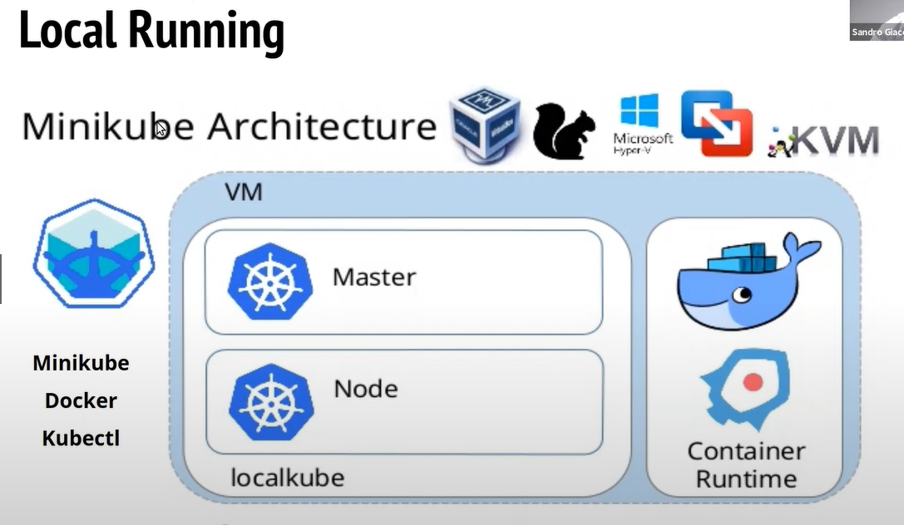
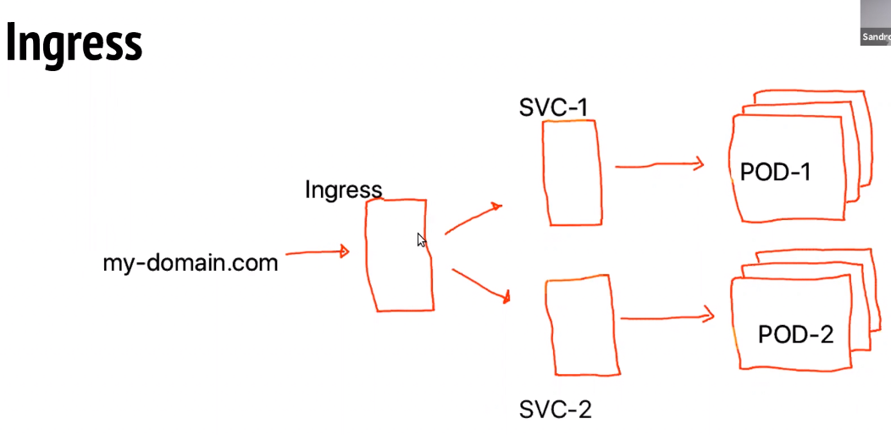
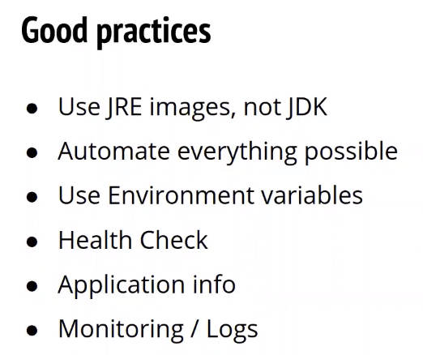

# Rodando sua aplicação Java no Kubernetes. Do deploy ao debug sem medo!

#### Definições

**Kubernetes (k8s)**  plataforma de gerenciamento de aplicativos de containers. Ele facilita a configuração e automação desses processos. 

**Docker** container.

**Minikube** simulação de um cluster local.

**Kubectl** linha de comando para interagir com o cluster.

*Dica:* `jenv` para gerenciar versões Java dentro de diretórios.

**Maven** automatizador de build

**Dockerfile** receita para criar um container. 

**Erro no comando `java --enable-preview -jar target/java-kubernetes.jar`** recriar o docker myapp

**Erro de porta 8080 sendo usada** fazer logout para desocupar a porta, ou parar o que estiver rodando na porta, porém pode ser o próprio IntellJ.

#### Objetivo

Criar uma aplicação Spring Boot com Docker e baixar uma imagem do MySQL

Portanto, existem dois containers: um da aplicação e outro para o banco de dados.

Kubernetes pode ser usado para simular um ambiente de microserviços em produção.

Ingress configura um domínio e mapeia as rotas para chegar na aplicação

Escolher um pod para fazer o debug

