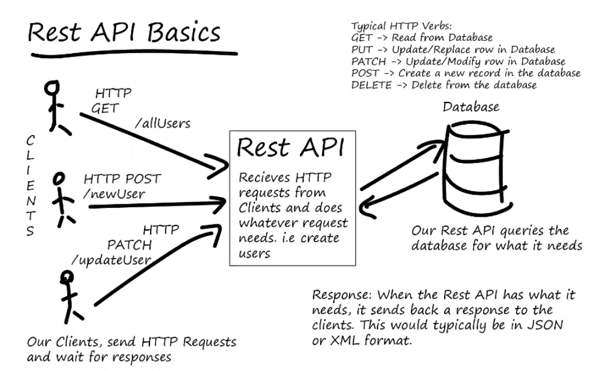
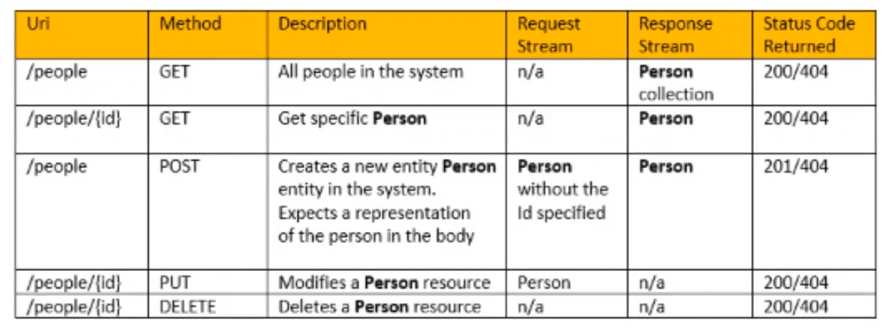
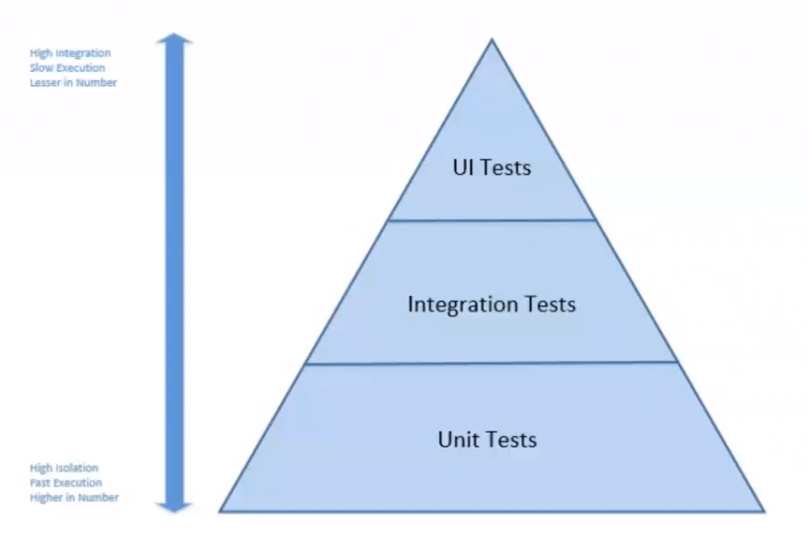
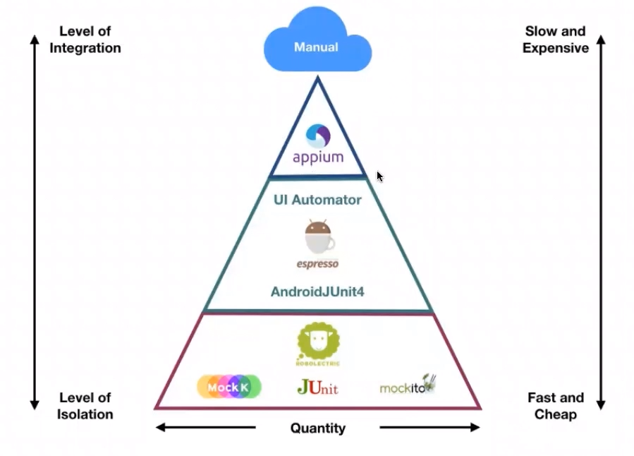

# Desenvolvimento de testes unitários para validar uma API REST de gerenciamento estoques de cerveja

## Verbos do HTTP

## Pirâmide de Testes

Isso garante que o sistema seja testado de ponta a ponta e evoluir  o sistema sem quebrar as funcionalidades, além de servir de documentação.#