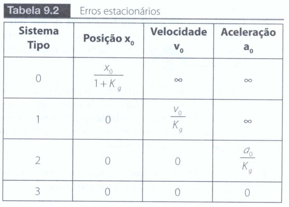

# Análise de Erros Estacionários

Tipos de sistema

- **Tipo 0:** nenhum polo de malha aberta na origem
- **Tipo 1:** 1 polo de malha aberta na origem
- **Tipo 2:** 2 polos de malha aberta na origem

**Erro do sistema** é a diferença do sinal de saída ideal desejado com o sinal de saída real

**Erro atuante** é a diferença entre o sinal de referência e um sinal de realimentação

Após a resposta transitória, o erro atuante se estabiliza e torna-se bem definido, por isso é denominado **erro estacionário**. Também é definido que o erro estacionário ou **erro estático** é o limite do erro atuante

**Erro estático da posição** para a entrada degrau

- Para tipo 0, existe equação

- Tipo 1, 0

- Tipo 2, 0

Para rastrear o degrau com erro nulo é preciso que a função de transferência do ramo direto tenha um polo na origem

**Erro estático da velocidade** entrada uma rampa

- Tipo 0, infinito
- Tipo 1, tem equação
- Tipo 2, zero

Para rastrear uma rampa com erro nulo é preciso que a função de transferência do ramo direto tenha dois polos na origem

**Erro estático da aceleração** entrada é uma parábola

- Tipo 0 , infinito
- Tipo 1, infinito
- Tipo 2, equação
- Tipo 3, zero

Para rastrear uma parábola com erro nulo é preciso que a função de transferência do ramo direto tenha 3 polos na origem

