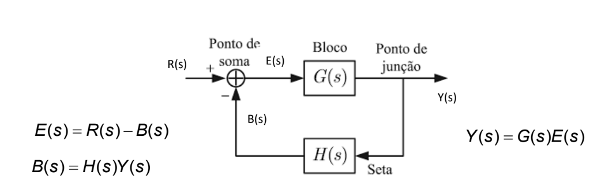
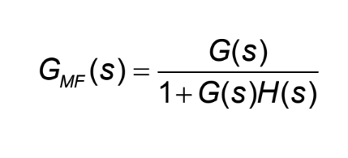

# Diagrama de Blocos

*Anderson de Alencar Barros*

É uma representação gráfica das funções de cada componente e o fluxo de sinais entre eles.

**Diagrama de Blocos em Malha Fechada**

Função de Transferência em Malha Fechada (para realimentação negativa, caso positiva o sinal torna-se negativo)

E(s) é chamada de *erro atuante*, E(s) = R(s) - H(s)Y(s)