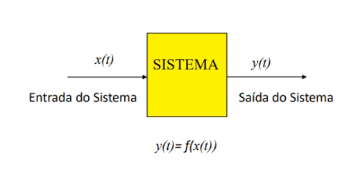
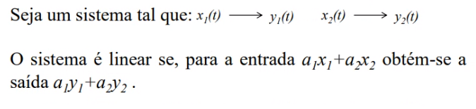

# Introdução a Sistemas de Controle

> Sistema é uma entidade que processa um conjunto de sinais, resultando em um outro conjunto de saídas.
>
> Lathi

> Definido como uma entidade que manipula sinais para realizar uma função, produzindo novos sinais.
>
> Haykin

**Sistemas SISO (Single Input Single Output)** possuem uma única entrada e uma única saída.

**Sistemas MIMO (Multiple Input Multiple Output)** possuem mais de uma entrada e mais de uma saída.

## Categorias de Sistemas

- **Sistemas de tempo contínuo** é aquele que os sinais de entrada e de saída são de tempo contínuo

- **Sistemas de tempo discreto** os sinais de entrada e saída são discretos

- **Linearidade** é aquele que

Princípio da superposição é uma propriedade da Linearidade.

- **Invariância no tempo** são sistemas com parâmetros constantes
- **Causalidade** se a saída no instante presente depende de valores passados e presentes da entrada e não de valores futuros. São sistemas físicos ou **não antecipativos**
- **Sistemas Instantâneos** aqueles sem memória, a saída atual depende entrada no mesmo instante
- **Sistemas  Dinâmicos** com memória, a saída atual depende das entrada e/ou saídas passadas, como sistemas que armazenam energia
- **Sistemas de parâmetros concentrados** onde os parâmetros descrevem propriedades que se manifestam em pontos bem definidos do sistema
- **Sistemas de parâmetros distribuídos** onde os parâmetros descrevem propriedades que aparecem apenas em partes do sistema ou em todo o sistema
- **Estabilidade** se, e somente se, toda entrada limitada resultar em uma saída limitada, conhecida como **BIBO (Bounded Input Bounded Output)**

## Sistemas de Controle em Malha Fechada ou Sistemas com Realimentação

A saída é medida e comparada com um valor desejado. 