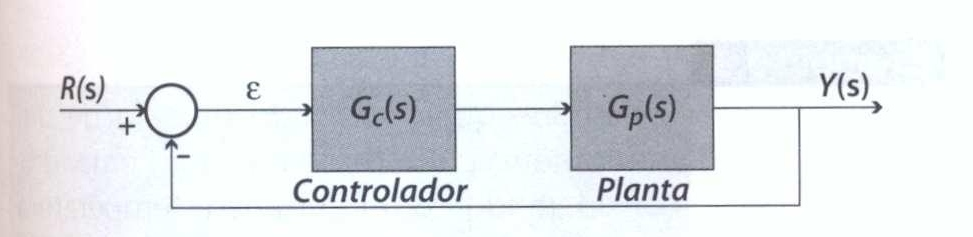

# Projeto de Controle

$$
G_p(s) = \frac{98}{(s + 22)(s + 54)}
$$

**Erro de posição nulo** rastrear o degrau com erro nulo, ou seja, polo na origem

**Sobressinal** equivale a Mp = 5%

**Tempo de estabelecimento** ts = 0,1