# Cálculo Vetorial: Campos vetoriais e Integrais de Linha

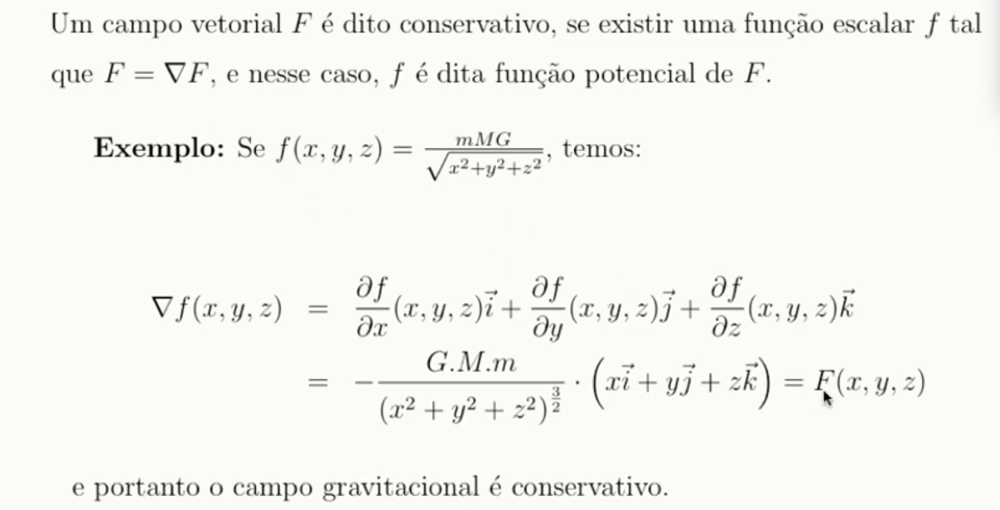

## Integral de Linha

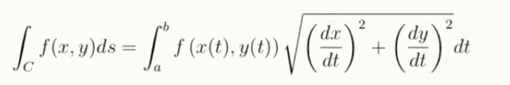

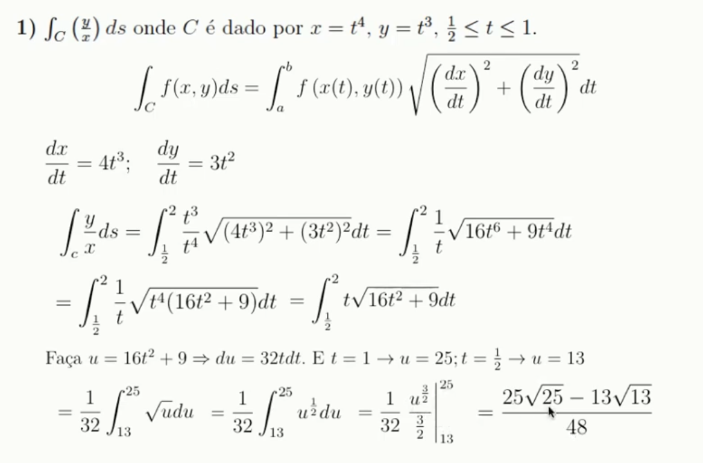

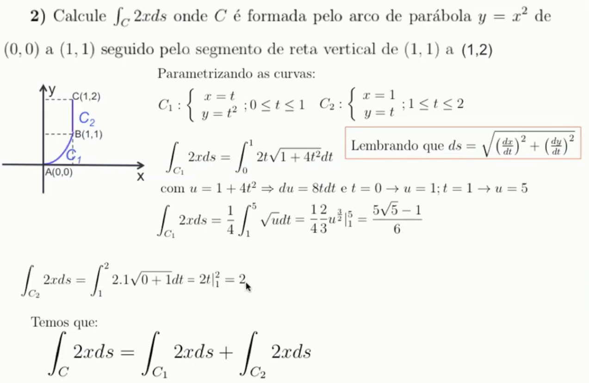

Integral de linha com relação a x e a y

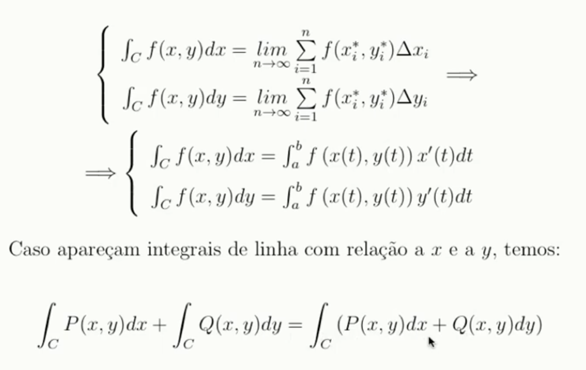

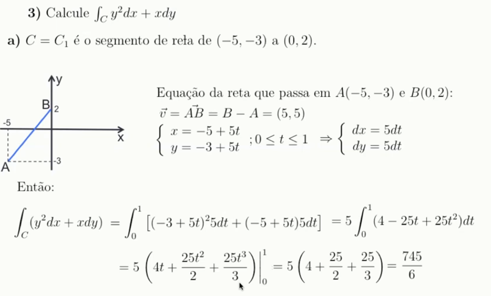

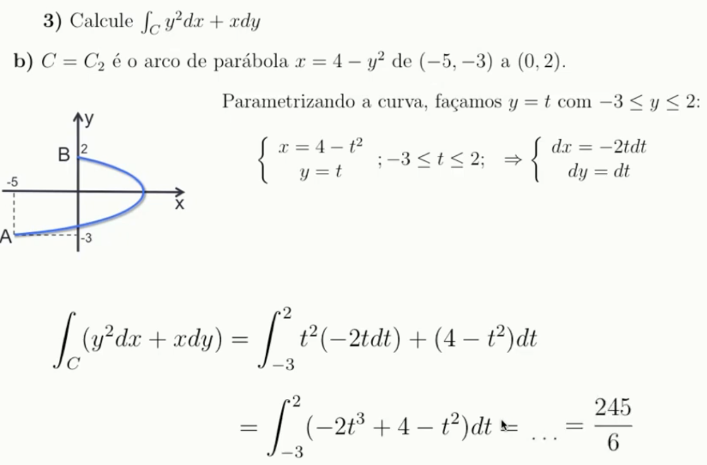

O sentido e a trajetória afeta o resultado da integral de linha. 

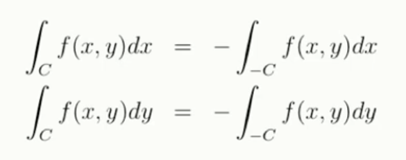

Porém na integral de linha no comprimento de arco isso não afeta ao resultado.

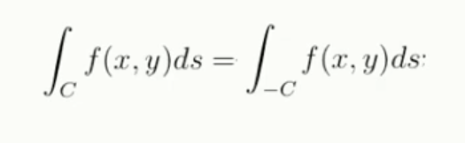

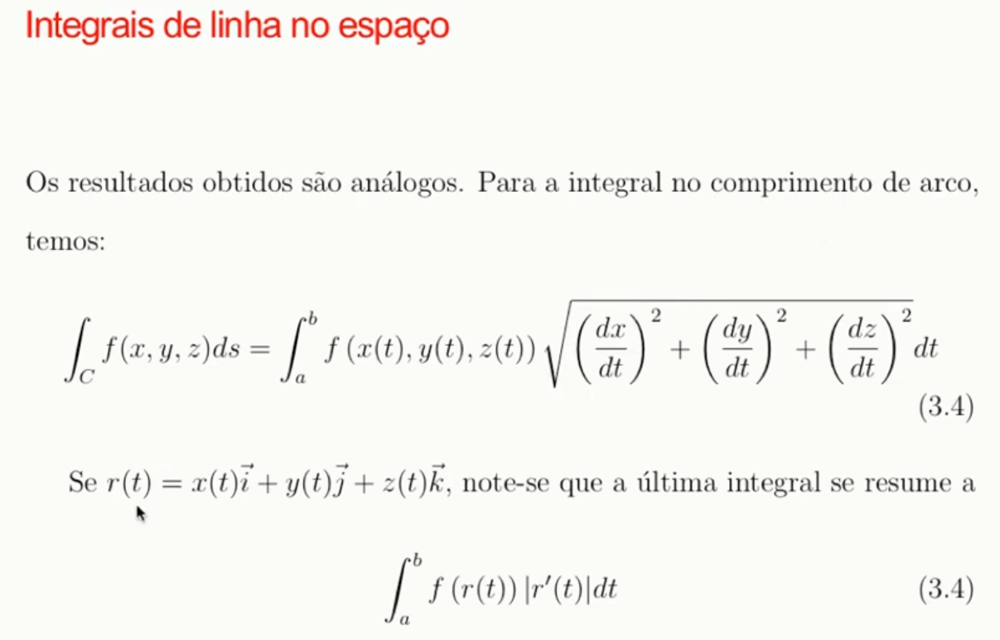

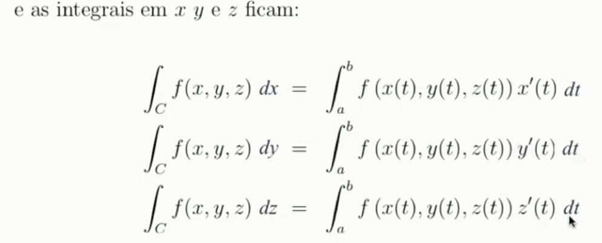

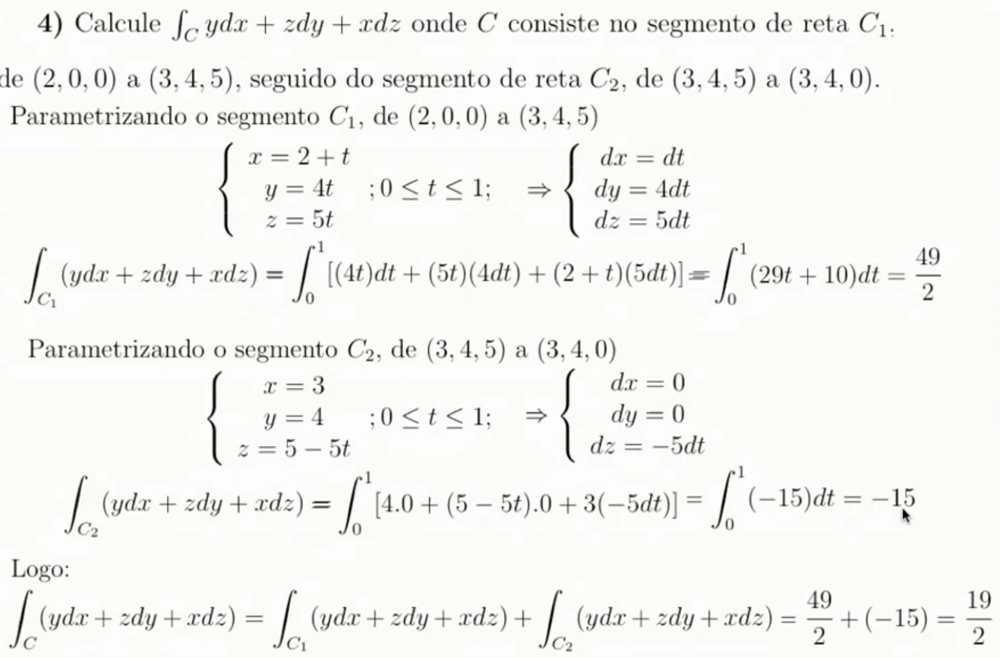

### Integral de Linha de um campo vetorial

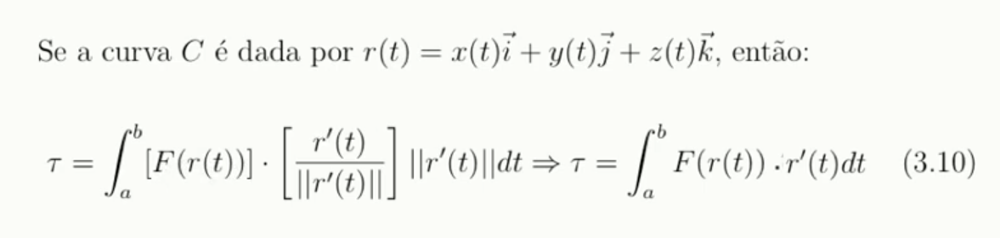

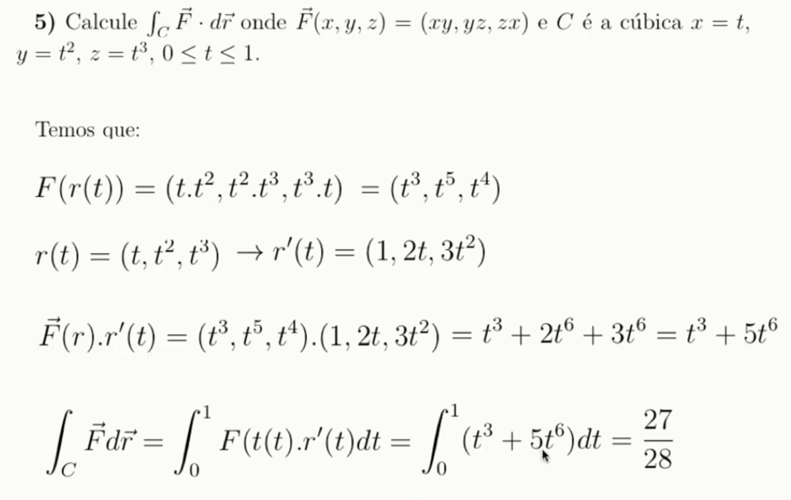

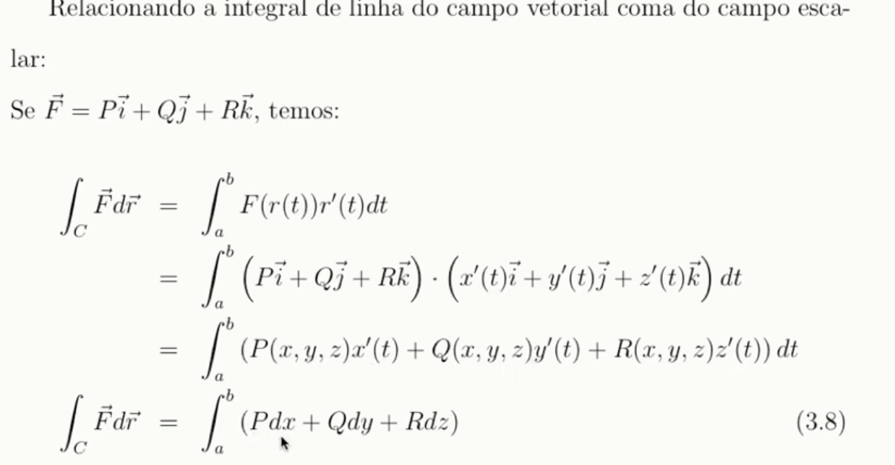

A integral de linha no campo vetorial é igual a integral da soma de campos escalares.