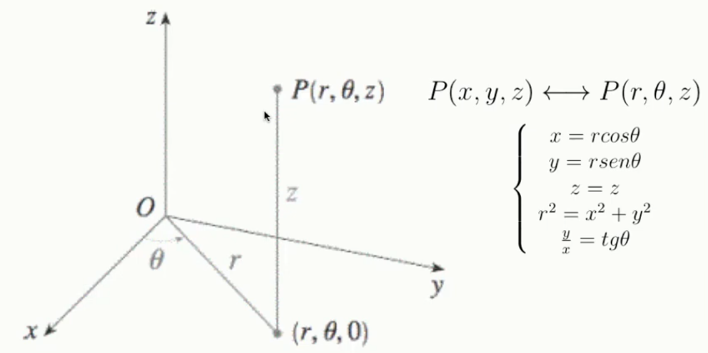
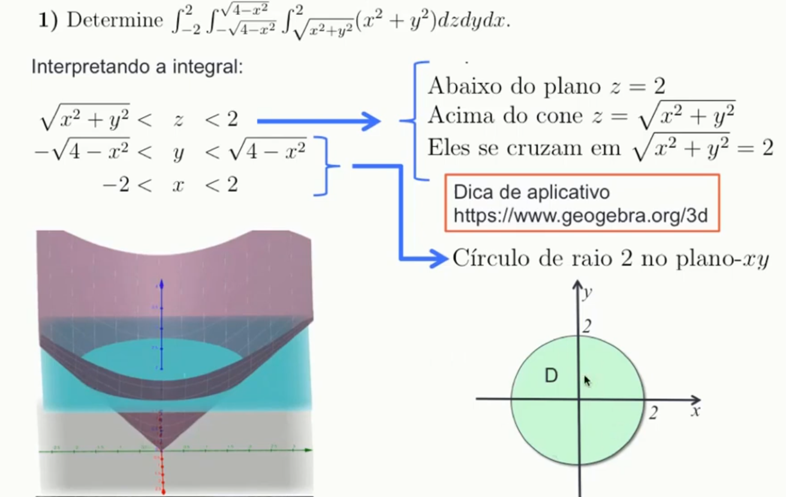
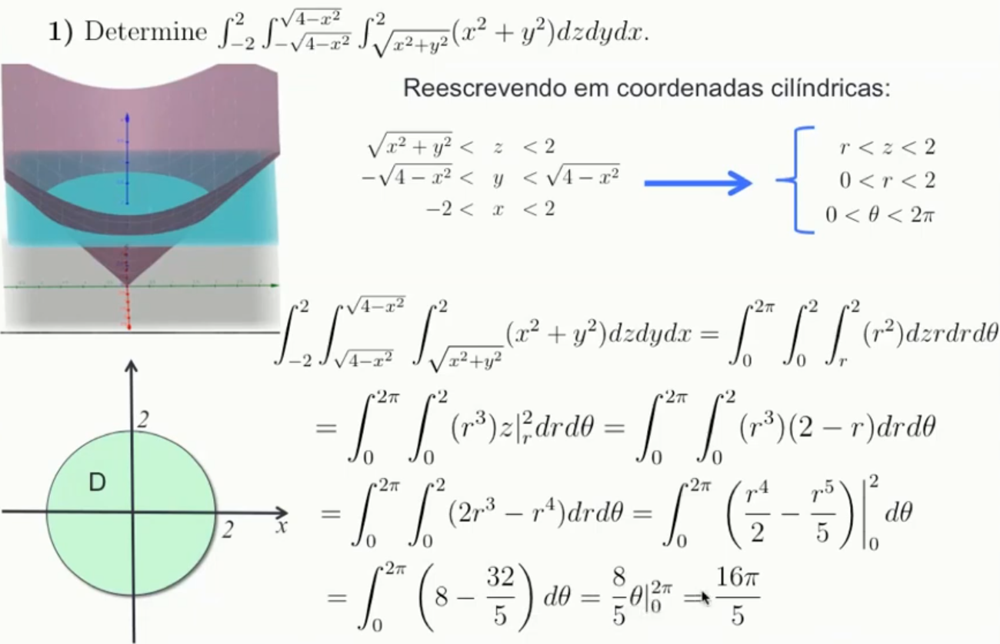
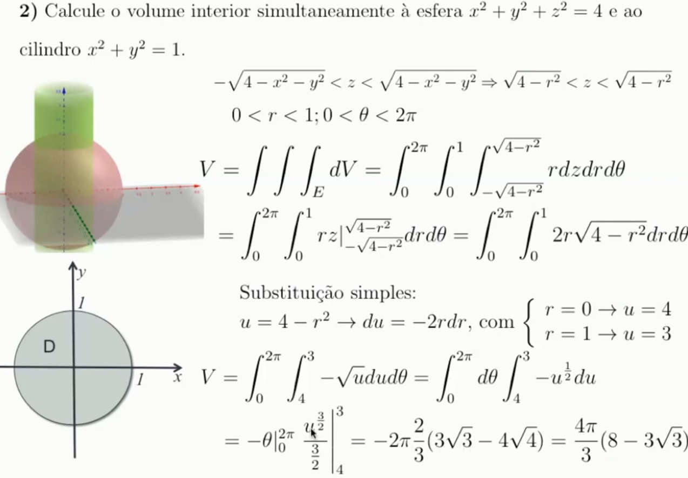

# Integrais triplas em coordenadas cilíndricas

Coordenada cinlíndrica é mais **usado** quando a região tem uma **simetria com o eixo z**.

Ou quando 2 coordenadas formam um círculo e uma terceira varia entre 2 valores.

