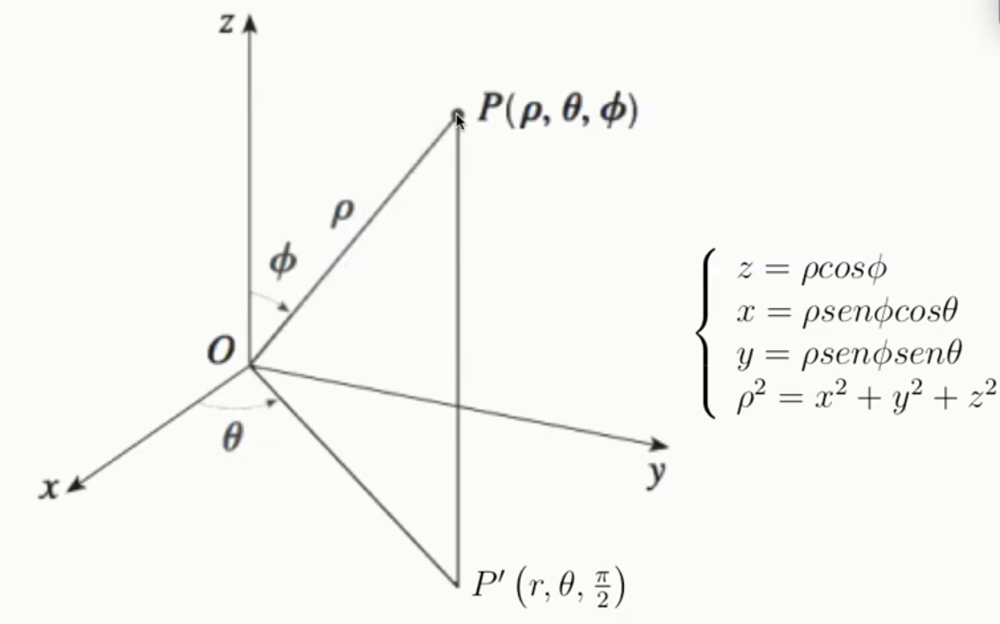
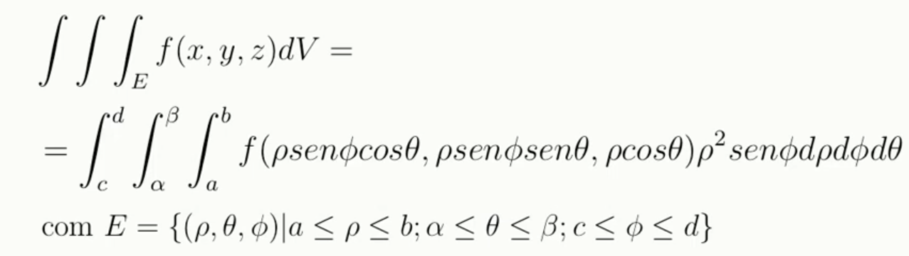
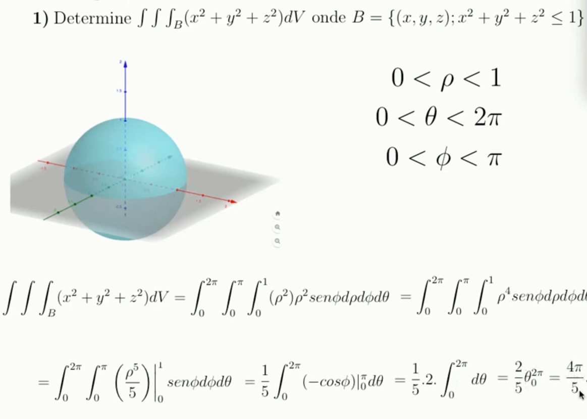
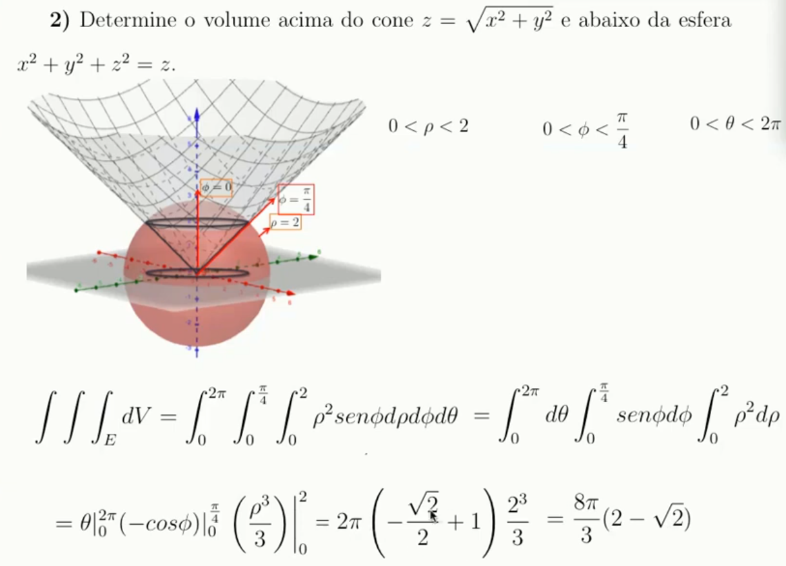

# Integrais triplas em coordenadas esféricas

Mais usadas para calcular **volume de sólidos esféricos**

**ATENÇÃO** O ângulo $\phi$ vai do eixo z positivo até z negativo. 

Ou seja, Pode variar de 0 até 180 (0 a pi)

$\phi$ pode ser encontrado substituindo as relações trigonométricas dentro da equação de z.

