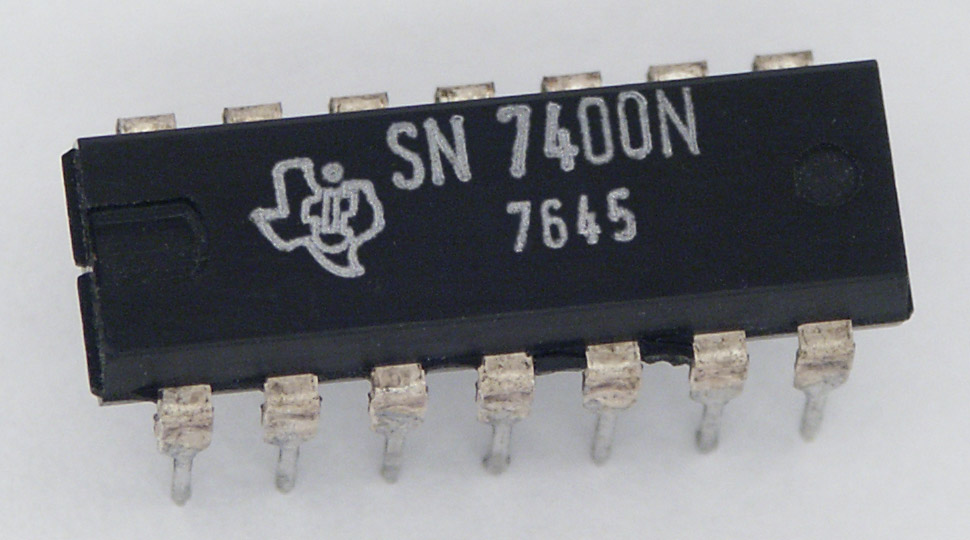
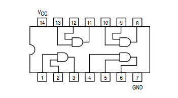

# Introdução a Simulação

*Anderson de Alencar Barros, 14 de março de 2021*

.png)

**Teoria das Filas** é um ramo da probabilidade que estuda a formação de filas e é utilizada para estabelecer relações físico-matemáticas dos sistemas computacionais permitindo a construção de modelos.

**GVA** é o Gerador de Variáveis Aleatórias e permite gerar valores para as funções de densidade de probabilidade.

**Validação** e **Verificação** são técnicas para comprovar se a simulação representa o sistema real.

**Sistema Computacional** são recursos de software e hardware, também incluem usuários e as tarefas feitas pelos usuários.

**Simulação** é o processo de construir e reproduzir o comportamento de Sistemas de Filas usando manipulando modelos. Assim, é possível avaliar seu comportamento e aspectos importantes, fazer análises e predições.

Desse modo, para construir uma simulação, o primeiro passo requer a construção de um modelo obtidos da Teoria das Filas.

Em seguida, obtém-se amostras representativas do comportamento do sistema. Com essas amostras é possível identificar uma função densidade de probabilidade e gerar variáveis aleatórias para a simulação do sistema. 

Assim, a partir de poucos dados representativos dos sistema, é possível reproduzir a dinâmica do sistema real.

**Sistema** é como uma coleção de entidades, por exemplo, pessoas ou máquinas, que agem e interagem juntas para a realização de algum fim lógico, ou uma relação de funcionalidade. O circuito abaixo seria o exemplo de um sistema.

**Sistema Geral**  é aquele com o a mínima descrição possível que somente as possíveis interações com o mundo externo são retidas. Assim, é um sistema que relaciona o sistema ao mundo exterior. 

**Sistema Orientado** é a relação entre entrada e saída.

**Modelo** descrições de um sistema através de uma abstração da realidade, considerando os aspectos mais importantes. Abaixo seria o modelo do sistema acima, uma versão simplificada.

| .png) |
| :----------------------------------------------------------: |
|                 *Processo de uma Simulação*                  |

Simulações podem ser classificadas em:

**Simulação Contínua** utilizada quando o estado varia continuamente no tempo, sendo comum o uso de equações diferenciais.

**Simulação Monte Carlo** usa amostragens aleatórias massivas para obter resultados numéricos e repetindo sucessivas simulações para calcular probabilidades.

**Simulação Baseada em Trace** utiliza registros (traces) como dados de entrada para avaliar o sistema. Os traces também podem ser usados para validação e verificação dos resultados, porém para serem úteis, devem ser amostras significativas.

**Simulação de Eventos Discretos (SED)** utilizada quando os estados são eventos discretos no tempo. *Pacotes* são as unidades desse tipo de sistema. Cada pacote tem um tempo de chegada na fila, tempo de entrada no servidor e um tempo de saída. O estado do sistema é definido pelo fluxo de pacotes. 

O objetivo de uma simulação de eventos discretos é representar o fluxo de pacotes através de um sistema e estudar o comportamento e o desempenho do sistema. Esse fluxo é a chegada, processamento e partida de pacotes.

Variáveis derivadas dos eventos discretos:

1. Número de pacotes na fila;
2. Condição do servidor (ocioso ou ocupado);
3. Tempo de ocupação do servidor;
4. Condição do pacote (na fila ou servidor);
5. Tempo de espera dos pacotes na fila;
6. Tempo de processamento dos pacotes no servidor;
7. Duração da simulação.

A **Simulação de Sistemas Computacionais** consiste em representar o Sistema de Filas: processar um conjunto de pacotes e analisar os tempos dos eventos discretos de cada pacote para produzir resultados.

| Etapas de um Estudo de Simulação        |                                                              |
| --------------------------------------- | ------------------------------------------------------------ |
| Identificação do Problema               | Discutir o problema e verificar a viabilidade do uso da simulação para solução. |
| Formulação do Problema                  | Formulado o problema para a simulação e deve ser um problema contínuo até o fim. |
| Objetivos                               | Identificar os resultados esperados e critério de avaliação. |
| Modelo Conceitual                       | Consiste em uma descrição estática e uma dinâmica. A descrição estática define os elementos do sistema e suas características. A descrição dinâmica define como os elementos interagem para causas mudanças no seu estado. |
| Entradas e Saídas                       | Amostras representativas do sistema podem ser usadas ou dados hipotéticos, como também dados da literatura: datasheets, livros, artigos entre outros. |
| Modelo Computacional                    | Tradução do modelo conceitural para o computador, ou seja, escrever um código. |
| Verificação                             | Analisar se o modelo conceitual é executado pelo computador como esperado. |
| Validação                               | Comprovar que o modelo conceitual representa o sistema real com fidelidade. |
| Plano de Tática e Estratégia            | Estabelecimento de ações para execução da simulação. O plano estratégico tem o objetivo de explicar as relações entre os resultados simulados e as variáveis controladas e como elas maximizam ou minimizam os resultados. O plano tático determina como cada simulação deve ser realizada para obter as informações desejadas. |
| Experimentação e Análise dos Resultados | Execução do modelo computacional, interpretação e análise dos resultados. |
| Implementação dos Resultados            | Os resultados da simulação são usados no sistema real e devem ser monitorados e avaliados. |
| Documentação                            | Documentar usando diagramas UML ou equivalente.              |
| Relatório da Simulação                  | Relatório técnico da simulação e dos cálculos usando normas técnicas ou equivalente. |

