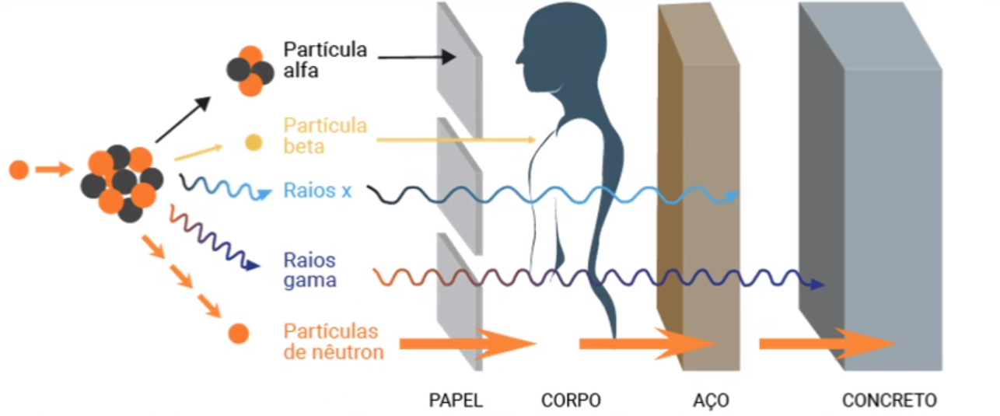
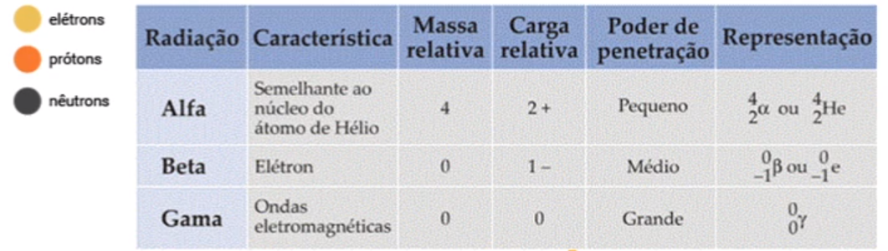
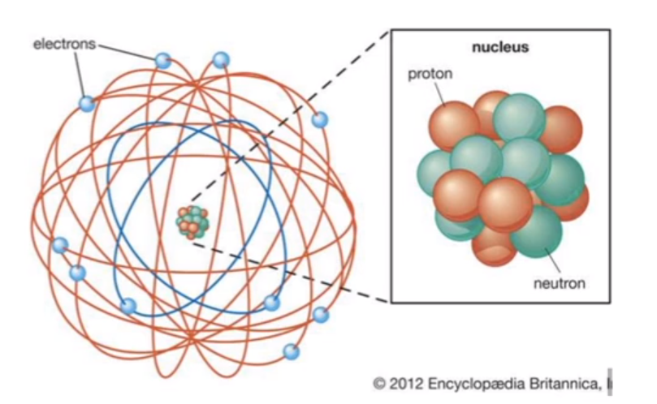
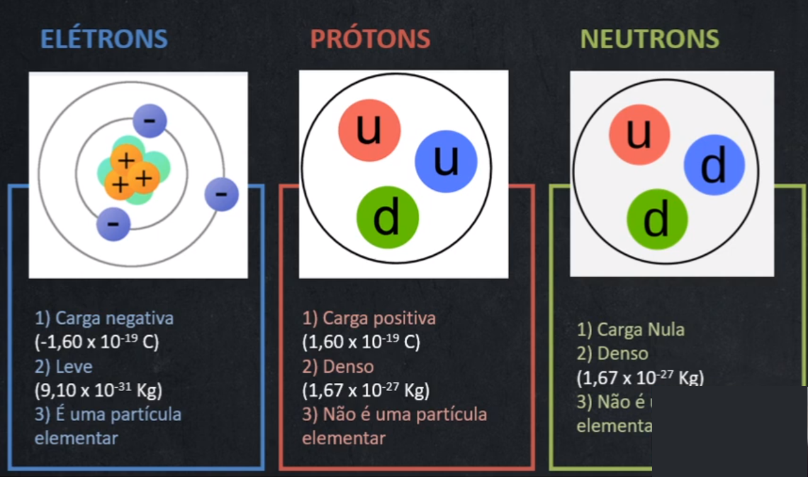
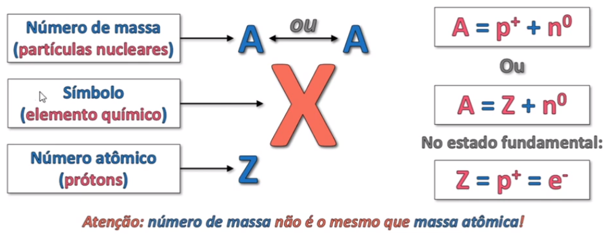
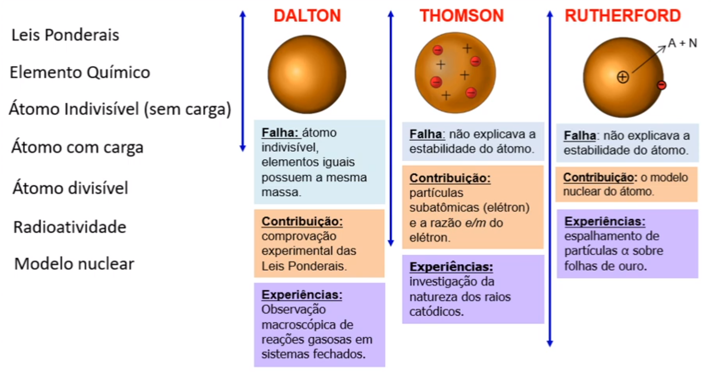
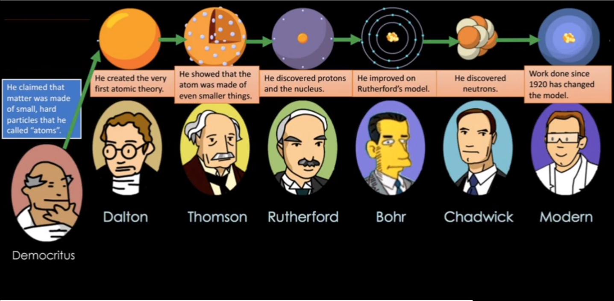

# Estrutura Atômica

*Anderson de Alencar Barros, 13 de março de 2021.*

Os antigos filósofos acreditavam que a matéria era formada pelos 4 elementos: ar, terra, fogo e água e disseram que a menor partícula era chamada de átomo.

Em 1803 **Dalton** apresentou o primeiro modelo atômico.  O modelo de Dalton considerou o átomo indivisível, esféricos, maciços, impenetráveis, idênticos e indestrutíveis. Seria o modelo da bola de bilhar.

Em seguida, em 1897, o modelo de **Thomson** propôs que o átomo era divisível, esféricos e maciços. O átomo seria uma massa positiva com cargas negativas inseridas nessa massa.  

Em 1919, **Millikan** estudou a magnitude da carga do elétron e descobriu que o elétron tem a carga de -1.6 x 10-19 e a massa de 9.1 x 10-31 kg.

Em 1886, **Goldestein** fez a descoberta do próton.

Em 1896 descobre-se a radioatividade. **Henri Becquerel** descobriu o urânio, que emite radiação de alta energia e **Marie Curie e Pierre** isolaram os componentes radioativos do mineral. **Rutherford** descobriu a existência de três tipos de radiação.

A radiação é formada por 3 tipos de partículas: &alpha; (carga positiva), &beta; (carga negativa) e &gamma; (carga neutra). Essas partículas ainda podem ser classificadas pelo poder de penetração.

Em 1911, o modelo de **Rutherford** propôs que o átomo segue um modelo nuclear, composto de um núcleo pequeno e denso e ao redor estaria os elétrons.

Em 1932, **Chadwick** descobriu que a massa de um átomo não era proporcional ao número de prótons e que nem todos os átomos de um elemento tinham   a mesma massa, assim descobriu-se os isótopos. Nêutrons isolam os prótons e evitam uma repulsão.

A representação de um elemento químico é dado na forma,

O **número de massa** (A) é a quantidade de partículas no número: A = Z + N.

A **massa atômica** é a média de massa de todos os isótopos de ocorrência natural. 

A **massa molecular** é a soma das massas dos átomos de uma molécula.

Resumindo...

