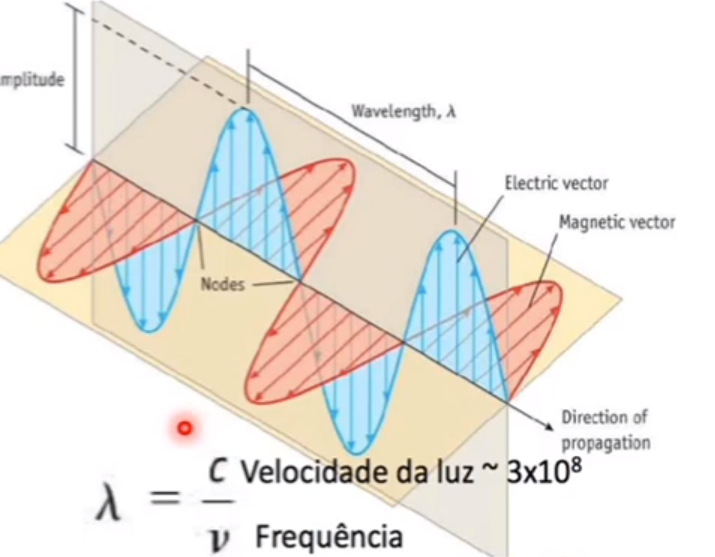
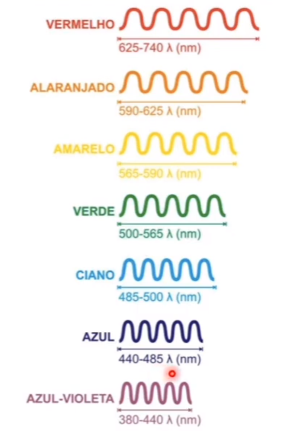
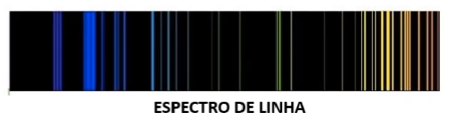
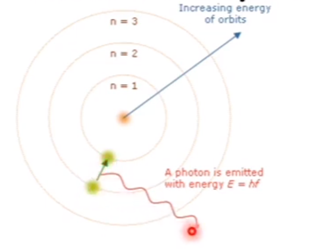
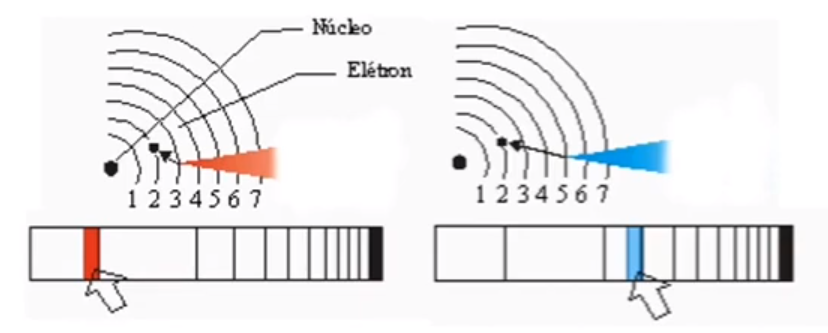
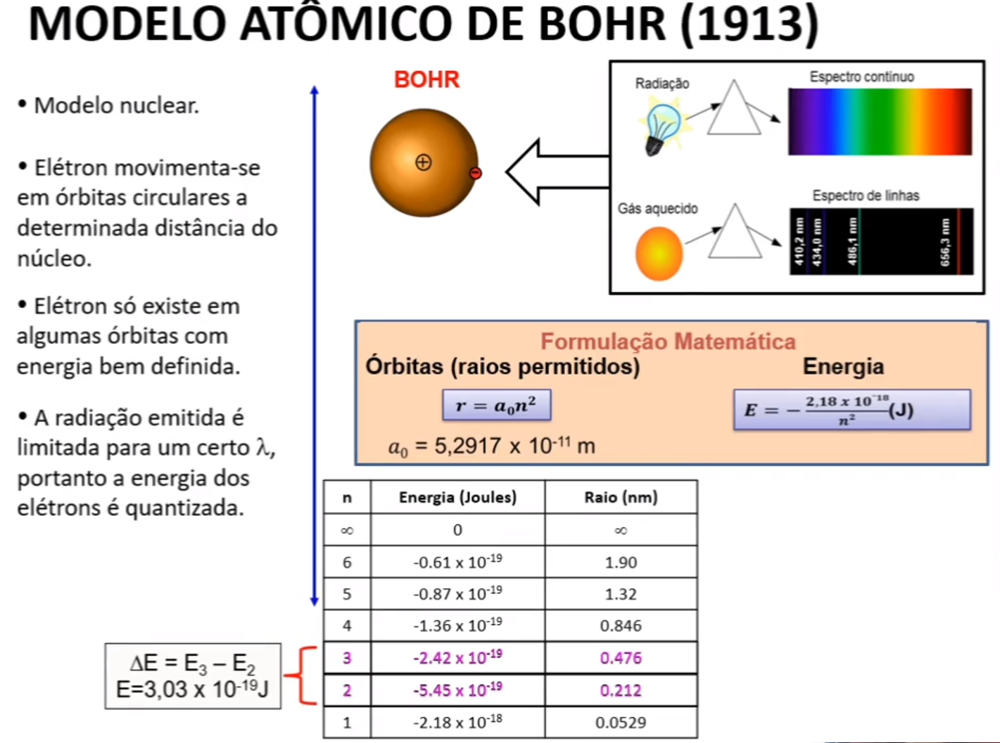
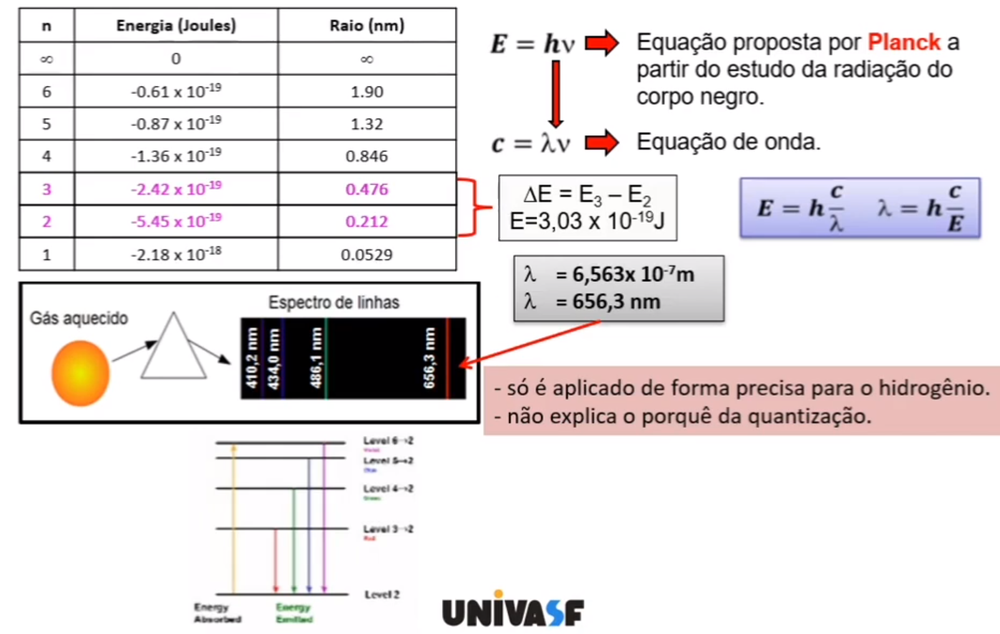
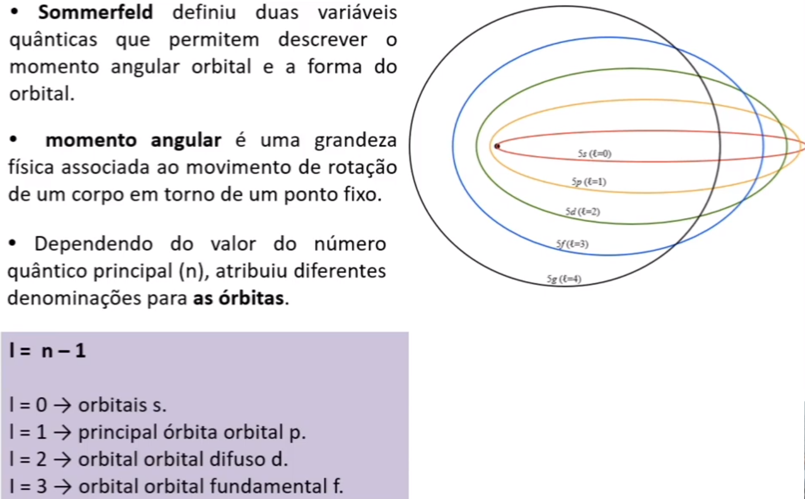
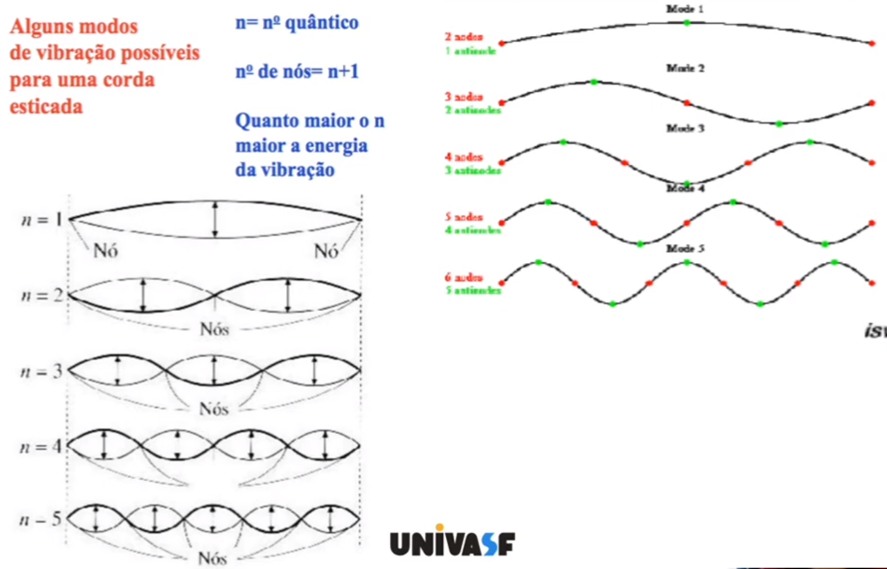
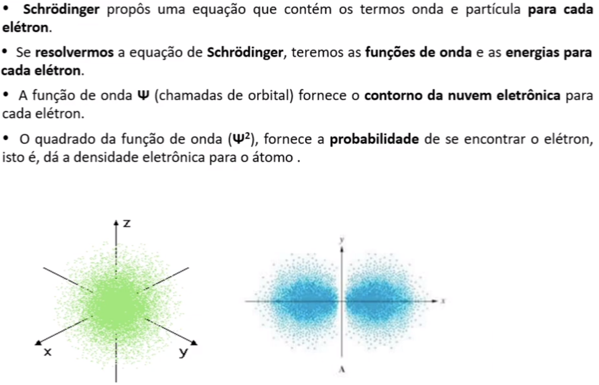

# Estrutura Eletrônica

*Anderson de Alencar Barros, 19 de março de 2021*

### Radiação Eletromagnética

Muito do entendimento atual sobre a estrutura eletrônica dos átomos veio da análise da luz emitida ou absorvida pelas substâncias.

A **luz** é um tipo de radiação eletromagnética que o produto da oscilação dos campos elétricos e magnéticos que transportam energia de um lado para o outro.

Uma **onda eletromagnética** pode variar o poder de penetração dependendo do comprimento de onda e da frequência.

Existe alguns fenômenos que não conseguem ser explicados.

**Radiação de Corpo Negro** emite e absorve radiação de todos os comprimentos de onda. O aquecimento do corpo negro mostrou divergências entre a Física Clássica e a Física Quântica. 

Assim, **Plank** propôs que a radiação emitida provinha da vibração dos elétrons e que nem todos vibram na mesma frequência. Com isso, a energia seria proporcional a frequência. Quanto maior a frequência, maior a energia transportada e assim mais penetrante.

**Albert Einstein** estudou o efeito fotoelétrico que é a capacidade de uma substância emitir elétrons quando submetido a algum tipo de radiação. Assim, concluiu que a luz tem propriedades semelhantes às partículas que foi chamadas de **fótons**.

### Espectros de Linha e o Modelo Atômico de Bohr

Com Plank e Einstein permitiu saber como os elétrons são distribuídos nos átomos. 

**Niels Bohr** percebeu que a estrutura atômica de uma substância seria encontrada na análise da luz quando submetida a altas temperaturas. Quando passou a luz sobre a matéria percebeu que o espectro apresentavam linhas.

Postulou a existência de **níveis de energia eletrônica quantizada**. O elétron está ao redor do núcleo em níveis diferentes, onde cada nível teria uma quantidade fixa de energia e em numa dada órbita eles não perdem nem ganham energia.  Se o elétron ganhar energia ele passa para um nível superior, causando uma instabilidade, sendo uma tendência ele voltar ao seu nível original e quando isso acontece ele emite radiação de diferentes cores e comprimentos de ondas dependendo da mudança de nível.

O **Modelo Atômico de Bohr** explicou a estabilidade do átomo. 

*n* é o nível de energia

### Modelo Atômico Atual

**Sommerfeld** percebeu que elétrons do mesmo nível podem ter quantidades de energia diferentes e concluiu que existem subníveis de energia dentro de cada nível e que as órbitas dos elétrons podem ser circulares ou elípticas.

**Broglie** propôs que todas as substâncias teriam a dualidade onda-partícula como a luz. Foi comprovado com a *Difração*, um curvamento sofrido por uma onda quando passa por um obstáculo. 

Considerando o elétron como uma onda, pode-se usar uma equação em termos de onda e determinar o movimento do elétron. 

**Heisenberg** definiu que o próprio ato de medir algo tão pequeno gera uma incerteza muito grande, maior que o tamanho do átomo, assim não seria possível medir a posição exata e a velocidade do elétron ao mesmo tempo, o chamado **Princípio da Incerteza**. O modelo de Bohr viola esse princípio, pois previa que o elétron estaria em órbitas específicas.

Assim, o modelo atômico atual de **Erwin Schrodinger** trata como probabilidade de encontrar um elétron em determinada região, sendo mais provável em uma área com mais vibração, com mais movimento. 

O elétron tem o comportamento de uma **onda estacionária tridimensional**, com diversos modos de vibração, formas, nós e antinós.

