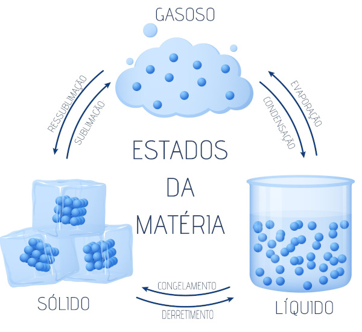
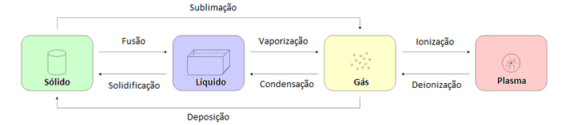
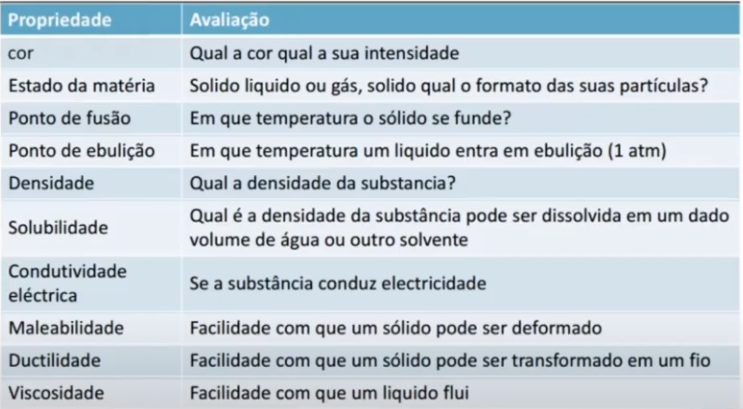
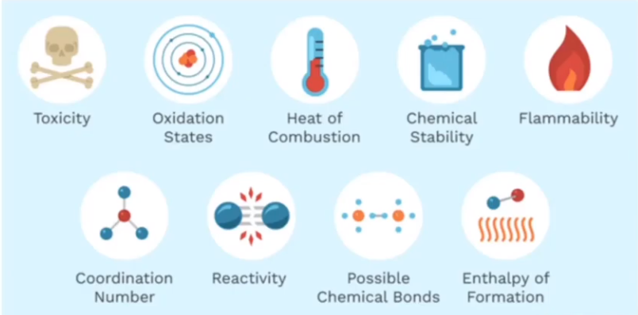
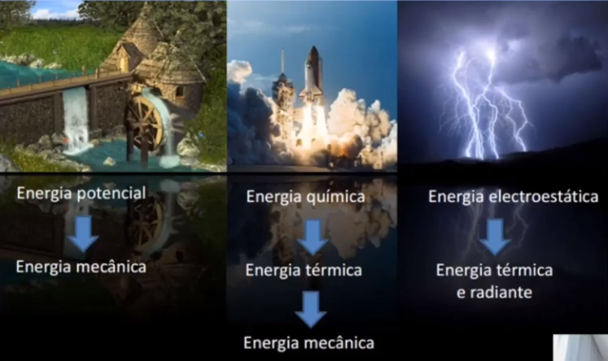
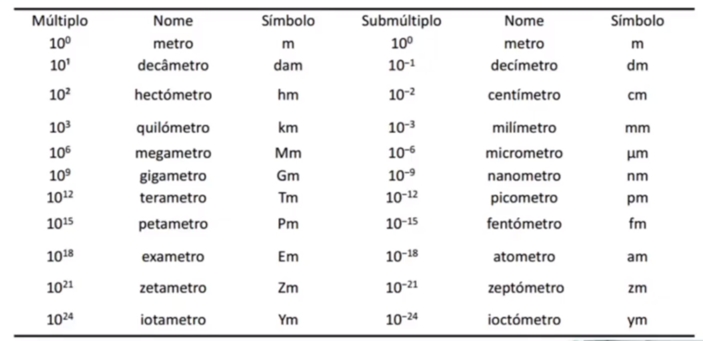

# Fundamentos de Química

*Anderson de Alencar Barros, 12 de março de 2021*

#### Sumário

- **[Composição da Matéria](#1)**
- **[Separação de Misturas](#2)**
- **[Estados da Matéria](#3)**
- **[Mudanças da Matéria](#4)**
  - [Transformação Física](#4.1)
  - [Transformação Química](#4.2)
- **[Propriedades da Matéria](#5)**
  - [Propriedades Físicas](#5.1)
  - [Propriedades Químicas](#5.2)
- **[Energia](#6)**
- **[Unidades de Medida](#7)**
  - [Escalas de Temperatura](#7.1)
  - [Escalas de Comprimento](#7.2)
  - [Unidades de Medida Derivadas do SI ](#7.3)
  - [Incerteza na Medida](#7.4)

## Composição da Matéria 

**Química** é uma ciência experimental que estuda a matéria e as transformações que nela ocorrem.

**Matéria** é tudo o que possui massa e ocupa espaço. Toda matéria é composta de **átomos**. Os átomos se agrupam e formam as **substâncias**, assim, os **elementos** são agrupamentos de átomos idênticos. 

O átomo contém um núcleo, que este contém **protons** e **nêutrons** e ao redor do núcleo fica os **elétrons**. 

Dentro do núcleo, os nêutrons evitam que as cargas iguais dos protons se repilam. Os protons e nêutrons ainda são formados por **quarks**, chamadas de partículas fundamentais.

Como os agrupamentos de átomos idênticos são chamados de elementos, as substâncias de átomos de diferentes são chamados de **compostos**, estes se dividem em **íons**, quando as partículas tem carga, e **moléculas**, quando as partículas não tem cargas. 

**Substância** tem uma composição fixa, definida que não pode ser purificada, como a água.

**Mistura** tem uma composição variada e pode ser purificada, como água e sal.

**Mistura homogênea** o aspecto visual é uniforme, também chamada de **solução**

**Mistura heterogênea** o aspecto visual possui fases diferentes.

Por exemplo,

Água é uma **substância pura.**

Água com sal é uma **mistura homogênea.**

Água e óleo é uma **mistura heterogênea.**

Água e gelo é uma **mistura heterogênea**, pois possui duas fases.

## Separação de Misturas 

Misturas podem ser separadas por processos físicos, em outras palavras, é chamado de **purificação**. Existem vários tipos de separações para cada tipo de mistura.

**Filtração** separa a parte sólida da parte líquida. Existem diversos tipos de filtração, podemos citar a filtração natural ou por gravidade, também existe a filtração forçada, por meio de uma bomba de vácuo e através da pressão força a passagem da solução.

**Decantação** a separação ocorre pela diferença de densidade. 

**Destilação Simples** utilizada para separar sólidos de líquidos onde existe uma diferença do ponto de ebulição muito grande, como água e sal.

**Destilação fracionada** é utilizada para separar líquidos com pontos de ebulição próximos, como ocorre nas indústrias petroquímicas para separação do petróleo.

## Estados da Matéria 

A matéria existem em 4 estados distintos: líquido, gasoso, sólido e plasma.

O estado **sólido** é completamente organizado, as espécimes químicas não possuem mobilidade e tem forma e corpo definido.

O estado **líquido** é mais desordenado, com mais mobilidade entre as espécimes química e toma a forma do corpo do recipiente que o contém.

O estado **gasoso** a desordem é maior ainda, assim como o líquido, ocupa o espaço do recipiente e pode ser comprimido.

O **plasma** é o gás ionizado, seria como um gás com uma quantidade de energia maior. Por conter cargas, tem uma elevada condução elétrica.

## Mudanças da Matéria 

### Transformação Física 

A **Transformação Física** é aquela que não altera a composição da matéria, porém pode mudar o estado. Diz-se que em uma transformação física altera-se o estado de ordem ou desordem das moléculas.

Quando ocorre o aumento de energia, diz-se que o processo é **endotérmico**, como de sólido para líquido. Quando ocorre perda de energia para o meio, diz-se que o processo é **exotérmico**, como de líquido para sólido.

Existe uma diferença entre **evaporização** e **ebulição**. Evaporização ocorre na temperatura ambiente. Ebulição é uma transição mais forçada, com temperaturas mais altas.

### Transformação Química 

A **Transformação Química** envolve uma alteração da composição da matéria. Pode-se dizer que ocorreu uma transformação química quando ocorrer alguma alteração visual no produto final. Não é possível voltar para o estado anterior da transformação.

**Observação Macroscópica** quando a transformação química podemos enxergar e observar o resultado. 

**Observação Microscópica** é o que acontece a nível molecular, ligações são quebradas e novas ligações são formadas.

## Propriedades da Matéria 

**Propriedades Extensivas** dependem do tamanho do sistema, como o calor liberado em uma combustão, o calor liberado em 1 g de metano é diferente do calor liberado por 1 kg.

**Propriedades Intensivas** não dependem do tamanho do sistema, por exemplo, a temperatura da água é a mesma para 100 ml, 200 ml e etc.

### Propriedades Físicas 

São propriedades que inerentes ao material. Vale ressaltar que a temperatura influência nessa propriedades.

### Propriedades Químicas 

São propriedades relacionadas as condições de reação.

## Energia 

Energia é capacidade de realizar trabalho. Energia no universo sempre é constante, ela nunca se perde, sempre se transforma.

**Energia Cinética** é associada ao movimento, é o caso da energia térmica, mecânica, elétrica e etc.

**Energia Potencial** associada a posição, ou a diferença de posição, como na energia gravitacional, energia em uma mola, energia eletrostática e etc.

## Unidades de Medida 

São 7 unidades principais no Sistema SI.

### Escalas de Temperatura 

Conversão entre as escalas Celsius, Kelvin e Fahrenheit.

### Escalas de Comprimento 

### Unidades de Medida Derivadas do SI 

| Grandeza  | Unidade          |
| --------- | ---------------- |
| Volume    | m3    |
| Densidade | g/cm3 |
| Força     | N                |
| Pressão   | Pa               |
| Energia   | J                |
| Trabalho  | J                |

### Incerteza na Medida 

Toda medida tem uma incerteza por mais sofisticado que seja o aparelho. Precisão e Exatidão medem a incerteza de valores nas medidas. 

**Precisão** é o grau de aproximação das medidas entre si, por isso é preciso realizar várias medições. A precisão pode ser determinada pelo desvio padrão.

**Exatidão** indica a aproximação entre as medidas e valor verdadeiro. Indicado pelo erro relativo.

Os **Algarismos Significativos** contribuem para a determinação da exatidão da medida.

**Zeros à esquerda** nunca serão significativos.

**Zeros à direita** são sempre significativos ou entre dois algarismos significativos.

Números com **zeros ao final sem vírgula** devem ser colocados em notação científica para eliminar a ambiguidade, é o caso de 1,03 x 103 que tem 3 algarismos significativos.

Na **adição** e **subtração**, o resultado terá a mesma quantidade de algarismos significativos que o número com a menor quantidade de dígitos.

Na **multiplicação** e **divisão**, o resultado terá o número de algarismos igual a grandeza com menor número de algarismos significativos.