# Lista de Exercícios 1

2.

a.	**orbital**, local mais provável de encontrar um elétron, **energia quantizada**, explica a estabilidade do átomo e **números quãnticos**, específicos para cada elétron no átomo.

b.	números quãnticos **principais** são os níveis de energia, **azimutal** ou subnível de energia são chamadas pelas letras s, p, d e f, **magnético** é a orientação orbital no espaço e depende do azimutal e o **spin** indica o estado de rotação do elétron.

c.	$\lambda \cdot v = c \rightarrow \lambda = \frac{c}{v}$

d.	$E = h \cdot v$ ou $E = \frac{h \cdot c}{\lambda}$, onde $v$ é frequência e também $v = \frac{c}{\lambda}$ e $c$ é a velocidade da luz e $\lambda$ o comprimento de onda

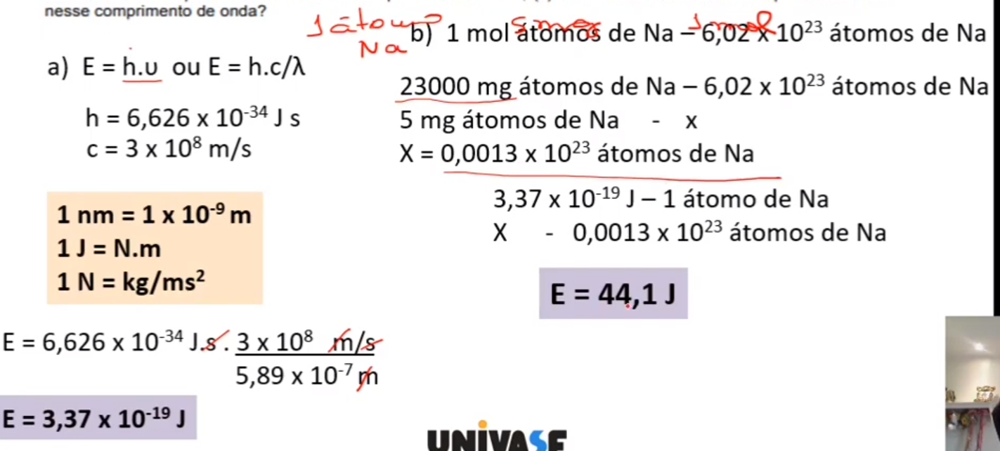

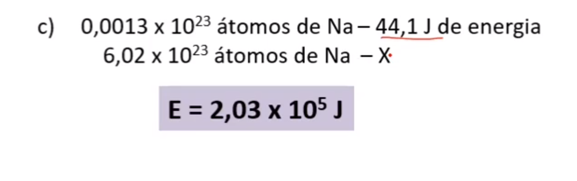

3. 

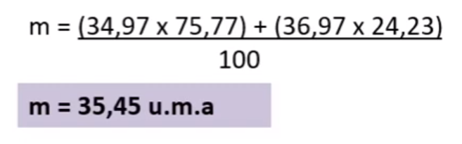

4.

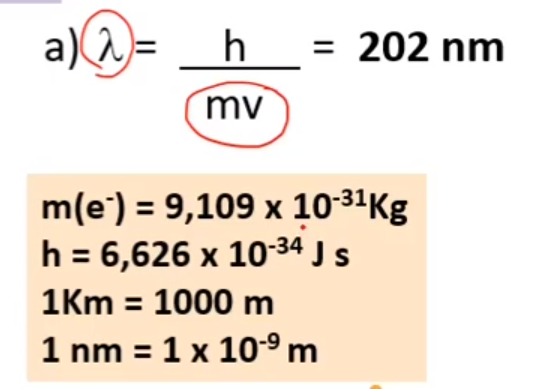

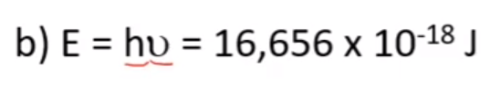

5.

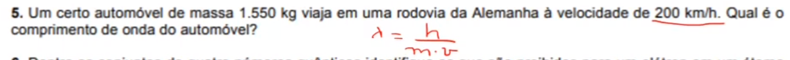

6. 

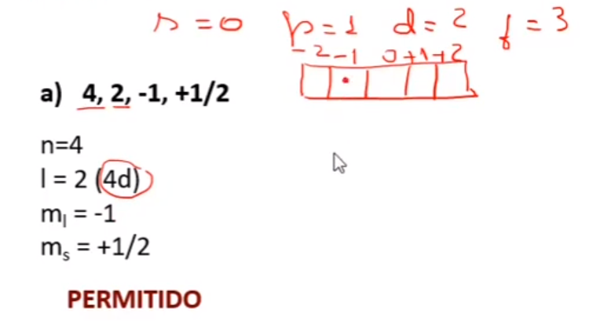

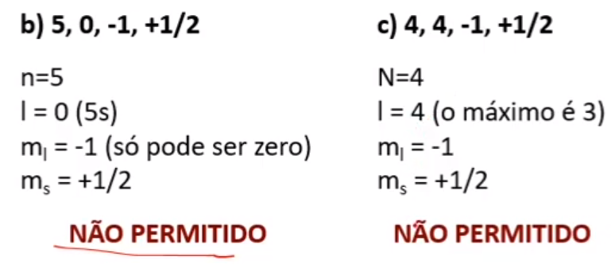

7.

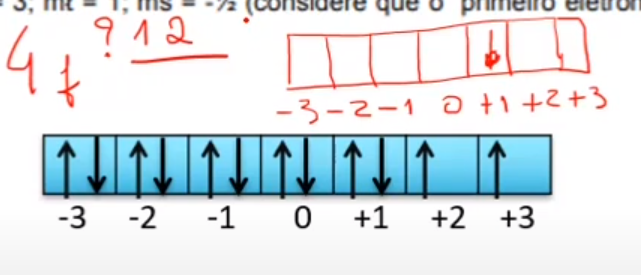

9.

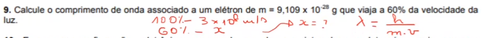

10.

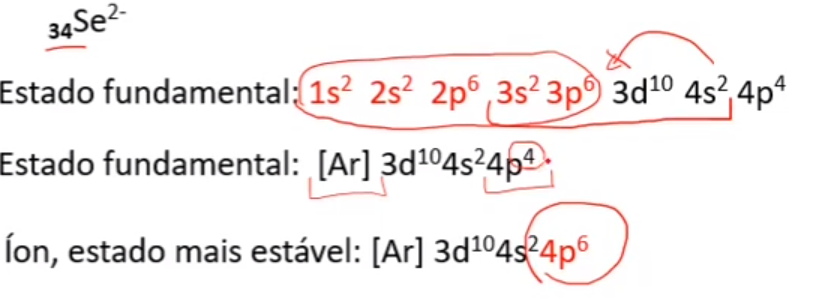16. Thompson descobriu que existem subpartículas no átomo e que tem cargas. Rutherford a maior contribuição foi seu modelo nuclear, onde existe o núcleo com prótons e nêutrons e por fora os elétrons.

17.

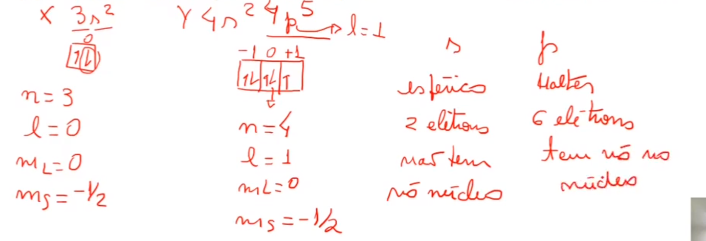

18.

c.	

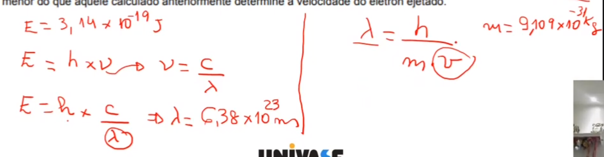

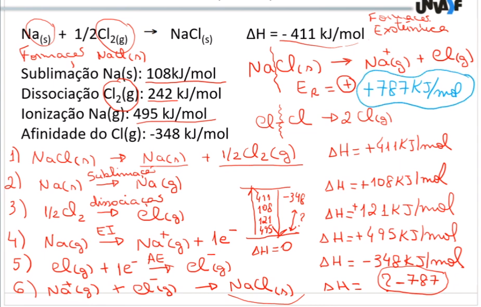

20. Energia de rede é usada para separa um composto iônico em íons isolados em estado de gás.

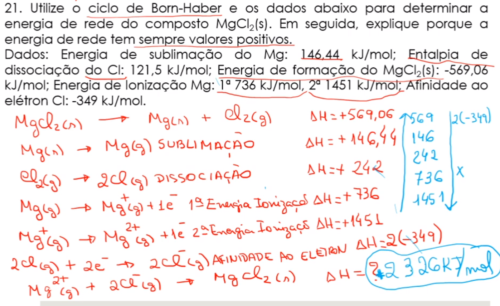